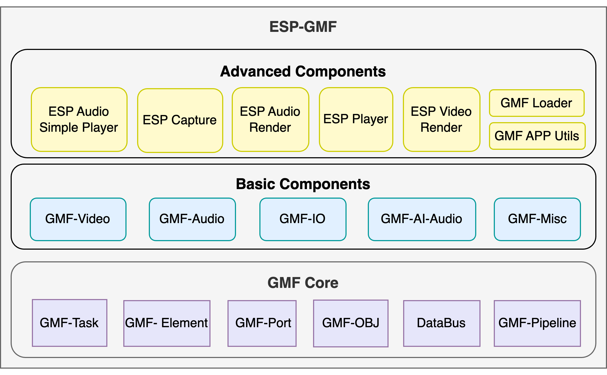

# ESP-GMF

- [English](./README.md)

为 Espressif 芯片打造多媒体产品，从一个轻量、模块化、容易扩展的框架开始。

ESP-GMF 全称 Espressif General Multimedia Framework，是乐鑫开发的应用于 IoT 多媒体领域的轻量级通用软件框架。它灵活性高，可扩展性强，专为 IoT 芯片量身打造，RAM 资源占用只有 7 KB。ESP-GMF 可应用于音频、图像、视频等产品，还可应用于任何流式处理数据的产品中。无论你是在做第一个 Demo，还是在构建面向量产的多媒体 pipeline，ESP-GMF 都希望帮助你从小处起步，并稳定地向前推进。

> **觉得 ESP-GMF 对你有帮助？欢迎顺手支持一下。** 
> [⭐ 点亮 Star](https://github.com/espressif/esp-gmf) · [💡 提交 Issue](https://github.com/espressif/esp-gmf/issues) · 分享你的使用案例 
> **🚀 每一个 Star、案例分享、问题反馈和代码贡献，都会帮助更多开发者发现 ESP-GMF、用好 ESP-GMF。**

ESP-GMF 包含 GMF-Core、 Elements、Packages 和 GMF-Examples 四个模块。

- **GMF-Core** 是 ESP-GMF 软件框架的核心，有 GMF-Element、GMF-Pipeline、GMF-Task 等主要部件。
- **Elements** 是基于 GMF-Core 实现的各种具体功能 element，比如音视频编解码算法、音效处理算法 和 AI 算法等。
- **Packages** 基于 GMF-Pipeline 实现的 High Level 功能的组件示例，比如 **ESP Audio Simple Player** 是一个简单音频解码播放器。
- **GMF-Examples** 提供如何使用 GMF-Pipeline 实现简单功能的示例，比如播放 flash 或 SD 卡中的音乐。

## 为什么选择 ESP-GMF

- **轻量，适合 IoT**：面向资源受限芯片设计。
- **模块化组合灵活**：按需拼装所需能力，也支持自行扩展 element 和 IO 组件。
- **能从 Demo 走向产品**：既能快速完成简单播放链路，也能逐步扩展到更丰富的音频、图像和视频场景。
- **对开发落地友好**：现成 packages 和 examples 可以帮助缩短 bring-up 周期，降低集成成本。

## 你可以这样开始

- **想尽快跑通一个可工作的应用？** 建议优先从 **[高级组件](#advanced-components)** 和仓库中的 examples 入手。
- **需要完全掌控自定义多媒体 pipeline？** 建议从 **[基础组件](#basic-components)** 开始组合搭建。
- **想沉淀自己的可复用能力或自定义 element？** 可以从 **[GMF-Core](#gmf-core-component)** 继续扩展。

# ESP-GMF 组件介绍

ESP-GMF 各个模块以组件的形式存在，组件又按功能分为**原子组件**、**基础组件**和**高级组件**。在开发项目时，推荐使用官方仓库的 elements 和 IOs 组件进行开发，也可以自行创建 element 和 IO 组件来扩展其应用场景。

## GMF 核心组件

GMF 核心组件是 ESP-GMF 不可或缺的基础构建单元。它提供底层基础设施，如 pipeline 管理、任务调度和数据流控制。大多数用户不需要直接使用该组件，因为它被高级组件所封装。但对于希望扩展框架或创建自定义 element 的开发者来说，该组件是必不可少的。

|  组件名称 |  功能 | 示例 | 依赖的组件  |
| :------------: | :------------:| :------------ |:------------ |
|  [gmf_core](./gmf_core) | GMF 基础框架  | [test_apps](./gmf_core/test_apps) |  无 |

## 基础组件

基础组件是 ESP-GMF 中的中间层模块，承担数据处理和音视频流编解码等核心能力。这些组件具备清晰的输入/输出接口，专注于一个具体的任务，具有复用性和可组合性。它们既可以单独使用，也常用于构建复杂应用程序。

**适用场景**：需要最大灵活性和精细控制多媒体 pipeline 的开发者。适合构建自定义处理管道、实现特殊音视频效果或创建独特应用逻辑。需要对 pipeline 概念和组件交互有较深入的理解。

|  组件名称 |  功能 | 示例 | 依赖的组件  |
| :------------: | :------------:| :------------ |:------------ |
|  [gmf_audio](./elements/gmf_audio) | GMF 音频编解码和 音效处理 element  | [test_apps](./elements/test_apps) | - `gmf_core` - `esp_audio_effects`  - `esp_audio_codec` |
|  [gmf_misc](./elements/gmf_misc) | 工具类 element   | [test_apps](./elements/test_apps) | 无  |
|  [gmf_io](./elements/gmf_io) | 文件、flash、HTTP 输入输出  | [test_apps](./elements/test_apps) | - `gmf_core` - `esp_codec_dev`  |
|  [gmf_ai_audio](./elements/gmf_ai_audio) | 智能语音算法和 语音识别 element | [examples](./elements/gmf_ai_audio/examples) | - `esp-sr` - `gmf_core` |
|  [gmf_video](./elements/gmf_video) | GMF 视频编解码和 视频效果处理 element  | [test_apps](./elements/test_apps) | - `gmf_core` - `esp_video_codec` |

## 高级组件

高级组件是 ESP-GMF 中面向特定应用场景的封装模块，通常由多个基础功能组件甚至原子组件组合而成。它们封装了常见的多媒体业务流程，隐藏了底层的 pipeline 构建和组件配置逻辑，提供简单易用的接口，帮助用户快速实现复杂的功能，以简化用户开发流程，便于快速集成。该分类还包括一些工具类模块和示例集合。

**适用场景**：推荐大多数用户使用。这些组件提供了常见多媒体任务的开箱即用解决方案，从简单的音频播放（`esp_audio_simple_player`）到高级功能如音视频 seek、混音和渲染（`esp_player`、`esp_audio_render`、`esp_capture`）。它们显著减少开发时间和复杂度，同时仍提供自定义选项。

|  组件名称 |  功能 | 示例 | 依赖的组件  |
| :------------: | :------------:| :------------ |:------------ |
|  [esp_audio_simple_player](./packages/esp_audio_simple_player) | 简单的音频播放器 | [test_apps](./packages/esp_audio_simple_player/test_apps) | - `gmf_audio` - `gmf_io` |
|  [gmf_loader](./packages/gmf_loader) | 使用 `Kconfig` 选择的配置 设置给定的 GMF Pool | [test_apps](./packages/gmf_loader/test_apps) | - `gmf_core` - `gmf_io` - `gmf_audio` - `gmf_misc` - `gmf_video` - `gmf_ai_audio` - `esp_codec_dev` - `esp_audio_codec` - `esp_video_codec` |
|  [gmf_app_utils](./packages/gmf_app_utils) | 常用外设配置，单元测试工具 内存泄漏检测工具 | [test_apps](./packages/gmf_app_utils/test_apps) | - `gmf_core` - `protocol_examples_common` - `esp_board_manager` |
|  [esp_capture](./packages/esp_capture) | 易用的音视频采集器 | [examples](./packages/esp_capture/examples) | - `gmf_core` - `gmf-audio` - `gmf-video` - `esp_muxer` - `esp_codec_dev` - `esp-sr` - `esp_video` - `esp32-camera`|
|  [esp_board_manager](./packages/esp_board_manager) | 智能、自动化的板子配置和管理工具，支持基于 YAML 的设置 | [test_apps](./packages/esp_board_manager/test_apps) | 根据选择的板子变化依赖 |
| [esp_audio_render](./packages/esp_audio_render) | 支持混音的音频渲染器 | [examples](./packages/esp_audio_render/examples) | - `gmf_core` - `gmf-audio` |
| [esp_bt_audio](./packages/esp_bt_audio) | 蓝牙音频模块，事件驱动流式 API，可选 GMF IO 集成 | [examples](./packages/esp_bt_audio/examples) | - `esp_audio_codec` - `gmf_core`（可选） - `gmf_io`（可选） |
| [gmf_fft](./packages/gmf_fft) | 定点 Q15 实数 FFT/IFFT 处理组件 | [examples](./packages/gmf_fft/examples) | 无 |
| [esp_video_render](./packages/esp_video_render) | 支持灵活显示后端的视频与 UI 合成组件 | [examples](./packages/esp_video_render/examples) | - `gmf_video` - `freetype`（可选） - `esp_lvgl_port`（可选） |

# ESP-GMF 使用说明

使用示例请参考上述各组件的 `examples` 或 `test_apps` 目录。

## 一起让 ESP-GMF 变得更好

- 如果 ESP-GMF 帮你节省了时间，欢迎到 [GitHub 仓库](https://github.com/espressif/esp-gmf) 点一个 Star。
- 如果你遇到了缺失、疑问或希望补充新的能力，欢迎提交 [GitHub issue](https://github.com/espressif/esp-gmf/issues)，包括示例需求、文档建议和功能想法。
- 如果你已经做出了有价值的实践，也欢迎贡献示例、板级适配或文档优化。哪怕是一个小改进，也可能正好帮到下一位开发者。

# 常见问题

- **ESP-GMF 和 ESP-ADF 有什么区别？**

  ESP-ADF 是一个包含很多模块的功能性仓库，比如 `audio_pipeline`、`services`、`peripherals` 和 `audio boards` 等，它常应用于比较复杂的项目中。ESP-GMF 是将 `audio_pipeline` 独立出来并进行功能扩展，使其支持音频、视频、图像等流式数据的应用场景。ESP-GMF 按功能分为不同的组件，灵活性优于 ESP-ADF 的 `audio_pipeline`，例如用于简单流式数据的处理，从 SD 卡/flash 播放一个音频，以及多个组件结合使用提供较复杂的功能模块（如音频播放器 `esp_audio_simple_player `）。ESP-ADF 的后期版本会使用 ESP-GMF 替代 `audio_pipeline` 模块。
