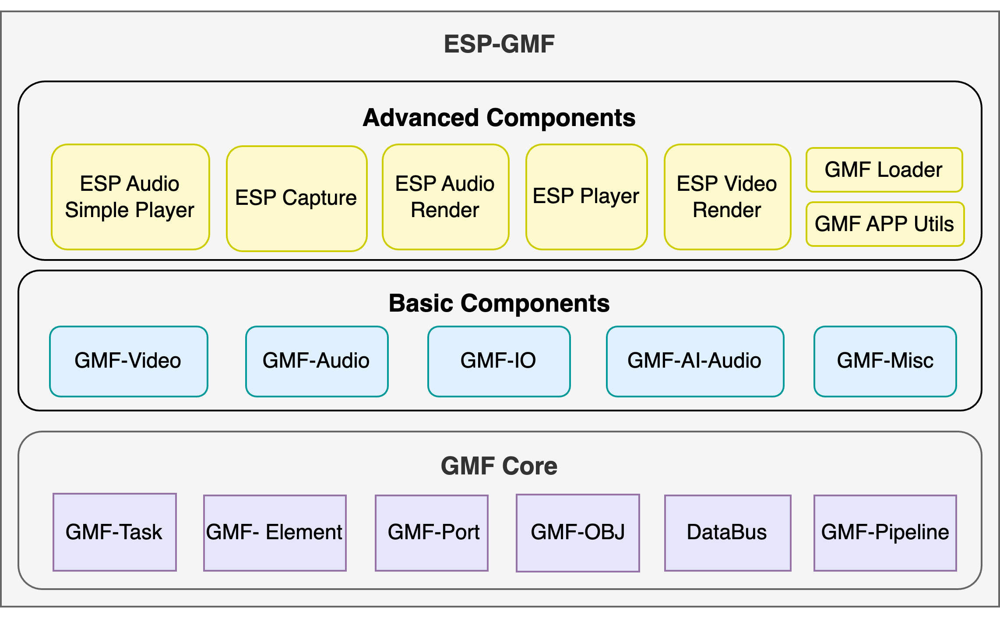

.. _index-sec-00:

Espressif General Multimedia Framework Guide
============================================

:link_to_translation:`zh_CN:[中文]`

.. list-table::
   :widths: 33 33 34

   * - |Get Started|_
     - |GMF Framework|_
     - |Best Practices|_
   * - `Get Started`_
     - `GMF Framework`_
     - `Best Practices`_

.. _Get Started: get-started/index.html

.. _GMF Framework: gmf-framework/index.html

.. _Best Practices: gmf-best-practices/index.html

|

.. _index-sec-01:

.. rubric:: Overview

`ESP-GMF <https://github.com/espressif/esp-gmf>`__ (Espressif General Multimedia Framework) is a lightweight general-purpose software framework built by Espressif for IoT multimedia applications. The framework uses modular elements as its basic building block, decomposing streaming data processing into independently developable and freely composable work units. At runtime, a pipeline chains these elements together while a task schedules their execution. The entire GMF-Core requires approximately 7 KB of runtime RAM on IoT chips. Beyond audio, the framework also handles image, video, and arbitrary streaming data processing.

.. rubric:: Key Features

- **Lightweight for IoT**: Designed for resource-constrained ESP32 series chips; GMF-Core runtime RAM footprint is approximately 7 KB
- **Multi-domain coverage**: Unified handling of audio, video, image, and generic streaming data within a single framework
- **Modular composition**: Assemble functionality using elements as needed, or extend with custom elements and IO components
- **Easy development**: Scales from simple playback pipelines to complex scenarios such as multi-channel mixing, AI speech, and video compositing
- **Rich components**: Built-in advanced application components including audio codecs, video codecs, and AI front-end processing
- **Ecosystem friendly**: Built on ESP-IDF and the Espressif Component Registry, compatible with the existing component ecosystem

.. _index-sec-02:

.. rubric:: System Modules

ESP-GMF consists of four main modules, listed bottom-up by dependency level:

- **GMF-Core**: The framework foundation, providing pipeline management, task scheduling, data flow control, and other infrastructure. Contains basic objects including element, pipeline, task, data bus, and pool. Most applications use GMF-Core indirectly through higher-level components; direct GMF-Core programming is needed when extending the framework or writing custom elements
- **Elements**: Mid-layer components that implement specific functionality on top of GMF-Core, including the following sub-modules:

  - ``gmf_audio``: Audio encoding, decoding, and effects
  - ``gmf_video``: Video encoding, decoding, and image effects
  - ``gmf_io``: File / network / flash / codec device IO
  - ``gmf_ai_audio``: AI front-end processing algorithms including wake word, command word, and AEC
  - ``gmf_misc``: Miscellaneous utilities

- **Packages**: High-level encapsulations targeting specific application scenarios, assembling multiple elements into common multimedia workflows, including the following sub-modules:

  - ``esp_audio_simple_player``: Simple audio player
  - ``esp_capture``: Multimedia capture
  - ``esp_audio_render``: Multi-channel mixing renderer
  - ``esp_video_render``: Video compositing and display / multi-channel video / UI compositing
  - ``esp_bt_audio``: Classic Bluetooth and LE Audio
  - ``esp_asrc``: Audio sample rate / bit depth / channel conversion
  - ``esp_board_manager``: Board-level management
  - ``gmf_loader``: GMF loader
  - ``gmf_app_utils``: Application utility tools
  - ``gmf_fft``: FFT computation component

- **GMF-Examples**: Demonstration projects showing how to use ESP-GMF, covering audio and video playback and recording, Bluetooth audio, AI Agent, and more

.. _index-sec-03:

.. rubric:: Relationship with ESP-ADF

ESP-GMF evolved from the ``audio_pipeline`` module in `ESP-ADF <https://github.com/espressif/esp-adf>`_ (Espressif Audio Development Framework), extracting the pipeline architecture and extending it to video, image, and generic streaming data. The distinction between the two:

- ESP-ADF is a feature-oriented repository for multimedia applications; its ``master`` branch serves as the continuing mainline, providing components based on ESP-GMF and offering product-level solution examples for customers
- ESP-GMF provides the pipeline architecture, with flexible support for audio, video, image, and arbitrary streaming data

.. toctree::
    :hidden:

    get-started/index
    gmf-framework/index
    gmf-best-practices/index
    resources
    contributions-guide
    glossary
    about
