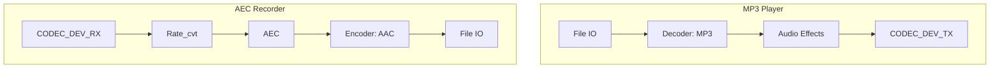

# Play Music from SDCard While Recording Audio with AEC

- [中文版](./README_CN.md)
- Regular Example: ⭐⭐

## Example Brief

This example uses two pipelines to demonstrate AEC-based recording. One pipeline reads MP3 files from the SD card via File IO, decodes them with a decoder element, applies audio effects, and outputs music through CODEC_DEV_TX IO. The other pipeline reads PCM from the I2S device via CODEC_DEV_RX IO, processes it with AEC, encodes the audio, and saves it via File IO.

This example can compress the AEC output to `AAC` format, enabled by the macro `ENCODER_ENABLE` in [main.c](./main/main.c):

```c
#define ENCODER_ENABLE (false)
```

- `ENCODER_ENABLE`: When enabled, the recording pipeline uses the `AAC` encoder and saves the result as `aec.aac`

### Typical Scenarios

- Playback while recording: play MP3 from the SD card while recording from the microphone with AEC and saving to file
- AEC effect verification: compare recordings with and without AEC to verify echo cancellation

### Prerequisites

- Familiarity with GMF pipeline and element concepts and the [ESP-IDF Programming Guide](https://docs.espressif.com/projects/esp-idf/en/latest/esp32s3/index.html) is recommended

### GMF Pipeline

Below is the diagram of the pipelines used in this example:



### AEC Element Initialization Parameters

```c
esp_gmf_element_handle_t gmf_aec_handle = NULL;
esp_gmf_aec_cfg_t gmf_aec_cfg = {
    .filter_len = 4,
    .type = AFE_TYPE_VC,
    .mode = AFE_MODE_HIGH_PERF,
    .input_format = "RMNM",
};
esp_gmf_aec_init(&gmf_aec_cfg, &gmf_aec_handle);
```

- `filter_len`: Filter length. Higher values increase CPU load. For esp32s3 and esp32p4, recommend filter_length = 4. For esp32c5, recommend filter_length = 2
- `type`: AEC type, options:
  - `AFE_TYPE_VC`: Echo cancellation for voice communication
  - `AFE_TYPE_SR`: Echo cancellation for voice recognition
- `mode`: AEC mode, options:
  - `AFE_MODE_LOW_POWER`: Low-power mode for power-sensitive scenarios
  - `AFE_MODE_HIGH_PERF`: High-performance mode for high-quality echo cancellation
- `input_format`: Input data format, e.g. `RMNM`:
  - `M`: Microphone channel
  - `R`: Reference (loopback) signal channel
  - `N`: Invalid signal

By configuring these parameters you can tune AEC performance and resource usage for your application. After adding the element to the GMF Pool, you can use AEC in a GMF Pipeline to process audio streams.

## Environment Setup

### Hardware Required

- **Board**: Default example is ESP32-S3-Korvo V3; other ESP audio boards with hardware reference (loopback) support are also applicable
- **Peripherals**: Audio DAC, Audio ADC, I2S, SDCard

### Default IDF Branch

This example supports IDF release/v5.4 (>= v5.4.3) and release/v5.5 (>= v5.5.2).

### Software Requirements

- Prepare an MP3 file and store it in the SDCard root directory (default filename `test.mp3`)

## Build and Flash

### Build Preparation

Before building this example, ensure the ESP-IDF environment is set up. If it is already set up, skip to the project directory. If not, run the following in the ESP-IDF root directory to complete the environment setup. For full steps, see the [ESP-IDF Programming Guide](https://docs.espressif.com/projects/esp-idf/en/latest/esp32s3/index.html).

```
./install.sh
. ./export.sh
```

Short steps:

- Go to this example's project directory (example path below; replace with your actual path):

```
cd $YOUR_GMF_PATH/elements/gmf_ai_audio/examples/aec_rec
```

- This example uses `esp_board_manager` for board-level resources; add board support first

On Linux / macOS:

```bash
idf.py set-target esp32s3
export IDF_EXTRA_ACTIONS_PATH=./managed_components/esp_board_manager
idf.py gen-bmgr-config -b esp32_s3_korvo2_v3
```

On Windows:

```powershell
idf.py set-target esp32s3
$env:IDF_EXTRA_ACTIONS_PATH = ".\managed_components\esp_board_manager"
idf.py gen-bmgr-config -b esp32_s3_korvo2_v3
```

For a custom board, see [Custom board](https://github.com/espressif/esp-gmf/blob/main/packages/esp_board_manager/README.md#custom-board).

### Build and Flash Commands

- Build the example:

```
idf.py build
```

- Flash the firmware and run the serial monitor (replace PORT with your port name):

```
idf.py -p PORT flash monitor
```

Exit the monitor with `Ctrl-]`.

## How to Use the Example

### Functionality and Usage

- This example requires an SDCard and an MP3 file; place one MP3 file in the SDCard root (default `test.mp3`)
- Before building, set `ENCODER_ENABLE` in `main.c` to enable or disable the `AAC` encoder
- Before running, ensure the SDCard is correctly installed on the board
- During run, speak to the board to verify AEC effect later
- After run, export files from the SDCard and use software to check the recording: without encoding the file is `aec_16k_16bit_1ch.pcm` (16K, 16-bit, mono); with encoding the file is `aec.aac`

### Log Output

The following is a sample of key log lines during run (both pipelines start/stop, AEC and codec):

```c
I (1288) ESP_GMF_THREAD: The TSK_0x3fcb5404 created on internal memory
I (1288) ESP_GMF_TASK: Waiting to run... [tsk:TSK_0x3fcb5404-0x3fcb5404, wk:0x0, run:0]
I (1304) AEC_EL_2_FILE: CB: RECV Pipeline EVT: el:NULL-0x3c23ef70, type:8192, sub:ESP_GMF_EVENT_STATE_OPENING, payload:0x0, size:0,0x0
I (1328) ESP_GMF_PORT: ACQ IN, new self payload:0x3c23f35c, port:0x3c23f2a8, el:0x3c23efa8-aud_rate_cvt
I (1329) ESP_GMF_PORT: ACQ OUT SET, new self payload:0x3c23fe68, p:0x3c23f1a8, el:0x3c23efa8-aud_rate_cvt
I (1358) GMF_AEC: GMF AEC open, frame_len: 2048, nch 4, chunksize 256
I (1359) AEC_EL_2_FILE: CB: RECV Pipeline EVT: el:ai_aec-0x3c23f0c4, type:12288, sub:ESP_GMF_EVENT_STATE_INITIALIZED, payload:0x3fcb6790, size:12,0x0
I (1371) AEC_EL_2_FILE: CB: RECV Pipeline EVT: el:ai_aec-0x3c23f0c4, type:8192, sub:ESP_GMF_EVENT_STATE_RUNNING, payload:0x0, size:0,0x0
I (1383) ESP_GMF_TASK: One times job is complete, del[wk:0x3c23f3dc,ctx:0x3c23f0c4, label:aec_open]
I (1401) ESP_GMF_TASK: Waiting to run... [tsk:TSK_0x3fcca2f8-0x3fcca2f8, wk:0x0, run:0]
I (1401) ESP_GMF_THREAD: The TSK_0x3fcca2f8 created on internal memory
I (1432) ESP_GMF_TASK: Waiting to run... [tsk:TSK_0x3fcca2f8-0x3fcca2f8, wk:0x3c252ac0, run:0]
I (1433) ESP_GMF_FILE: Open, dir:1, uri:/sdcard/test.mp3
I (1446) ESP_GMF_FILE: File size: 2994349 byte, io_file position: 0
I (1447) AEC_EL_2_FILE: CB: RECV Pipeline EVT: el:NULL-0x3c25230c, type:8192
I (1460) ESP_GMF_TASK: One times job is complete, del[wk:0x3c252ac0,ctx:0x3c252344, label:aud_simp_dec_open]
I (1469) ESP_GMF_PORT: ACQ IN, new self payload:0x3c252ac0, port:0x3c252964, el:0x3c252344-aud_dec
I (1482) ESP_GMF_PORT: ACQ OUT SET, new self payload:0x3c252d64, p:0x3c25252c, el:0x3c252344-aud_dec
W (1491) ESP_GMF_ASMP_DEC: Not enough memory for out, need:4608, old: 1024, new: 4608
I (1505) ESP_GMF_ASMP_DEC: NOTIFY Info, rate: 0, bits: 0, ch: 0 --> rate: 44100, bits: 16, ch: 2
Audio >
I (1589) ESP_GMF_TASK: One times job is complete, del[wk:0x3c253fa4,ctx:0x3c252420, label:rate_cvt_open]
I (1590) ESP_GMF_PORT: ACQ OUT SET, new self payload:0x3c253fa4, p:0x3c2526c4, el:0x3c252420-aud_rate_cvt
I (1603) ESP_GMF_TASK: One times job is complete, del[wk:0x3c253fec,ctx:0x3c2525ac, label:ch_cvt_open]
I (1615) AEC_EL_2_FILE: CB: RECV Pipeline EVT: el:aud_bit_cvt-0x3c252744, type:12288, sub:ESP_GMF_EVENT_STATE_INITIALIZED, payload:0x3fccb680, size:12,0x0
I (1627) AEC_EL_2_FILE: CB: RECV Pipeline EVT: el:aud_bit_cvt-0x3c252744, type:8192, sub:ESP_GMF_EVENT_STATE_RUNNING, payload:0x0, size:0,0x0
I (1639) ESP_GMF_TASK: One times job is complete, del[wk:0x3c255608,ctx:0x3c252744, label:bit_cvt_open]
I (1651) ESP_GMF_PORT: ACQ OUT, new self payload:0x3c255608, port:0x3c252a34, el:0x3c252744-aud_bit_cvt
I (21462) ESP_GMF_CODEC_DEV: CLose, 0x3c23f228, pos = 7716864/0
I (21464) ESP_GMF_TASK: One times job is complete, del[wk:0x3c23f410,ctx:0x3c23efa8, label:rate_cvt_close]
I (21478) ESP_GMF_TASK: One times job is complete, del[wk:0x3c253fec,ctx:0x3c23f0c4, label:aec_close]
I (21479) AEC_EL_2_FILE: CB: RECV Pipeline EVT: el:NULL-0x3c23ef70, type:8192, sub:ESP_GMF_EVENT_STATE_STOPPED, payload:0x0, size:0,0x0
I (21501) ESP_GMF_TASK: Waiting to run... [tsk:TSK_0x3fcb5404-0x3fcb5404, wk:0x0, run:0]
I (21502) ESP_GMF_TASK: Waiting to run... [tsk:TSK_0x3fcb5404-0x3fcb5404, wk:0x0, run:0]
I (21514) ESP_GMF_FILE: CLose, 0x3c2528d8, pos = 318464/2994349
I (21525) ESP_GMF_CODEC_DEV: CLose, 0x3c2529a4, pos = 7633608/0
I (21526) ESP_GMF_TASK: One times job is complete, del[wk:0x3c25562c,ctx:0x3c252344, label:aud_simp_dec_close]
I (21538) ESP_GMF_TASK: One times job is complete, del[wk:0x3c23f410,ctx:0x3c252420, label:rate_cvt_close]
I (21549) ESP_GMF_TASK: One times job is complete, del[wk:0x3c23f380,ctx:0x3c2525ac, label:ch_cvt_close]
I (21561) ESP_GMF_TASK: One times job is complete, del[wk:0x3c23f3b8,ctx:0x3c252744, label:bit_cvt_close]
I (21572) AEC_EL_2_FILE: CB: RECV Pipeline EVT: el:NULL-0x3c25230c, type:8192, sub:ESP_GMF_EVENT_STATE_STOPPED, payload:0x0, size:0,0x0
I (21584) ESP_GMF_TASK: Waiting to run... [tsk:TSK_0x3fcca2f8-0x3fcca2f8, wk:0x0, run:0]
I (21595) ESP_GMF_TASK: Waiting to run... [tsk:TSK_0x3fcca2f8-0x3fcca2f8, wk:0x0, run:0]
E (25298) i2s_common: i2s_channel_disable(1116): the channel has not been enabled yet
E (25303) i2s_common: i2s_channel_disable(1116): the channel has not been enabled yet
I (25314) main_task: Returned from app_main()
```

### References

- [ESP-IDF Programming Guide](https://docs.espressif.com/projects/esp-idf/en/latest/esp32s3/index.html)

## Troubleshooting

### SDCard Not Recognized

- Ensure the SDCard is formatted as FAT32
- Check that the SDCard is properly inserted into the board

### MP3 File Not Playing

- Ensure the MP3 file is in the SDCard root directory
- Verify that the MP3 file is not corrupted
- Ensure the MP3 file is named `test.mp3`

### No Audio Recorded

- Verify that the board microphone hardware works correctly
- Ensure the audio channel configuration matches the hardware design

### High CPU Usage with AEC in the Pipeline

The AEC algorithm is CPU-intensive; when building pipelines that include AEC, allocate resources appropriately:

- Identify CPU-intensive elements in the pipeline, such as `ai_aec`, `aud_enc`, or `io_file`
- Split the pipeline into two pipelines running on different CPU cores and connect them with `gmf port`

## Technical Support

For technical support, use the links below:

- Technical support: [esp32.com](https://esp32.com/viewforum.php?f=20) forum
- Issue reports and feature requests: [GitHub issue](https://github.com/espressif/esp-gmf/issues)

We will reply as soon as possible.
