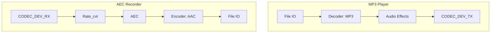

# 播放 SDCard 音乐同时 AEC 录制音频例程

- [English Version](./README.md)
- 例程难度：⭐⭐

## 例程简介

本例程使用两路 pipeline 演示 AEC 录制音频的效果。一路 pipeline 使用 File IO 读取存储在 SDCard 中的 MP3 文件，经 decoder 元素解码后进行音频效果处理，再通过 CODEC_DEV_TX IO 输出音乐；另一路 pipeline 使用 CODEC_DEV_RX IO 从 I2S 设备读取 PCM 数据，经 AEC 处理后进行音频编码，最终通过 File IO 保存为文件。

本例程支持将 AEC 处理后的音频压缩为 `AAC` 格式，通过 [main.c](./main/main.c) 中的宏 `ENCODER_ENABLE` 使能：

```c
#define ENCODER_ENABLE (false)
```

- `ENCODER_ENABLE`：使能后将在录音 pipeline 中启用 `AAC` 编码器，并保存为 `aec.aac`

### 典型场景

- 放音同时录音：播放 SD 卡中的 MP3 的同时，通过麦克风录制并做 AEC 后保存
- AEC 效果验证：对比有无 AEC 的录音文件，验证回声消除效果

### 预备知识

- 建议先熟悉 GMF Pipeline 与元素概念，以及 [《ESP-IDF 编程指南》](https://docs.espressif.com/projects/esp-idf/zh_CN/latest/esp32s3/index.html)

### GMF Pipeline

以下是本例程中使用的 pipeline 的示意图：



### AEC 元素初始化参数说明

```c
esp_gmf_element_handle_t gmf_aec_handle = NULL;
esp_gmf_aec_cfg_t gmf_aec_cfg = {
    .filter_len = 4,
    .type = AFE_TYPE_VC,
    .mode = AFE_MODE_HIGH_PERF,
    .input_format = "RMNM",
};
esp_gmf_aec_init(&gmf_aec_cfg, &gmf_aec_handle);
```

- `filter_len`: 滤波器长度。数值越大，CPU 负载越高。对于 esp32s3 和 esp32p4，建议 filter_length = 4。对于 esp32c5，建议 filter_length = 2
- `type`: AEC 类型，支持以下选项：
  - `AFE_TYPE_VC`: 适用于语音通信的回声消除
  - `AFE_TYPE_SR`: 适用于语音识别的回声消除
- `mode`: AEC 模式，支持以下选项：
  - `AFE_MODE_LOW_POWER`: 低功耗模式，适用于功耗敏感的场景
  - `AFE_MODE_HIGH_PERF`: 高性能模式，适用于需要高质量回声消除的场景
- `input_format`: 输入数据的格式, 如 `RMNM`：
  - `M`：麦克风通道
  - `R`：回采信号通道
  - `N`：无效信号

通过配置这些参数，可以根据具体应用场景调整 AEC 的性能和资源使用。添加到 `GMF Pool` 中后，可在 `GMF Pipeline` 中使用 AEC 处理音频流

## 环境配置

### 硬件要求

- **开发板**：默认以 ESP32-S3-Korvo V3 为例，其他支持硬件回采的 ESP 音频板同样适用
- **外设**：Audio DAC、Audio ADC、I2S、SDCard

### 默认 IDF 分支

本例程支持 IDF release/v5.4(>= v5.4.3) and release/v5.5(>= v5.5.2) 分支。

### 软件要求

- 用户需准备一份 MP3 文件并存入 SDCard 根目录（默认文件名为 `test.mp3`）

## 编译和下载

### 编译准备

编译本例程前需先确保已配置 ESP-IDF 环境；若已配置可跳过本段，直接进入工程目录并运行相关预编译脚本。若未配置，请在 ESP-IDF 根目录运行以下脚本完成环境设置，完整步骤请参阅 [《ESP-IDF 编程指南》](https://docs.espressif.com/projects/esp-idf/zh_CN/latest/esp32s3/index.html)。

```
./install.sh
. ./export.sh
```

下面是简略步骤：

- 进入本例程工程目录（以下为示例路径，请改为实际例程路径）：

```
cd $YOUR_GMF_PATH/elements/gmf_ai_audio/examples/aec_rec
```

- 执行预编译脚本，根据提示选择编译芯片，自动设置 IDF Action 扩展，通过 `esp_board_manager` 选择支持的开发板，如需选择自定义开发板，详情参考：[自定义板子](https://github.com/espressif/esp-gmf/blob/main/packages/esp_board_manager/README.md#custom-board)

在 Linux / macOS 中运行以下命令：
```bash/zsh
source prebuild.sh
```

在 Windows 中运行以下命令：
```powershell
.\prebuild.ps1
```

### 编译与烧录

- 编译示例程序

```
idf.py build
```

- 烧录程序并运行 monitor 工具来查看串口输出 (替换 PORT 为端口名称)：

```
idf.py -p PORT flash monitor
```

退出 monitor 可使用 `Ctrl-]`。

## 如何使用例程

### 功能和用法

- 本例程需要 SDCard 和 MP3 文件，用户需准备一份 MP3 文件并存入 SDCard 根目录（默认 `test.mp3`）
- 编译前可通过 `main.c` 中 `ENCODER_ENABLE` 的值决定是否启用 `AAC` 编码
- 运行前请确保 SDCard 已正确安装到开发板上
- 运行时可对开发板说话，以便后续验证 AEC 效果
- 运行结束后可将 SDCard 中的文件导出并用软件查看录音内容：
  - 未启用编码且AEC工作在8K采样率时文件名为 `aec_8k_16bit_1ch.pcm`（8K 采样率、16 bit、单声道）
  - 未启用编码且AEC工作在16K采样率时文件名为 `aec_16k_16bit_1ch.pcm`（16K 采样率、16 bit、单声道）
  - 启用编码时文件名为 `aec.aac`

### 日志输出

以下为运行过程中的关键日志示例（两路 Pipeline 启停、AEC 与编解码）：

```c
I (1288) ESP_GMF_THREAD: The TSK_0x3fcb5404 created on internal memory
I (1288) ESP_GMF_TASK: Waiting to run... [tsk:TSK_0x3fcb5404-0x3fcb5404, wk:0x0, run:0]
I (1304) AEC_EL_2_FILE: CB: RECV Pipeline EVT: el:NULL-0x3c23ef70, type:8192, sub:ESP_GMF_EVENT_STATE_OPENING, payload:0x0, size:0,0x0
I (1328) ESP_GMF_PORT: ACQ IN, new self payload:0x3c23f35c, port:0x3c23f2a8, el:0x3c23efa8-aud_rate_cvt
I (1329) ESP_GMF_PORT: ACQ OUT SET, new self payload:0x3c23fe68, p:0x3c23f1a8, el:0x3c23efa8-aud_rate_cvt
I (1358) GMF_AEC: GMF AEC open, frame_len: 2048, nch 4, chunksize 256
I (1359) AEC_EL_2_FILE: CB: RECV Pipeline EVT: el:ai_aec-0x3c23f0c4, type:12288, sub:ESP_GMF_EVENT_STATE_INITIALIZED, payload:0x3fcb6790, size:12,0x0
I (1371) AEC_EL_2_FILE: CB: RECV Pipeline EVT: el:ai_aec-0x3c23f0c4, type:8192, sub:ESP_GMF_EVENT_STATE_RUNNING, payload:0x0, size:0,0x0
I (1383) ESP_GMF_TASK: One times job is complete, del[wk:0x3c23f3dc,ctx:0x3c23f0c4, label:aec_open]
I (1401) ESP_GMF_TASK: Waiting to run... [tsk:TSK_0x3fcca2f8-0x3fcca2f8, wk:0x0, run:0]
I (1401) ESP_GMF_THREAD: The TSK_0x3fcca2f8 created on internal memory
I (1432) ESP_GMF_TASK: Waiting to run... [tsk:TSK_0x3fcca2f8-0x3fcca2f8, wk:0x3c252ac0, run:0]
I (1433) ESP_GMF_FILE: Open, dir:1, uri:/sdcard/test.mp3
I (1446) ESP_GMF_FILE: File size: 2994349 byte, io_file position: 0
I (1447) AEC_EL_2_FILE: CB: RECV Pipeline EVT: el:NULL-0x3c25230c, type:8192
I (1460) ESP_GMF_TASK: One times job is complete, del[wk:0x3c252ac0,ctx:0x3c252344, label:aud_simp_dec_open]
I (1469) ESP_GMF_PORT: ACQ IN, new self payload:0x3c252ac0, port:0x3c252964, el:0x3c252344-aud_dec
I (1482) ESP_GMF_PORT: ACQ OUT SET, new self payload:0x3c252d64, p:0x3c25252c, el:0x3c252344-aud_dec
W (1491) ESP_GMF_ASMP_DEC: Not enough memory for out, need:4608, old: 1024, new: 4608
I (1505) ESP_GMF_ASMP_DEC: NOTIFY Info, rate: 0, bits: 0, ch: 0 --> rate: 44100, bits: 16, ch: 2
Audio >
I (1589) ESP_GMF_TASK: One times job is complete, del[wk:0x3c253fa4,ctx:0x3c252420, label:rate_cvt_open]
I (1590) ESP_GMF_PORT: ACQ OUT SET, new self payload:0x3c253fa4, p:0x3c2526c4, el:0x3c252420-aud_rate_cvt
I (1603) ESP_GMF_TASK: One times job is complete, del[wk:0x3c253fec,ctx:0x3c2525ac, label:ch_cvt_open]
I (1615) AEC_EL_2_FILE: CB: RECV Pipeline EVT: el:aud_bit_cvt-0x3c252744, type:12288, sub:ESP_GMF_EVENT_STATE_INITIALIZED, payload:0x3fccb680, size:12,0x0
I (1627) AEC_EL_2_FILE: CB: RECV Pipeline EVT: el:aud_bit_cvt-0x3c252744, type:8192, sub:ESP_GMF_EVENT_STATE_RUNNING, payload:0x0, size:0,0x0
I (1639) ESP_GMF_TASK: One times job is complete, del[wk:0x3c255608,ctx:0x3c252744, label:bit_cvt_open]
I (1651) ESP_GMF_PORT: ACQ OUT, new self payload:0x3c255608, port:0x3c252a34, el:0x3c252744-aud_bit_cvt
I (21462) ESP_GMF_CODEC_DEV: CLose, 0x3c23f228, pos = 7716864/0
I (21464) ESP_GMF_TASK: One times job is complete, del[wk:0x3c23f410,ctx:0x3c23efa8, label:rate_cvt_close]
I (21478) ESP_GMF_TASK: One times job is complete, del[wk:0x3c253fec,ctx:0x3c23f0c4, label:aec_close]
I (21479) AEC_EL_2_FILE: CB: RECV Pipeline EVT: el:NULL-0x3c23ef70, type:8192, sub:ESP_GMF_EVENT_STATE_STOPPED, payload:0x0, size:0,0x0
I (21501) ESP_GMF_TASK: Waiting to run... [tsk:TSK_0x3fcb5404-0x3fcb5404, wk:0x0, run:0]
I (21502) ESP_GMF_TASK: Waiting to run... [tsk:TSK_0x3fcb5404-0x3fcb5404, wk:0x0, run:0]
I (21514) ESP_GMF_FILE: CLose, 0x3c2528d8, pos = 318464/2994349
I (21525) ESP_GMF_CODEC_DEV: CLose, 0x3c2529a4, pos = 7633608/0
I (21526) ESP_GMF_TASK: One times job is complete, del[wk:0x3c25562c,ctx:0x3c252344, label:aud_simp_dec_close]
I (21538) ESP_GMF_TASK: One times job is complete, del[wk:0x3c23f410,ctx:0x3c252420, label:rate_cvt_close]
I (21549) ESP_GMF_TASK: One times job is complete, del[wk:0x3c23f380,ctx:0x3c2525ac, label:ch_cvt_close]
I (21561) ESP_GMF_TASK: One times job is complete, del[wk:0x3c23f3b8,ctx:0x3c252744, label:bit_cvt_close]
I (21572) AEC_EL_2_FILE: CB: RECV Pipeline EVT: el:NULL-0x3c25230c, type:8192, sub:ESP_GMF_EVENT_STATE_STOPPED, payload:0x0, size:0,0x0
I (21584) ESP_GMF_TASK: Waiting to run... [tsk:TSK_0x3fcca2f8-0x3fcca2f8, wk:0x0, run:0]
I (21595) ESP_GMF_TASK: Waiting to run... [tsk:TSK_0x3fcca2f8-0x3fcca2f8, wk:0x0, run:0]
E (25298) i2s_common: i2s_channel_disable(1116): the channel has not been enabled yet
E (25303) i2s_common: i2s_channel_disable(1116): the channel has not been enabled yet
I (25314) main_task: Returned from app_main()
```

### 参考文献

- [ESP-IDF 编程指南](https://docs.espressif.com/projects/esp-idf/zh_CN/latest/esp32s3/index.html)

## 故障排除

### 无法识别 SDCard

- 确保 SDCard 已正确格式化为 FAT32 文件系统
- 检查 SDCard 是否正确插入开发板

### 无法播放 MP3 文件

- 确保 MP3 文件存储在 SDCard 的根目录中
- 确保 MP3 文件未损坏
- 确保 MP3 文件名为 `test.mp3`

### 录制音频无声音

- 确保开发板的麦克风硬件正常工作
- 确保语音通道配置符合硬件设计

### 集成 AEC 的 Pipeline CPU 占用过高

AEC 算法所需 CPU 算力较多，组建包含 AEC 元素的 Pipeline 时需合理分配资源：

- 查看 Pipeline 中需较多算力的元素，如 `ai_aec`、`aud_enc`、`io_file` 等
- 可将出现问题的 Pipeline 拆分为两个，分别运行在不同 CPU 核心上，使用 `gmf port` 连接

## 技术支持

请按照下面的链接获取技术支持：

- 技术支持参见 [esp32.com](https://esp32.com/viewforum.php?f=20) 论坛
- 问题反馈与功能需求，请创建 [GitHub issue](https://github.com/espressif/esp-gmf/issues)

我们会尽快回复。
