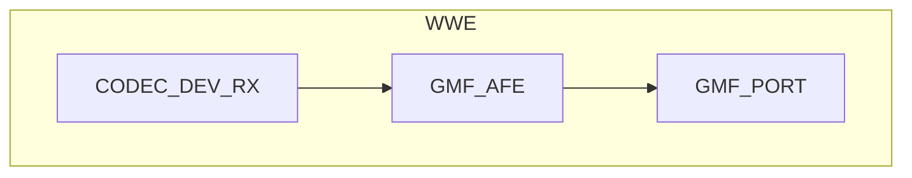

# Speech Recognition Example

- [中文版](./README_CN.md)
- Regular Example: ⭐⭐

## Example Brief

This example demonstrates how to use the `AFE element` for wake word detection, voice activity detection (VAD), and command word recognition. Features are configured via macro definitions in [main.c](./main/main.c) to achieve different application combinations.

### Typical Scenarios

- Offline wake word and command word: say the wake word then the command, or disable wake word and use commands directly
- Voice event recording: use VAD to save voice segments to files (e.g. `VOICE2FILE`) for later analysis

### Prerequisites

- Voice wake word and command word detection are from `esp-sr`; see [esp-sr](https://github.com/espressif/esp-sr/blob/master/README.md) for configuration and usage
- Familiarity with the [ESP-IDF Programming Guide](https://docs.espressif.com/projects/esp-idf/en/latest/esp32s3/index.html) is recommended

### GMF Pipeline



## Environment Setup

### Hardware Required

- **Board**: Default example is ESP32-S3-Korvo V3; other ESP audio boards are also applicable
- **Peripherals**: Microphone, Audio ADC, Audio DAC, I2S; SDCard required when `VOICE2FILE` is enabled

### Default IDF Branch

This example supports IDF release/v5.4 (>= v5.4.3) and release/v5.5 (>= v5.5.2).

### Software Requirements

- When `VOICE2FILE` is enabled, ensure the SD card is correctly installed; when `WAKENET_ENABLE` is enabled, say the wake word first then the command word

## Build and Flash

### Build Preparation

Before building this example, ensure the ESP-IDF environment is set up. If it is already set up, skip to the project directory. If not, run the following in the ESP-IDF root directory to complete the environment setup. For full steps, see the [ESP-IDF Programming Guide](https://docs.espressif.com/projects/esp-idf/en/latest/esp32s3/index.html).

```
./install.sh
. ./export.sh
```

Short steps:

- Go to this example's project directory (example path below; replace with your actual path):

```
cd $YOUR_GMF_PATH/elements/gmf_ai_audio/examples/wwe
```

- This example uses `esp_board_manager` for board-level resources; add board support first

On Linux / macOS:

```bash
idf.py set-target esp32s3
export IDF_EXTRA_ACTIONS_PATH=./managed_components/esp_board_manager
idf.py gen-bmgr-config -b esp32_s3_korvo2_v3
```

On Windows:

```powershell
idf.py set-target esp32s3
$env:IDF_EXTRA_ACTIONS_PATH = ".\managed_components\esp_board_manager"
idf.py gen-bmgr-config -b esp32_s3_korvo2_v3
```

For a custom board, see [Custom board](https://github.com/espressif/esp-gmf/blob/main/packages/esp_board_manager/README.md#custom-board).

### Build and Flash Commands

- Build the example:

```
idf.py build
```

- Flash the firmware and run the serial monitor (replace PORT with your port name):

```
idf.py -p PORT flash monitor
```

Exit the monitor with `Ctrl-]`.

## How to Use the Example

### Functionality and Usage

- **Macros**: In `main.c`, enable or disable features via the following macros to choose the application scenario:
  - `VOICE2FILE`: Save audio between VAD start and VAD end as a file
  - `WAKENET_ENABLE`: Enable wake word recognition
  - `VAD_ENABLE`: Enable voice activity detection
  - `VCMD_ENABLE`: Enable command word recognition
- **Run requirements**: When `VOICE2FILE` is enabled ensure the SD card is correctly installed; when `WAKENET_ENABLE` is enabled say the wake word first then the command word, or disable wake word to use commands directly
- **Results**: The serial console prints detected events; when `VOICE2FILE` is enabled, recordings are saved to the SD card with filenames `16k_16bit_1ch_{idx}.pcm`

### Log Output

The following is a sample of key log lines during run (AFE init, pipeline ready, wake and command events):

```c
I (1547) AFE: AFE Version: (2MIC_V250113)
I (1550) AFE: Input PCM Config: total 4 channels(2 microphone, 1 playback), sample rate:16000
I (1560) AFE: AFE Pipeline: [input] -> |AEC(SR_HIGH_PERF)| -> |SE(BSS)| -> |VAD(WebRTC)| -> |WakeNet(wn9_hilexin,)| -> [output]
I (1572) AFE_manager: Feed task, ch 4, chunk 1024, buf size 8192
I (1579) GMF_AFE: Create AFE, ai_afe-0x3c2dcf90
I (1584) GMF_AFE: Create AFE, ai_afe-0x3c2dd0b8
I (1589) GMF_AFE: New an object,ai_afe-0x3c2dd0b8
I (1595) ESP_GMF_TASK: Waiting to run... [tsk:TSK_0x3fcc500c-0x3fcc500c, wk:0x0, run:0]
I (1603) ESP_GMF_THREAD: The TSK_0x3fcc500c created on internal memory
I (1610) ESP_GMF_TASK: Waiting to run... [tsk:TSK_0x3fcc500c-0x3fcc500c, wk:0x3c2dd17c, run:0]
I (1620) AI_AUDIO_WWE: CB: RECV Pipeline EVT: el:NULL-0x3c2dd080, type:8192, sub:ESP_GMF_EVENT_STATE_OPENING, payload:0x0, size:0,0x0
I (1632) AFE_manager: AFE Ctrl [1, 0]
I (1637) AFE_manager: VAD ctrl ret 1
Build fst from commands.
Quantized MultiNet6:rnnt_ctc_1.0, name:mn6_cn, (Feb 18 2025 12:00:53)
Quantized MultiNet6 search method: 2, time out:5.8 s
I (2639) NEW_DATA_BUS: New ringbuffer:0x3c6feeb4, num:2, item_cnt:8192, db:0x3c6e2b3c
I (2643) NEW_DATA_BUS: New ringbuffer:0x3c6fe4d0, num:1, item_cnt:20480, db:0x3c6fcbd8
I (2651) AFE_manager: AFE manager suspend 1
I (2656) AFE_manager: AFE manager suspend 0
I (2661) AI_AUDIO_WWE: CB: RECV Pipeline EVT: el:ai_afe-0x3c2dd0b8, type:12288, sub:ESP_GMF_EVENT_STATE_INITIALIZED, payload:0x3fccd920, size:12,0x0
I (2675) AI_AUDIO_WWE: CB: RECV Pipeline EVT: el:ai_afe-0x3c2dd0b8, type:8192, sub:ESP_GMF_EVENT_STATE_RUNNING, payload:0x0, size:0,0x0
I (2688) ESP_GMF_TASK: One times job is complete, del[wk:0x3c2dd17c,ctx:0x3c2dd0b8, label:gmf_afe_open]
I (2698) ESP_GMF_PORT: ACQ IN, new self payload:0x3c2dd17c, port:0x3c2dd240, el:0x3c2dd0b8-ai_afe

Type 'help' to get the list of commands.
Use UP/DOWN arrows to navigate through command history.
Press TAB when typing command name to auto-complete.
I (2893) ESP_GMF_PORT: ACQ OUT, new self payload:0x3c6fc548, port:0x3c2dd280, el:0x3c2dd0b8-ai_afe
Audio > I (5668) AFE_manager: AFE Ctrl [1, 1]
I (5669) AFE_manager: VAD ctrl ret 1
I (5674) AI_AUDIO_WWE: WAKEUP_START [1 : 1]
I (6334) AI_AUDIO_WWE: VAD_START
W (7833) AI_AUDIO_WWE: Command 25, phrase_id 25, prob 0.998051, str:  da kai kong tiao
I (8110) AI_AUDIO_WWE: VAD_END
I (8128) AI_AUDIO_WWE: File closed
I (10110) AFE_manager: AFE Ctrl [1, 0]
I (10111) AFE_manager: VAD ctrl ret 1
I (10118) AI_AUDIO_WWE: WAKEUP_END
```

### References

- [esp-sr](https://github.com/espressif/esp-sr/blob/master/README.md)
- [ESP-IDF Programming Guide](https://docs.espressif.com/projects/esp-idf/en/latest/esp32s3/index.html)

## Troubleshooting

### Wake Word Not Detected

- Ensure `WAKENET_ENABLE` is set to `true`
- Verify that the model files are correctly loaded
- Check if the channel configuration matches the hardware

### Recording File Not Generated

- Ensure the SD card is correctly installed
- Verify that `VOICE2FILE` is set to `true`
- Confirm that speech is detected after wakeup

### Task Watchdog Timeout

- Ensure `esp_afe_manager_cfg_t.feed_task_setting.core` and `esp_afe_manager_cfg_t.fetch_task_setting.core` are set to different CPU cores
- Allocate tasks on the core where the timeout occurs appropriately

## Technical Support

For technical support, use the links below:

- Technical support: [esp32.com](https://esp32.com/viewforum.php?f=20) forum
- Issue reports and feature requests: [GitHub issue](https://github.com/espressif/esp-gmf/issues)

We will reply as soon as possible.
