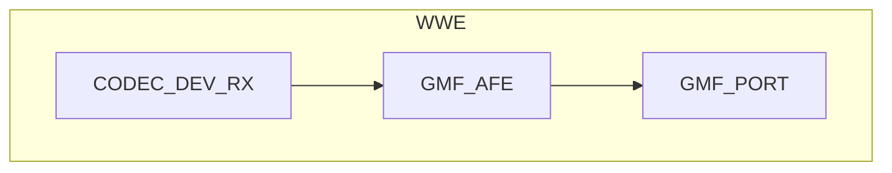

# 语音识别例程

- [English Version](./README.md)
- 例程难度：⭐⭐

## 例程简介

本例程介绍使用 `AFE element` 进行唤醒词、人声检测和命令词检测的方法，并通过 [main.c](./main/main.c) 中的宏定义配置功能，实现不同的应用组合。

### 典型场景

- 离线语音唤醒与命令词：设备待机时先说唤醒词再发命令词，或关闭唤醒后直接说命令词
- 语音事件记录：结合 VAD 将人声片段保存为文件（如 `VOICE2FILE`）便于后续分析

### 预备知识

- 例程中使用的语音唤醒和命令词检测源自 `esp-sr`，请先了解其配置与使用：[esp-sr](https://github.com/espressif/esp-sr/blob/master/README.md)
- 建议先熟悉 [《ESP-IDF 编程指南》](https://docs.espressif.com/projects/esp-idf/zh_CN/latest/esp32s3/index.html)

### GMF Pipeline



## 环境配置

### 硬件要求

- **开发板**：默认以 ESP32-S3-Korvo V3 为例，其他ESP音频板同样适用
- **外设**：麦克风、Audio ADC、Audio DAC, I2S；启用 `VOICE2FILE` 时需 SDCard

### 默认 IDF 分支

本例程支持 IDF release/v5.4(>= v5.4.3) and release/v5.5(>= v5.5.2) 分支。

### 软件要求

- 若启用 `VOICE2FILE`，请确保 SD 卡已正确安装；若启用 `WAKENET_ENABLE`，需先说出唤醒词再说命令词

## 编译和下载

### 编译准备

编译本例程前需先确保已配置 ESP-IDF 环境；若已配置可跳过本段，直接进入工程目录。若未配置，请在 ESP-IDF 根目录运行以下脚本完成环境设置，完整步骤请参阅 [《ESP-IDF 编程指南》](https://docs.espressif.com/projects/esp-idf/zh_CN/latest/esp32s3/index.html)。

```shell
./install.sh
. ./export.sh
```

下面是简略步骤：

- 进入本例程工程目录（以下为示例路径，请改为实际例程路径）：

```
cd $YOUR_GMF_PATH/elements/gmf_ai_audio/examples/wwe
```

- 本例程使用 `esp_board_manager` 管理板级资源，需先添加板级支持

在 Linux / macOS 中：

```bash
idf.py set-target esp32s3
export IDF_EXTRA_ACTIONS_PATH=./managed_components/esp_board_manager
idf.py gen-bmgr-config -b esp32_s3_korvo2_v3
```

在 Windows 中：

```powershell
idf.py set-target esp32s3
$env:IDF_EXTRA_ACTIONS_PATH = ".\managed_components\esp_board_manager"
idf.py gen-bmgr-config -b esp32_s3_korvo2_v3
```

如需选择自定义开发板，详情参考：[自定义板子](https://github.com/espressif/esp-gmf/blob/main/packages/esp_board_manager/README.md#custom-board)。

### 编译与烧录

- 编译示例程序

```
idf.py build
```

- 烧录程序并运行 monitor 工具来查看串口输出 (替换 PORT 为端口名称)：

```
idf.py -p PORT flash monitor
```

退出 monitor 可使用 `Ctrl-]`。

## 如何使用例程

### 功能和用法

- **宏定义**：在 `main.c` 中通过以下宏启用或禁用功能，选择对应应用场景：
  - `VOICE2FILE`：将 VAD 开始到 VAD 结束之间的音频保存为文件
  - `WAKENET_ENABLE`：唤醒词识别使能
  - `VAD_ENABLE`：人声检测使能
  - `VCMD_ENABLE`：命令词检测使能
- **运行要求**：若启用 `VOICE2FILE` 请确保 SD 卡已正确安装；若启用 `WAKENET_ENABLE` 需先说出唤醒词再说命令词，关闭唤醒则可直接说命令词
- **查看结果**：串口会打印检测到的事件日志；若启用 `VOICE2FILE`，录音文件将保存到 SD 卡，文件名格式为 `16k_16bit_1ch_{idx}.pcm`

### 日志输出

以下为运行过程中的关键日志示例（AFE 初始化、Pipeline 就绪、唤醒与命令词事件）：

```c
I (1547) AFE: AFE Version: (2MIC_V250113)
I (1550) AFE: Input PCM Config: total 4 channels(2 microphone, 1 playback), sample rate:16000
I (1560) AFE: AFE Pipeline: [input] -> |AEC(SR_HIGH_PERF)| -> |SE(BSS)| -> |VAD(WebRTC)| -> |WakeNet(wn9_hilexin,)| -> [output]
I (1572) AFE_manager: Feed task, ch 4, chunk 1024, buf size 8192
I (1579) GMF_AFE: Create AFE, ai_afe-0x3c2dcf90
I (1584) GMF_AFE: Create AFE, ai_afe-0x3c2dd0b8
I (1589) GMF_AFE: New an object,ai_afe-0x3c2dd0b8
I (1595) ESP_GMF_TASK: Waiting to run... [tsk:TSK_0x3fcc500c-0x3fcc500c, wk:0x0, run:0]
I (1603) ESP_GMF_THREAD: The TSK_0x3fcc500c created on internal memory
I (1610) ESP_GMF_TASK: Waiting to run... [tsk:TSK_0x3fcc500c-0x3fcc500c, wk:0x3c2dd17c, run:0]
I (1620) AI_AUDIO_WWE: CB: RECV Pipeline EVT: el:NULL-0x3c2dd080, type:8192, sub:ESP_GMF_EVENT_STATE_OPENING, payload:0x0, size:0,0x0
I (1632) AFE_manager: AFE Ctrl [1, 0]
I (1637) AFE_manager: VAD ctrl ret 1
Build fst from commands.
Quantized MultiNet6:rnnt_ctc_1.0, name:mn6_cn, (Feb 18 2025 12:00:53)
Quantized MultiNet6 search method: 2, time out:5.8 s
I (2639) NEW_DATA_BUS: New ringbuffer:0x3c6feeb4, num:2, item_cnt:8192, db:0x3c6e2b3c
I (2643) NEW_DATA_BUS: New ringbuffer:0x3c6fe4d0, num:1, item_cnt:20480, db:0x3c6fcbd8
I (2651) AFE_manager: AFE manager suspend 1
I (2656) AFE_manager: AFE manager suspend 0
I (2661) AI_AUDIO_WWE: CB: RECV Pipeline EVT: el:ai_afe-0x3c2dd0b8, type:12288, sub:ESP_GMF_EVENT_STATE_INITIALIZED, payload:0x3fccd920, size:12,0x0
I (2675) AI_AUDIO_WWE: CB: RECV Pipeline EVT: el:ai_afe-0x3c2dd0b8, type:8192, sub:ESP_GMF_EVENT_STATE_RUNNING, payload:0x0, size:0,0x0
I (2688) ESP_GMF_TASK: One times job is complete, del[wk:0x3c2dd17c,ctx:0x3c2dd0b8, label:gmf_afe_open]
I (2698) ESP_GMF_PORT: ACQ IN, new self payload:0x3c2dd17c, port:0x3c2dd240, el:0x3c2dd0b8-ai_afe

Type 'help' to get the list of commands.
Use UP/DOWN arrows to navigate through command history.
Press TAB when typing command name to auto-complete.
I (2893) ESP_GMF_PORT: ACQ OUT, new self payload:0x3c6fc548, port:0x3c2dd280, el:0x3c2dd0b8-ai_afe
Audio > I (5668) AFE_manager: AFE Ctrl [1, 1]
I (5669) AFE_manager: VAD ctrl ret 1
I (5674) AI_AUDIO_WWE: WAKEUP_START [1 : 1]
I (6334) AI_AUDIO_WWE: VAD_START
W (7833) AI_AUDIO_WWE: Command 25, phrase_id 25, prob 0.998051, str:  da kai kong tiao
I (8110) AI_AUDIO_WWE: VAD_END
I (8128) AI_AUDIO_WWE: File closed
I (10110) AFE_manager: AFE Ctrl [1, 0]
I (10111) AFE_manager: VAD ctrl ret 1
I (10118) AI_AUDIO_WWE: WAKEUP_END
```

### 参考文献

- [esp-sr](https://github.com/espressif/esp-sr/blob/master/README.md)
- [ESP-IDF 编程指南](https://docs.espressif.com/projects/esp-idf/zh_CN/latest/esp32s3/index.html)

## 故障排除

### 无法检测唤醒词

- 确保 `WAKENET_ENABLE` 设置为 `true`
- 检查模型文件是否正确加载
- 确认配置的通道顺序是否符合硬件实际

### 录音文件未生成

- 确保 SD 卡已正确安装
- 检查 `VOICE2FILE` 是否设置为 `true`
- 确认唤醒后是否有说话

### Task Watch Dog

- 确保 `esp_afe_manager_cfg_t.feed_task_setting.core` 和 `esp_afe_manager_cfg_t.fetch_task_setting.core` 配置在不同的 CPU 核心上
- 将出现 `task wdt` 的核上任务合理分配

## 技术支持

请按照下面的链接获取技术支持：

- 技术支持参见 [esp32.com](https://esp32.com/viewforum.php?f=20) 论坛
- 问题反馈与功能需求，请创建 [GitHub issue](https://github.com/espressif/esp-gmf/issues)

我们会尽快回复。
