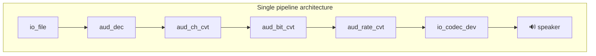
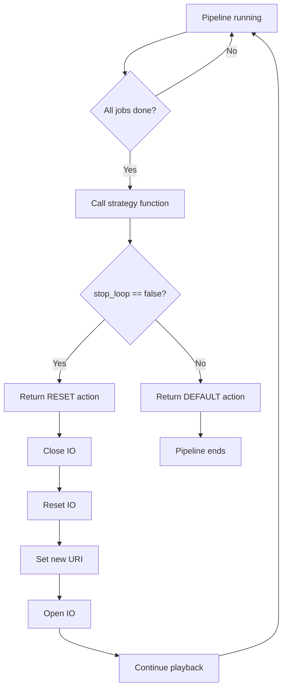
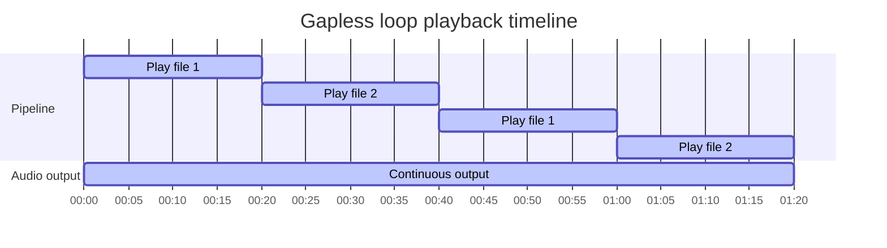

# Loop Music Playback Without Gap

- [中文版](./README_CN.md)
- Basic Example: ⭐

## Example Brief

This example demonstrates how to use the GMF task strategy function to achieve gapless loop playback of music files from a microSD card.

- When the current file finishes, the strategy callback automatically switches to the next file without stopping the pipeline, avoiding gaps between tracks.
- Playback can stop after a given duration (default 60 seconds).
- Single pipeline: `io_file` → `aud_dec` → channel/bit/sample-rate conversion → `io_codec_dev`, with `esp_gmf_task_set_strategy_func` registering the strategy so the next file in the list is played on finish.

### Typical Scenarios

- Background music, announcement playlists, or any scenario that requires continuous, gapless playback of multiple files.

### Run Flow

- Architecture



- Strategy function workflow



- Loop playback timeline



## Environment Setup

### Hardware Required

- **Board**: ESP32-S3-Korvo V3 by default; other ESP audio boards are also supported.
- **Resource requirements**: microSD card, Audio DAC, speaker.

### Default IDF Branch

This example supports IDF release/v5.4 (>= v5.4.3) and release/v5.5 (>= v5.5.2).

### Software Requirements

- Place audio files on the microSD root to match the playlist (default: `test.mp3`, `test_short.mp3`).
- You can change the list and duration via `play_urls[]` and `PLAYBACK_DURATION_MS` in the code.

## Build and Flash

### Build Preparation

Before building this example, ensure the ESP-IDF environment is set up. If it is already set up, skip this paragraph and go to the project directory and run the pre-build script(s) as follows. If not, run the following in the ESP-IDF root directory to complete the environment setup. For full steps, see the [ESP-IDF Programming Guide](https://docs.espressif.com/projects/esp-idf/en/latest/esp32s3/index.html).

```
./install.sh
. ./export.sh
```

Short steps:

- Go to this example's project directory:

```
cd $YOUR_GMF_PATH/gmf_examples/basic_examples/pipeline_loop_play_no_gap
```

- Run the pre-build script: follow the prompts to select the target chip, set up the IDF Action extension, and use `esp_board_manager` to select a supported board. For a custom board, see [Custom board](https://github.com/espressif/esp-gmf/blob/main/packages/esp_board_manager/README.md#custom-board).

On Linux / macOS:
```bash/zsh
source prebuild.sh
```

On Windows:
```powershell
.\prebuild.ps1
```

### Project Configuration

- To adjust audio parameters (sample rate, channels, bit depth), configure GMF Audio options in menuconfig; default is fine for a quick build.

```bash
idf.py menuconfig
```

Configure the following in menuconfig:

- `ESP GMF Loader` → `GMF Audio Configurations` → `GMF Audio Effects` → `Channel Convert Destination Channel`
- `ESP GMF Loader` → `GMF Audio Configurations` → `GMF Audio Effects` → `Bit Convert Destination Bits`
- `ESP GMF Loader` → `GMF Audio Configurations` → `GMF Audio Effects` → `Rate Convert Destination Rate`

> Press `s` to save and `Esc` to exit after configuration.

### Build and Flash Commands

- Build the example:

```
idf.py build
```

- Flash the firmware and run the serial monitor (replace PORT with your port name):

```
idf.py -p PORT flash monitor
```

- To exit the monitor, use `Ctrl-]`

## How to Use the Example

### Functionality and Usage

- After power-on, the example mounts the microSD card and initializes audio output, then loops over the files in `play_urls[]` for the configured duration (default 60 s, controlled by `PLAYBACK_DURATION_MS`). When the duration is reached, a stop flag is set; the pipeline stops after the current file and releases resources. During playback you will hear gapless switching between files.
- Change the playlist and duration in `main/play_music_without_gap.c` via `play_urls[]` and `PLAYBACK_DURATION_MS`.

### Log Output

- Normal run: register elements and set audio info, create pipeline, bind task and load jobs, listen events, start pipeline, loop play files, then wait for stop and destroy resources. Key steps are marked with `[ 1 ]`–`[ 6 ]` and `Play file:`.

```c
I (914) main_task: Calling app_main()
I (915) PLAY_MUSIC_NO_GAP: [ 1 ] Mount sdcard and setup audio codec
Name: SA32G
Type: SDHC
Speed: 40.00 MHz (limit: 40.00 MHz)
Size: 29544MB
CSD: ver=2, sector_size=512, capacity=60506112 read_bl_len=9
SSR: bus_width=1
I (994) PLAY_MUSIC_NO_GAP: [ 2 ] Register all the elements and set audio information to play codec device
I (996) PLAY_MUSIC_NO_GAP: [ 3 ] Create audio pipeline
I (998) PLAY_MUSIC_NO_GAP: [ 3.1 ] Create gmf task, bind task to pipeline and load linked element jobs to the bind task
I (1009) PLAY_MUSIC_NO_GAP: [ 3.2 ] Create event group and listen events from pipeline
I (1016) PLAY_MUSIC_NO_GAP: [ 4 ] Start audio_pipeline
I (1021) PLAY_MUSIC_NO_GAP: [ 4.1 ] Playing 60000ms before change strategy
I (1024) PLAY_MUSIC_NO_GAP: CB: RECV Pipeline EVT: el: NULL-0x3c128d18, type: 2000, sub: ESP_GMF_EVENT_STATE_OPENING, payload: 0x0, size: 0, 0x3fcec33c
W (1044) ESP_GMF_ASMP_DEC: Not enough memory for out, need:2304, old: 1024, new: 2304
I (1191) PLAY_MUSIC_NO_GAP: CB: RECV Pipeline EVT: el: aud_rate_cvt-0x3c129118, type: 3000, sub: ESP_GMF_EVENT_STATE_INITIALIZED, payload: 0x3c12a2e0, size: 16, 0x3fcec33c
I (1195) PLAY_MUSIC_NO_GAP: CB: RECV Pipeline EVT: el: aud_rate_cvt-0x3c129118, type: 2000, sub: ESP_GMF_EVENT_STATE_RUNNING, payload: 0x0, size: 0, 0x3fcec33c
I (8873) PLAY_MUSIC_NO_GAP: Play file: /sdcard/test_short.mp3
I (16586) PLAY_MUSIC_NO_GAP: Play file: /sdcard/test.mp3
I (24308) PLAY_MUSIC_NO_GAP: Play file: /sdcard/test_short.mp3
I (32018) PLAY_MUSIC_NO_GAP: Play file: /sdcard/test.mp3
I (39731) PLAY_MUSIC_NO_GAP: Play file: /sdcard/test_short.mp3
I (47453) PLAY_MUSIC_NO_GAP: Play file: /sdcard/test.mp3
I (55166) PLAY_MUSIC_NO_GAP: Play file: /sdcard/test_short.mp3
I (61043) PLAY_MUSIC_NO_GAP: [ 5 ] Wait stop event to the pipeline and stop all the pipeline
I (62885) PLAY_MUSIC_NO_GAP: CB: RECV Pipeline EVT: el: NULL-0x3c128d18, type: 2000, sub: ESP_GMF_EVENT_STATE_FINISHED, payload: 0x0, size: 0, 0x3fcec33c
I (62888) PLAY_MUSIC_NO_GAP: [ 6 ] Destroy all the resources
W (62894) GMF_SETUP_AUD_CODEC: Unregistering default decoder
E (62909) i2s_common: i2s_channel_disable(1262): the channel has not been enabled yet
W (62910) PERIPH_I2S: Caution: Releasing TX (0x0).
W (62911) PERIPH_I2S: Caution: RX (0x3c127fb4) forced to stop.
E (62916) i2s_common: i2s_channel_disable(1262): the channel has not been enabled yet
```

## Troubleshooting

### Audio file not found

If the log shows the error below, ensure the playlist files exist on the microSD root (default: `test.mp3`, `test_short.mp3`) and that paths in `play_urls[]` match the filenames on the card:

```c
E (1133) ESP_GMF_FILE: Failed to open on read, path: /sdcard/test.mp3, err: No such file or directory
E (1140) ESP_GMF_IO: esp_gmf_io_open(71): esp_gmf_io_open failed
```

### Unsupported audio format

- Use a format supported by the example (e.g. MP3, FLAC, AAC). All files in the playlist must use the same format. See [esp_audio_codec](https://github.com/espressif/esp-adf-libs/tree/master/esp_audio_codec).

## Technical Support

For technical support, use the links below:

- Technical support: [esp32.com](https://esp32.com/viewforum.php?f=20) forum
- Issue reports and feature requests: [GitHub issue](https://github.com/espressif/esp-gmf/issues)

We will reply as soon as possible.
