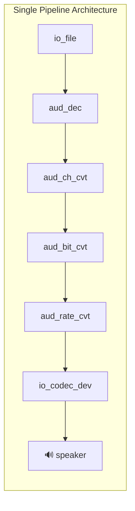
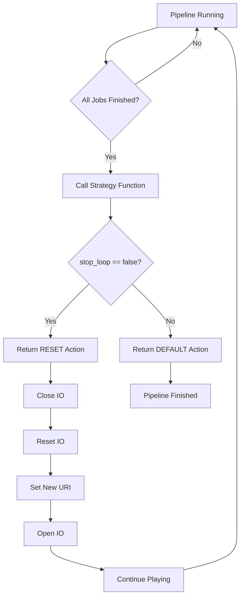

# Loop Music Playback Without Gap

- [中文版](./README_CN.md)
- Basic Example ⭐

## Example Brief

This example demonstrates how to use the ESP GMF framework's task strategy function to achieve seamless loop playback of music files. By registering a strategy callback function, when the pipeline finishes playing an audio file, it automatically switches to the next file and continues playing without stopping the pipeline, eliminating traditional gaps or pauses that occur during music looping. The example supports time-based playback control and can automatically stop playback after a specified duration.

### Core Features

- **Single Pipeline Architecture**: Uses one decode pipeline to complete the entire playback process, simple and efficient
- **Strategy Function Mechanism**: Uses `esp_gmf_task_set_strategy_func` to register a callback function that handles file switching when playback completes
- **Multi-Format Support**: Supports MP3(default), FLAC, AAC, G711A, OPUS, AMR-NB, AMR-WB and other audio formats
- **Playlist Support**: Supports multiple audio files(need same format) in a playlist for loop playback

### Key Configuration Parameters

- `PLAYBACK_DURATION_MS`: Playback duration in milliseconds (default: 60000ms)
- `play_urls[]`: Playlist array containing audio file paths
- `stop_loop`: Boolean flag to control whether to stop loop playback

### Architecture Principle



### Strategy Function Workflow



### Loop Playback Timeline


## Example Set Up

### Default IDF Branch

This example needs use release/v5.4(>=v5.4.3) and release/v5.5(>=v5.5.2) branches for IDF.

### Configuration

This example requires a microSD card with audio files. By default, the example uses the following playlist:

```c
static const char *play_urls[] = {
    "/sdcard/test.mp3",
    "/sdcard/test_short.mp3"
};
```

Please ensure the audio files are stored in the root directory of the microSD card.

Users can modify the `play_urls[]` array in the code to change the playlist and the `PLAYBACK_DURATION_MS` macro to adjust the playback duration.

### Build and Flash

Before compiling this example, ensure that the ESP-IDF environment is properly configured. If it is already set up, you can proceed to the next configuration step. If not, run the following script in the root directory of ESP-IDF to set up the build environment. For detailed steps on configuring and using ESP-IDF, please refer to the [ESP-IDF Programming Guide](https://docs.espressif.com/projects/esp-idf/en/latest/esp32s3/index.html)

```
./install.sh
. ./export.sh
```

Here are the summarized steps for compilation:

- Enter the location where the loop music playback without gap test project is stored

```
cd $YOUR_GMF_PATH/gmf_examples/basic_examples/pipeline_loop_play_no_gap
```

- Execute the prebuild script, select the target chip, automatically setup IDF Action Extension

On Linux / macOS, run following command:
```bash/zsh
source prebuild.sh
```

On Windows, run following command:
```powershell
.\prebuild.ps1
```

- Build the Example

```
idf.py build
```

- Flash the program and run the monitor tool to view serial output (replace PORT with the port name):

```
idf.py -p PORT flash monitor
```

- Exit the debugging interface using ``Ctrl-]``

## How to use the Example

### Functionality and Usage

- After the example starts running, it automatically creates a single pipeline and loops the playlist on the microSD card for the specified duration (configured by `PLAYBACK_DURATION_MS`, default is 60 seconds). After reaching the specified playback time, the program sets a stop flag, and the pipeline stops and exits after the current file finishes playing. During playback, you can observe the seamless switching between files:

```c
W (952) PERIPH_I2S: I2S[0] STD already enabled, tx:0x3c117df8, rx:0x3c117fb4
I (982) PLAY_MUSIC_NO_GAP: [ 2 ] Register all the elements and set audio information to play codec device
I (984) PLAY_MUSIC_NO_GAP: [ 3 ] Create audio pipeline
I (986) PLAY_MUSIC_NO_GAP: [ 3.1 ] Create gmf task, bind task to pipeline and load linked element jobs to the bind task
I (997) PLAY_MUSIC_NO_GAP: [ 3.2 ] Create event group and listen events from pipeline
I (1004) PLAY_MUSIC_NO_GAP: [ 4 ] Start audio_pipeline
I (1011) PLAY_MUSIC_NO_GAP: CB: RECV Pipeline EVT: el: NULL-0x3c118c68, type: 2000, sub: ESP_GMF_EVENT_STATE_OPENING, payload: 0x0, size: 0, 0x3fcec32c
I (1022) PLAY_MUSIC_NO_GAP: [ 4.1 ] Playing 60000ms before change strategy
W (1025) ESP_GMF_ASMP_DEC: Not enough memory for out, need:2304, old: 1024, new: 2304
I (1179) PLAY_MUSIC_NO_GAP: CB: RECV Pipeline EVT: el: aud_rate_cvt-0x3c119068, type: 3000, sub: ESP_GMF_EVENT_STATE_INITIALIZED, payload: 0x3c11a160, size: 16, 0x3fcec32c
I (1183) PLAY_MUSIC_NO_GAP: CB: RECV Pipeline EVT: el: aud_rate_cvt-0x3c119068, type: 2000, sub: ESP_GMF_EVENT_STATE_RUNNING, payload: 0x0, size: 0, 0x3fcec32c
I (8861) PLAY_MUSIC_NO_GAP: Play file: /sdcard/test_short.mp3
I (16573) PLAY_MUSIC_NO_GAP: Play file: /sdcard/test.mp3
I (24296) PLAY_MUSIC_NO_GAP: Play file: /sdcard/test_short.mp3
I (32005) PLAY_MUSIC_NO_GAP: Play file: /sdcard/test.mp3
I (39720) PLAY_MUSIC_NO_GAP: Play file: /sdcard/test_short.mp3
I (47440) PLAY_MUSIC_NO_GAP: Play file: /sdcard/test.mp3
I (55155) PLAY_MUSIC_NO_GAP: Play file: /sdcard/test_short.mp3
I (61212) PLAY_MUSIC_NO_GAP: [ 5 ] Wait stop event to the pipeline and stop all the pipeline
I (62873) PLAY_MUSIC_NO_GAP: CB: RECV Pipeline EVT: el: NULL-0x3c118c68, type: 2000, sub: ESP_GMF_EVENT_STATE_FINISHED, payload: 0x0, size: 0, 0x3fcec32c
I (62876) PLAY_MUSIC_NO_GAP: [ 6 ] Destroy all the resources
```

### Key Implementation Details

1. **Strategy Context Structure**: The `pipeline_strategy_ctx_t` structure maintains the playback state:
   - `stop_loop`: Boolean flag to control whether to stop loop playback
   - `play_index`: Current playback index
   - `file_count`: Total number of files in the playlist
   - `file_path`: Array of file paths
   - `io`: IO handle for the pipeline input

2. **Strategy Function Logic**: The `pipeline_strategy_finish_func` is called when:
   - `GMF_TASK_STRATEGY_TYPE_FINISH`: All jobs completed (file playback finished)
   - `GMF_TASK_STRATEGY_TYPE_ABORT`: Job returned abort error

3. **Seamless Switching**: When a file finishes, the strategy function:
   - Increments `play_index`
   - Checks the `stop_loop` flag status
   - If `stop_loop` is false: Returns `GMF_TASK_STRATEGY_ACTION_RESET`, switches IO to next file
   - If `stop_loop` is true: Returns `GMF_TASK_STRATEGY_ACTION_DEFAULT`, pipeline finishes normally

## Troubleshooting

### Audio File Not Found

If your log shows the following error message, this indicates that the required audio file is not found on the microSD card. Please ensure the audio file is correctly named and stored on the card:

```c
E (1133) ESP_GMF_FILE: Failed to open on read, path: /sdcard/test.mp3, err: No such file or directory
E (1140) ESP_GMF_IO: esp_gmf_io_open(71): esp_gmf_io_open failed
```

**Solution**: Ensure all audio files in the `play_urls[]` playlist exist in the root directory of the microSD card.

### Unsupported Audio Format

Ensure the audio format being used is in the supported list. For details, refer to: [esp_audio_codec](https://github.com/espressif/esp-adf-libs/tree/master/esp_audio_codec)
