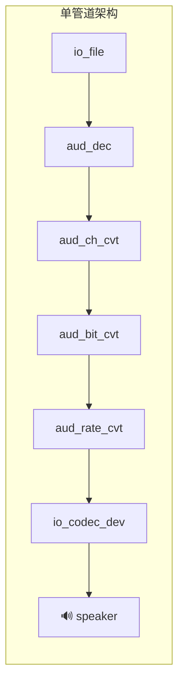
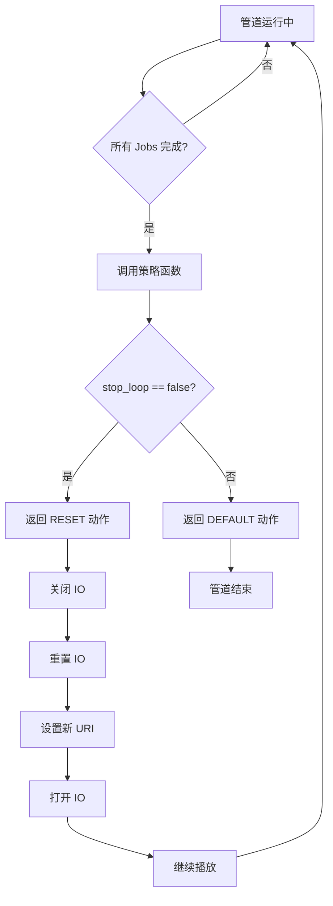
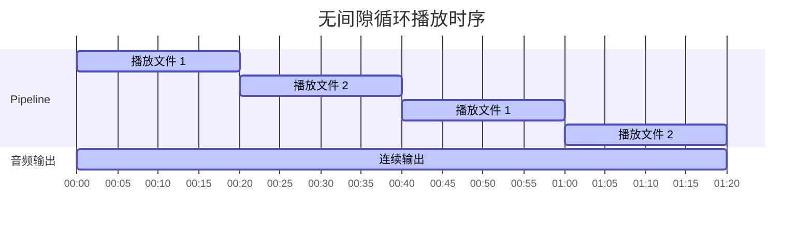

# 无缝循环播放音乐

- [English](./README.md)
- 例程难度 ⭐

## 例程简介

本例程展示了如何使用 ESP GMF 框架的任务策略函数（Task Strategy Function）实现音乐文件的无缝循环播放。通过注册策略回调函数，当管道播放完一个音频文件时，自动切换到下一个文件继续播放，无需停止管道，消除传统播放器在循环时产生的停顿或间隙。该例程支持基于时间的播放控制，可以在指定时间后自动停止播放。

### 核心特性

- **单管道架构**: 使用一个解码管道完成整个播放过程，简单高效
- **策略函数机制**: 使用 `esp_gmf_task_set_strategy_func` 注册回调函数，在播放完成时处理文件切换
- **多格式支持**: 支持 MP3(default)、FLAC、AAC、G711A、OPUS、AMR-NB、AMR-WB 等多种音频格式
- **播放列表支持**: 支持多个音频文件（同样格式的音乐）组成播放列表进行循环播放

### 关键配置参数

- `PLAYBACK_DURATION_MS`: 播放持续时间，以毫秒为单位（默认: 60000ms）
- `play_urls[]`: 播放列表数组，包含音频文件路径
- `stop_loop`: 控制是否停止循环播放的布尔标志

### 架构原理



### 策略函数工作流程



### 循环播放时序图



## 示例创建

### IDF 默认分支

本例程支持 IDF release/v5.4(>= v5.4.3) and release/v5.5(>= v5.5.2) 分支。

### 配置

本例程需要准备一张 microSD 卡，并存储音频文件。默认情况下，例程使用以下播放列表：

```c
static const char *play_urls[] = {
    "/sdcard/test.mp3",
    "/sdcard/test_short.mp3"
};
```

请确保音频文件存储在 microSD 卡的根目录中。

用户可通过修改代码中的 `play_urls[]` 数组来更改播放列表，以及修改 `PLAYBACK_DURATION_MS` 宏来调整播放持续时间。

### 编译和下载

编译本例程前需要先确保已配置 ESP-IDF 的环境，如果已配置可跳到下一项配置，如果未配置需要先在 ESP-IDF 根目录运行下面脚本设置编译环境，有关配置和使用 ESP-IDF 完整步骤，请参阅 [《ESP-IDF 编程指南》](https://docs.espressif.com/projects/esp-idf/zh_CN/latest/esp32s3/index.html)：

```
./install.sh
. ./export.sh
```

下面是简略编译步骤：

- 进入循环播放无间隙音乐测试工程存放位置

```
cd $YOUR_GMF_PATH/gmf_examples/basic_examples/pipeline_loop_play_no_gap
```

- 执行预编译脚本，根据提示选择编译芯片，自动设置 IDF Action 扩展

在 Linux / macOS 中运行以下命令：
```bash/zsh
source prebuild.sh
```

在 Windows 中运行以下命令：
```powershell
.\prebuild.ps1
```

- 编译例子程序

```
idf.py build
```

- 烧录程序并运行 monitor 工具来查看串口输出 (替换 PORT 为端口名称)：

```
idf.py -p PORT flash monitor
```

- 退出调试界面使用 ``Ctrl-]``

## 如何使用例程

### 功能和用法

- 例程开始运行后，会自动创建单个管道，在指定时间内（由 `PLAYBACK_DURATION_MS` 配置，默认 60 秒）循环播放 microSD 卡中播放列表的音乐文件。达到指定播放时间后，程序会设置停止标志，管道在当前文件播放完成后停止并退出。播放过程中可以观察到文件之间的无缝切换：

```c
W (952) PERIPH_I2S: I2S[0] STD already enabled, tx:0x3c117df8, rx:0x3c117fb4
I (982) PLAY_MUSIC_NO_GAP: [ 2 ] Register all the elements and set audio information to play codec device
I (984) PLAY_MUSIC_NO_GAP: [ 3 ] Create audio pipeline
I (986) PLAY_MUSIC_NO_GAP: [ 3.1 ] Create gmf task, bind task to pipeline and load linked element jobs to the bind task
I (997) PLAY_MUSIC_NO_GAP: [ 3.2 ] Create event group and listen events from pipeline
I (1004) PLAY_MUSIC_NO_GAP: [ 4 ] Start audio_pipeline
I (1011) PLAY_MUSIC_NO_GAP: CB: RECV Pipeline EVT: el: NULL-0x3c118c68, type: 2000, sub: ESP_GMF_EVENT_STATE_OPENING, payload: 0x0, size: 0, 0x3fcec32c
I (1022) PLAY_MUSIC_NO_GAP: [ 4.1 ] Playing 60000ms before change strategy
W (1025) ESP_GMF_ASMP_DEC: Not enough memory for out, need:2304, old: 1024, new: 2304
I (1179) PLAY_MUSIC_NO_GAP: CB: RECV Pipeline EVT: el: aud_rate_cvt-0x3c119068, type: 3000, sub: ESP_GMF_EVENT_STATE_INITIALIZED, payload: 0x3c11a160, size: 16, 0x3fcec32c
I (1183) PLAY_MUSIC_NO_GAP: CB: RECV Pipeline EVT: el: aud_rate_cvt-0x3c119068, type: 2000, sub: ESP_GMF_EVENT_STATE_RUNNING, payload: 0x0, size: 0, 0x3fcec32c
I (8861) PLAY_MUSIC_NO_GAP: Play file: /sdcard/test_short.mp3
I (16573) PLAY_MUSIC_NO_GAP: Play file: /sdcard/test.mp3
I (24296) PLAY_MUSIC_NO_GAP: Play file: /sdcard/test_short.mp3
I (32005) PLAY_MUSIC_NO_GAP: Play file: /sdcard/test.mp3
I (39720) PLAY_MUSIC_NO_GAP: Play file: /sdcard/test_short.mp3
I (47440) PLAY_MUSIC_NO_GAP: Play file: /sdcard/test.mp3
I (55155) PLAY_MUSIC_NO_GAP: Play file: /sdcard/test_short.mp3
I (61212) PLAY_MUSIC_NO_GAP: [ 5 ] Wait stop event to the pipeline and stop all the pipeline
I (62873) PLAY_MUSIC_NO_GAP: CB: RECV Pipeline EVT: el: NULL-0x3c118c68, type: 2000, sub: ESP_GMF_EVENT_STATE_FINISHED, payload: 0x0, size: 0, 0x3fcec32c
I (62876) PLAY_MUSIC_NO_GAP: [ 6 ] Destroy all the resources
```

### 关键实现细节

1. **策略上下文结构体**: `pipeline_strategy_ctx_t` 结构体维护播放状态：
   - `stop_loop`: 控制是否停止循环播放的布尔标志
   - `play_index`: 当前播放索引
   - `file_count`: 播放列表中的文件总数
   - `file_path`: 文件路径数组
   - `io`: 管道输入的 IO 句柄

2. **策略函数逻辑**: `pipeline_strategy_finish_func` 在以下情况被调用：
   - `GMF_TASK_STRATEGY_TYPE_FINISH`: 所有 jobs 完成（文件播放结束）
   - `GMF_TASK_STRATEGY_TYPE_ABORT`: job 返回中止错误

3. **无缝切换原理**: 当文件播放完成时，策略函数：
   - 递增 `play_index`
   - 检查 `stop_loop` 标志状态
   - 如果 `stop_loop` 为 false：返回 `GMF_TASK_STRATEGY_ACTION_RESET`，将 IO 切换到下一个文件
   - 如果 `stop_loop` 为 true：返回 `GMF_TASK_STRATEGY_ACTION_DEFAULT`，管道正常结束

## 故障排除

### 音频文件未找到

如果您的日志有如下的错误提示，这是因为在 microSD 卡中没有找到需要播放的音频文件，请确保音频文件已正确命名并存储在卡中：

```c
E (1133) ESP_GMF_FILE: Failed to open on read, path: /sdcard/test.mp3, err: No such file or directory
E (1140) ESP_GMF_IO: esp_gmf_io_open(71): esp_gmf_io_open failed
```

**解决方案**: 确保 `play_urls[]` 播放列表中的所有音频文件都存在于 microSD 卡的根目录中。

### 音频格式不支持

- 确保使用的音频格式在支持列表中，详情参考：[esp_audio_codec](https://github.com/espressif/esp-adf-libs/tree/master/esp_audio_codec)
