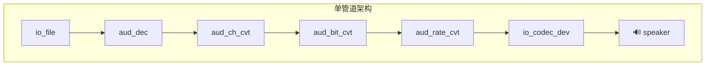
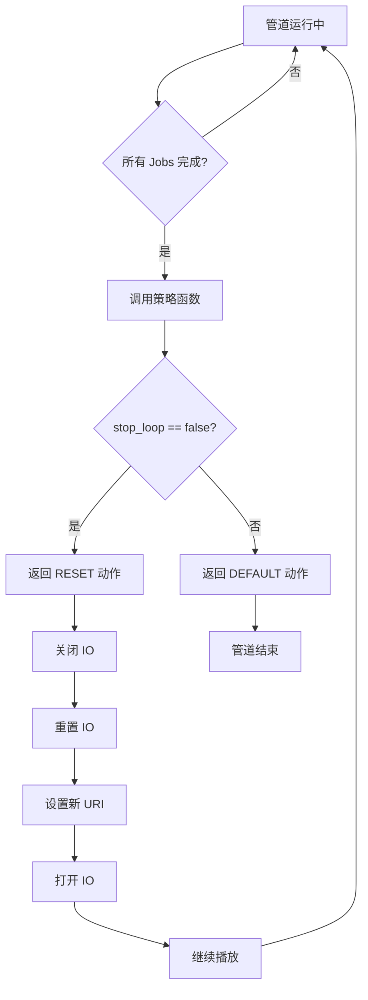
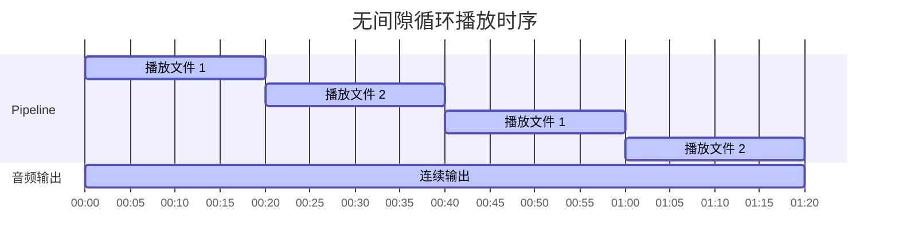

# 无缝循环播放音乐

- [English Version](./README.md)
- 例程难度：⭐

## 例程简介

本示例展示了如何使用 GMF 任务策略函数实现 microSD 卡中音乐文件的无缝循环播放。

- 支持播放完当前文件后通过策略回调自动切换下一首，无需停止管道，避免循环时的停顿或间隙。
- 支持给定时间后停止（默认播放 60 秒后停止）。
- 本示例使用单管道架构：`io_file` → `aud_dec` → 声道/位深/采样率转换 → `io_codec_dev`，并通过 `esp_gmf_task_set_strategy_func` 注册策略函数，在播放完成时切换播放列表中的下一个文件。

### 典型场景

- 背景音乐、播报列表等需要多文件连续、无间隙循环播放的场景。

### 运行机制

- 架构原理



- 策略函数工作流程



- 循环播放时序图



## 环境配置

### 硬件要求

- **开发板**：默认以 ESP32-S3-Korvo V3 为例，其他 ESP 音频板同样适用。
- **资源要求**：microSD 卡、Audio DAC、扬声器。

### 默认 IDF 分支

本例程支持 IDF release/v5.4 (>= v5.4.3) 与 release/v5.5 (>= v5.5.2) 分支。

### 软件要求

- 在 microSD 卡根目录放置与播放列表一致的音频文件（默认需 `test.mp3`、`test_short.mp3`）。
- 可通过修改代码中的 `play_urls[]` 和 `PLAYBACK_DURATION_MS` 调整列表与播放时长。

## 编译和下载

### 编译准备

编译本例程前需先确保已配置 ESP-IDF 环境；若已配置可跳过本段，直接进入工程目录并运行相关预编译脚本。若未配置，请在 ESP-IDF 根目录运行以下脚本完成环境设置，完整步骤请参阅 [《ESP-IDF 编程指南》](https://docs.espressif.com/projects/esp-idf/zh_CN/latest/esp32s3/index.html)。

```
./install.sh
. ./export.sh
```

下面是简略步骤：

- 进入本例程工程目录：

```
cd $YOUR_GMF_PATH/gmf_examples/basic_examples/pipeline_loop_play_no_gap
```

- 执行预编译脚本，根据提示选择编译芯片，自动设置 IDF Action 扩展，通过 `esp_board_manager` 选择支持的开发板，如需选择自定义开发板，详情参考：[自定义板子](https://github.com/espressif/esp-gmf/blob/main/packages/esp_board_manager/README.md#custom-board)

在 Linux / macOS 中运行以下命令：
```bash/zsh
source prebuild.sh
```

在 Windows 中运行以下命令：
```powershell
.\prebuild.ps1
```

### 项目配置

- 若需调整音频效果相关参数（采样率、声道、位深等），可在 menuconfig 中配置 GMF Audio 相关选项；默认可直接编译。

```bash
idf.py menuconfig
```

在 menuconfig 中进行以下配置：

- `ESP GMF Loader` → `GMF Audio Configurations` → `GMF Audio Effects` → `Channel Convert Destination Channel`
- `ESP GMF Loader` → `GMF Audio Configurations` → `GMF Audio Effects` → `Bit Convert Destination Bits`
- `ESP GMF Loader` → `GMF Audio Configurations` → `GMF Audio Effects` → `Rate Convert Destination Rate`

> 配置完成后按 `s` 保存，然后按 `Esc` 退出。

### 编译与烧录

- 编译示例程序

```
idf.py build
```

- 烧录程序并运行 monitor 工具来查看串口输出 (替换 PORT 为端口名称)：

```
idf.py -p PORT flash monitor
```

- 退出调试界面使用 `Ctrl-]`

## 如何使用例程

### 功能和用法

- 上电后例程会挂载 microSD 卡并初始化音频输出，在指定时间内（默认 60 秒，由 `PLAYBACK_DURATION_MS` 控制）循环播放 `play_urls[]` 中的文件。到达时间后设置停止标志，当前文件播完后管道停止并释放资源。播放过程中可听到文件之间的无缝切换。
- 播放列表与时长可在 `main/play_music_without_gap.c` 中修改 `play_urls[]` 和 `PLAYBACK_DURATION_MS`。

### 日志输出

- 正常流程会依次打印：注册元素与设置音频信息、创建 pipeline、绑定任务与加载 jobs、监听事件、启动 pipeline、循环播放各文件，最后等待停止事件并销毁资源。关键步骤以 `[ 1 ]`～`[ 6 ]` 及 `Play file:` 标出。

```c
I (914) main_task: Calling app_main()
I (915) PLAY_MUSIC_NO_GAP: [ 1 ] Mount sdcard and setup audio codec
Name: SA32G
Type: SDHC
Speed: 40.00 MHz (limit: 40.00 MHz)
Size: 29544MB
CSD: ver=2, sector_size=512, capacity=60506112 read_bl_len=9
SSR: bus_width=1
I (994) PLAY_MUSIC_NO_GAP: [ 2 ] Register all the elements and set audio information to play codec device
I (996) PLAY_MUSIC_NO_GAP: [ 3 ] Create audio pipeline
I (998) PLAY_MUSIC_NO_GAP: [ 3.1 ] Create gmf task, bind task to pipeline and load linked element jobs to the bind task
I (1009) PLAY_MUSIC_NO_GAP: [ 3.2 ] Create event group and listen events from pipeline
I (1016) PLAY_MUSIC_NO_GAP: [ 4 ] Start audio_pipeline
I (1021) PLAY_MUSIC_NO_GAP: [ 4.1 ] Playing 60000ms before change strategy
I (1024) PLAY_MUSIC_NO_GAP: CB: RECV Pipeline EVT: el: NULL-0x3c128d18, type: 2000, sub: ESP_GMF_EVENT_STATE_OPENING, payload: 0x0, size: 0, 0x3fcec33c
W (1044) ESP_GMF_ASMP_DEC: Not enough memory for out, need:2304, old: 1024, new: 2304
I (1191) PLAY_MUSIC_NO_GAP: CB: RECV Pipeline EVT: el: aud_rate_cvt-0x3c129118, type: 3000, sub: ESP_GMF_EVENT_STATE_INITIALIZED, payload: 0x3c12a2e0, size: 16, 0x3fcec33c
I (1195) PLAY_MUSIC_NO_GAP: CB: RECV Pipeline EVT: el: aud_rate_cvt-0x3c129118, type: 2000, sub: ESP_GMF_EVENT_STATE_RUNNING, payload: 0x0, size: 0, 0x3fcec33c
I (8873) PLAY_MUSIC_NO_GAP: Play file: /sdcard/test_short.mp3
I (16586) PLAY_MUSIC_NO_GAP: Play file: /sdcard/test.mp3
I (24308) PLAY_MUSIC_NO_GAP: Play file: /sdcard/test_short.mp3
I (32018) PLAY_MUSIC_NO_GAP: Play file: /sdcard/test.mp3
I (39731) PLAY_MUSIC_NO_GAP: Play file: /sdcard/test_short.mp3
I (47453) PLAY_MUSIC_NO_GAP: Play file: /sdcard/test.mp3
I (55166) PLAY_MUSIC_NO_GAP: Play file: /sdcard/test_short.mp3
I (61043) PLAY_MUSIC_NO_GAP: [ 5 ] Wait stop event to the pipeline and stop all the pipeline
I (62885) PLAY_MUSIC_NO_GAP: CB: RECV Pipeline EVT: el: NULL-0x3c128d18, type: 2000, sub: ESP_GMF_EVENT_STATE_FINISHED, payload: 0x0, size: 0, 0x3fcec33c
I (62888) PLAY_MUSIC_NO_GAP: [ 6 ] Destroy all the resources
W (62894) GMF_SETUP_AUD_CODEC: Unregistering default decoder
E (62909) i2s_common: i2s_channel_disable(1262): the channel has not been enabled yet
W (62910) PERIPH_I2S: Caution: Releasing TX (0x0).
W (62911) PERIPH_I2S: Caution: RX (0x3c127fb4) forced to stop.
E (62916) i2s_common: i2s_channel_disable(1262): the channel has not been enabled yet
```

## 故障排除

### 音频文件未找到

若日志出现如下错误，请确认 microSD 卡根目录下存在播放列表中的文件（默认需 `test.mp3`、`test_short.mp3`），且 `play_urls[]` 中的路径与卡内文件名一致：

```c
E (1133) ESP_GMF_FILE: Failed to open on read, path: /sdcard/test.mp3, err: No such file or directory
E (1140) ESP_GMF_IO: esp_gmf_io_open(71): esp_gmf_io_open failed
```

### 音频格式不支持

- 请使用例程支持的格式（如 MP3、FLAC、AAC 等），播放列表中所有文件需为同一格式。可参考 [esp_audio_codec](https://github.com/espressif/esp-adf-libs/tree/master/esp_audio_codec)。

## 技术支持

请按照下面的链接获取技术支持：

- 技术支持参见 [esp32.com](https://esp32.com/viewforum.php?f=20) 论坛
- 问题反馈与功能需求，请创建 [GitHub issue](https://github.com/espressif/esp-gmf/issues)

我们会尽快回复。
