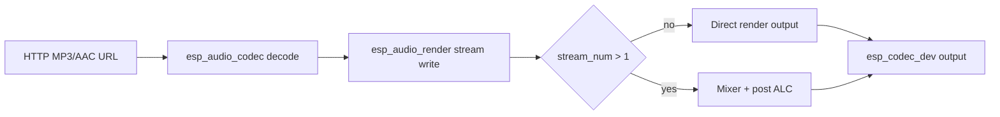

# ESP Audio Render Example

- [中文版](./README_CN.md)
- Regular Example: ⭐⭐

## Example Brief

- This example shows how to use `esp_audio_render` for single-stream playback and multi-stream mixing.
- It demonstrates the full GMF audio path: HTTP source -> decoder -> `esp_audio_render` stream(s) -> optional processors -> codec output.

### Typical Scenarios

- Validate audio render stream open/write/close lifecycle
- Verify multi-stream mixing with unified output format
- Evaluate ALC processing both per-stream and post-mix

## Environment Setup

### Hardware Required

- Recommended board: [ESP32-S3-Korvo2](https://docs.espressif.com/projects/esp-adf/en/latest/design-guide/dev-boards/user-guide-esp32-s3-korvo-2.html) or [ESP32-P4-Function-EV-Board](https://docs.espressif.com/projects/esp-dev-kits/en/latest/esp32p4/esp32-p4-function-ev-board/user_guide.html)
- Audio playback device available on board (`ESP_BOARD_DEVICE_NAME_AUDIO_DAC`)
- Wi-Fi connection for downloading test audio files

### Default IDF Branch

This example supports IDF `release/v5.4` (>= v5.4.3) and `release/v5.5` (>= v5.5.2).

## Build and Flash

### Build Preparation

Go to the example directory:

```bash
cd $YOUR_GMF_PATH/packages/esp_audio_render/examples/audio_render
```

Select board configuration:

```bash
idf.py gen-bmgr-config -l
idf.py gen-bmgr-config -b esp32_s3_korvo2_v3
```

> [!NOTE]
> For other supported boards, use the same command flow with the corresponding board name.
> For custom boards, see [Custom Board Guide](https://github.com/espressif/esp-gmf/blob/main/packages/esp_board_manager/docs/how_to_customize_board.md).

### Build and Flash Commands

```bash
idf.py build
idf.py -p PORT flash monitor
```

## How to Use the Example

### Flow Introduction



### Functionality and Usage

After startup, the example runs two test stages automatically:

1. Single stream render test (`simple_audio_render_run`)
   - Downloads one remote file and plays it for 30 seconds.
2. Multi-stream mixing test (`audio_render_with_mixer_run`)
   - Starts 8 decode/render streams and mixes them to one output sink

Key settings used by the example:

- Fixed output format: 16 kHz / 16 bit / 2 channels
- Per-stream processing: `ESP_AUDIO_RENDER_PROC_ALC`
- Post-mix processing: `ESP_AUDIO_RENDER_PROC_ALC`

### References

- API reference: `esp_audio_render`, `esp_audio_codec`, `esp_codec_dev`
- Board guide: `esp_board_manager` quick start and custom board docs

## Troubleshooting

### No audio output

- Check board audio codec init (`ESP_BOARD_DEVICE_NAME_AUDIO_DAC`)
- Check volume setting in `app_main()` (`esp_codec_dev_set_out_vol`)
- Confirm speaker/headphone is connected correctly

### Network source playback fails

- Confirm Wi-Fi is connected successfully before playback
- Verify target URL is reachable from your network environment

## Technical Support

- Technical support forum: [esp32.com](https://esp32.com/viewforum.php?f=20)
- Issues and feature requests: [GitHub issue](https://github.com/espressif/esp-gmf/issues)
