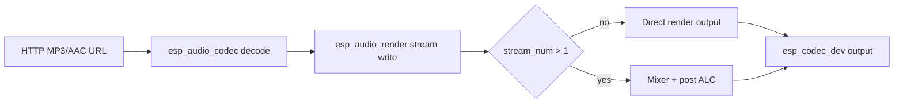

# ESP Audio Render Example

- [中文版](./README_CN.md)
- Regular Example: ⭐⭐

## Example Brief

- This example shows how to use `esp_audio_render` for single-stream playback and multi-stream mixing.
- It demonstrates the full GMF audio path: HTTP source -> decoder -> `esp_audio_render` stream(s) -> optional processors -> codec output.

### Typical Scenarios

- Validate audio render stream open/write/close lifecycle
- Verify multi-stream mixing with unified output format
- Evaluate ALC processing both per-stream and post-mix

## Environment Setup

### Hardware Required

- Recommended board: [ESP32-S3-Korvo2](https://docs.espressif.com/projects/esp-adf/en/latest/design-guide/dev-boards/user-guide-esp32-s3-korvo-2.html) or [ESP32-P4-Function-EV-Board](https://docs.espressif.com/projects/esp-dev-kits/en/latest/esp32p4/esp32-p4-function-ev-board/user_guide.html)
- Audio playback device available on board (`ESP_BOARD_DEVICE_NAME_AUDIO_DAC`)
- Wi-Fi connection for downloading test audio files

### Default IDF Branch

This example supports IDF `release/v5.4` (>= v5.4.3) and `release/v5.5` (>= v5.5.2).

## Build and Flash

### Select and configure a development board

This example uses [ESP Board Manager](https://github.com/espressif/esp-board-manager) to manage board-level resources. The [`esp-bmgr-assist`](https://pypi.org/project/esp-bmgr-assist/) helper tool is recommended as the default entry point.

Install once in your activated ESP-IDF Python environment:

```bash
pip install esp-bmgr-assist
pip install --upgrade esp-bmgr-assist  # run this command when an update is requested
```

- List supported boards:

```bash
idf.py bmgr -l
```

Example output:

```text
ℹ️  Board Components:
  espressif/esp_boards:
    [1] esp32_c3_lyra
    [2] esp32_lyrat_4_3
    [3] esp32_lyrat_mini_1_1
    [4] esp32_p4_eye
    [5] esp32_p4_function_ev_board
    [6] esp32_s31_function_coreboard_1
    [7] esp32_s31_korvo_1
    [8] esp32_s3_box_3
    [9] esp32_s3_box_lite
    [10] esp32_s3_korvo_2_3
    [11] esp32_s3_lcd_ev_board
    [12] esp_vocat_1_0
    [13] esp_vocat_1_2
```

The example output above is based on the board list and ordering from `esp_boards` 0.5.2. Different `esp_boards` versions or custom board dependencies may change the list and indexes. Use the actual output of `idf.py bmgr -l` when selecting a board.

- Select a board:

```bash
idf.py bmgr -b <board_index|board_name>
```

For example, to select `esp32_s3_korvo_2_3`:

```bash
idf.py bmgr -b 10
# or
idf.py bmgr -b esp32_s3_korvo_2_3
```

On first invocation, the component is downloaded automatically based on the `espressif/esp_board_manager` dependency declared in `main/idf_component.yml`.

> [!NOTE]
> To switch to a different board supported by `esp_board_manager`, repeat the same steps with the new board name or index.
> For a custom board, see [Creating a Board Guide](https://docs.espressif.com/projects/esp-board-manager/en/latest/create-board/index.html).
> For more information about `esp_board_manager`, see the [ESP Board Manager Getting Started Guide](https://github.com/espressif/esp-board-manager/blob/main/esp_board_manager/README.md).

### Build and Flash Commands

```bash
idf.py build
idf.py -p PORT flash monitor
```

## How to Use the Example

### Flow Introduction


```mermaid
flowchart LR
  NET[HTTP MP3/AAC URL] --> DEC[esp_audio_codec decode]
  DEC --> STRM[esp_audio_render stream write]
  STRM --> MIX{stream_num > 1}
  MIX -- no --> OUT[Direct render output]
  MIX -- yes --> MX[Mixer + post ALC]
  OUT --> SINK[esp_codec_dev output]
  MX --> SINK
```

### Functionality and Usage

After startup, the example runs two test stages automatically:

1. Single stream render test (`simple_audio_render_run`)
   - Downloads one remote file and plays it for 30 seconds.
2. Multi-stream mixing test (`audio_render_with_mixer_run`)
   - Starts 8 decode/render streams and mixes them to one output sink

Key settings used by the example:

- Fixed output format: 16 kHz / 16 bit / 2 channels
- Per-stream processing: `ESP_AUDIO_RENDER_PROC_ALC`
- Post-mix processing: `ESP_AUDIO_RENDER_PROC_ALC`

### References

- API reference: `esp_audio_render`, `esp_audio_codec`, `esp_codec_dev`
- Board guide: `esp_board_manager` quick start and custom board docs

## Troubleshooting

### No audio output

- Check board audio codec init (`ESP_BOARD_DEVICE_NAME_AUDIO_DAC`)
- Check volume setting in `app_main()` (`esp_codec_dev_set_out_vol`)
- Confirm speaker/headphone is connected correctly

### Network source playback fails

- Confirm Wi-Fi is connected successfully before playback
- Verify target URL is reachable from your network environment

## Technical Support

- Technical support forum: [esp32.com](https://esp32.com/viewforum.php?f=20)
- Issues and feature requests: [GitHub issue](https://github.com/espressif/esp-gmf/issues)
