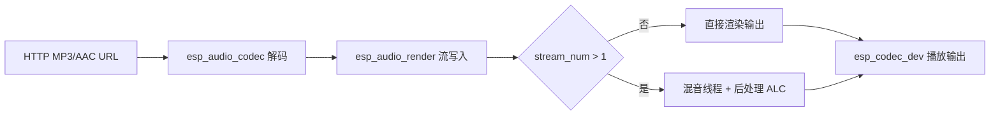

# ESP 音频渲染示例

- [English Version](./README.md)
- 例程难度：⭐⭐

## 例程简介

- 本例程展示如何使用 `esp_audio_render` 实现单路播放与多路混音输出。
- 例程覆盖完整链路：HTTP 音频源 -> 解码 -> `esp_audio_render` 流处理 -> 编解码器输出。

### 典型场景

- 验证音频渲染流的 open/write/close 生命周期
- 验证多路输入混音到统一输出格式
- 验证每路处理与混音后处理（ALC）能力

## 环境配置

### 硬件要求

- 推荐开发板：[ESP32-S3-Korvo2](https://docs.espressif.com/projects/esp-adf/en/latest/design-guide/dev-boards/user-guide-esp32-s3-korvo-2.html) 或 [ESP32-P4-Function-EV-Board](https://docs.espressif.com/projects/esp-dev-kits/en/latest/esp32p4/esp32-p4-function-ev-board/user_guide.html)
- 开发板具备音频播放设备（`ESP_BOARD_DEVICE_NAME_AUDIO_DAC`）
- 需要可用 Wi-Fi 连接（用于下载测试音频）

### 默认 IDF 分支

本例程支持 IDF `release/v5.4` (>= v5.4.3) 和 `release/v5.5` (>= v5.5.2)。

## 编译和下载

### 选择并配置开发板

本示例使用 [ESP Board Manager](https://github.com/espressif/esp-board-manager) 管理板级资源。推荐安装辅助工具 [`esp-bmgr-assist`](https://pypi.org/project/esp-bmgr-assist/) 作为默认入口。

在已激活的 ESP-IDF Python 环境下安装（同一环境只需安装一次）：

```bash
pip install esp-bmgr-assist
pip install --upgrade esp-bmgr-assist
```

- 查看支持的板子：

```bash
idf.py bmgr -l
```

输出示例：

```text
ℹ️  Main Boards:
  [1] dual_eyes_board_v1_0
  [2] esp32_c3_lyra
  [3] esp32_c5_spot
  [4] esp32_p4_function_ev
  [5] esp32_s3_korvo2_v3
  [6] esp32_s3_korvo2l
  [7] esp_box_3
  [8] esp_box_lite
  [9] esp_hi
```

- 选择开发板：

```bash
idf.py bmgr -b <board_index|board_name>
```

例如选择 `esp32_s3_korvo2_v3`：

```bash
idf.py bmgr -b 5
# 或
idf.py bmgr -b esp32_s3_korvo2_v3
```

首次执行 `idf.py bmgr` 时，组件会根据本工程 `main/idf_component.yml` 中声明的 `espressif/esp_board_manager` 依赖自动下载。

> [!NOTE]
> 如果切换为其他 `esp_board_manager` 支持的开发板，请按相同步骤执行并替换板型名称/索引。
> 自定义开发板请参考 [自定义开发板指南](https://github.com/espressif/esp-board-manager/blob/main/esp_board_manager/docs/how_to_customize_board_cn.md)。
> `esp_board_manager` 更多信息请参考 [ESP_BOARD_MANAGER 入门指南](https://github.com/espressif/esp-board-manager/blob/main/esp_board_manager/README_CN.md)

### 编译与烧录

```bash
idf.py build
idf.py -p PORT flash monitor
```

## 如何使用例程

### 流程介绍


```mermaid
flowchart LR
  NET[HTTP MP3/AAC URL] --> DEC[esp_audio_codec 解码]
  DEC --> STRM[esp_audio_render 流写入]
  STRM --> MIX{stream_num > 1}
  MIX -- 否 --> OUT[直接渲染输出]
  MIX -- 是 --> MX[混音线程 + 后处理 ALC]
  OUT --> SINK[esp_codec_dev 播放输出]
  MX --> SINK
```

### 功能和用法

程序启动后会自动执行两个测试阶段：

1. 单流渲染测试（`simple_audio_render_run`）
   - 下载一个远端音频并播放 30 秒
2. 多流混音测试（`audio_render_with_mixer_run`）
   - 启动 8 路解码/渲染流并混音到同一输出

主要配置如下：

- 固定输出格式：16 kHz / 16 bit / 双声道
- 每流处理：`ESP_AUDIO_RENDER_PROC_ALC`
- 混音后处理：`ESP_AUDIO_RENDER_PROC_ALC`

### 参考资料

- API 文档：`esp_audio_render`、`esp_audio_codec`、`esp_codec_dev`
- 开发板配置：`esp_board_manager` 快速开始与自定义板文档

## 故障排除

### 无声音输出

- 检查音频播放设备初始化（`ESP_BOARD_DEVICE_NAME_AUDIO_DAC`）
- 检查 `app_main()` 中音量设置（`esp_codec_dev_set_out_vol`）
- 确认扬声器或耳机连接正常

### 网络音频播放失败

- 确认播放前 Wi-Fi 已连接成功
- 确认音频 URL 在当前网络环境可访问

## 技术支持

- 技术支持论坛：[esp32.com](https://esp32.com/viewforum.php?f=20)
- 问题反馈与功能建议：[GitHub issue](https://github.com/espressif/esp-gmf/issues)
