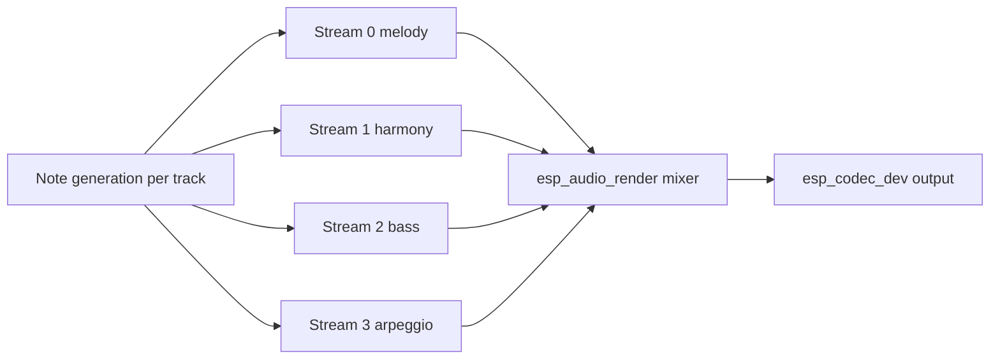

# Simple Piano Example

- [中文版](./README_CN.md)
- Complex Example: ⭐⭐⭐

## Example Brief

- This example builds a polyphonic piano player on top of `esp_audio_render`.
- It demonstrates four generated tracks (melody, harmony, bass, arpeggio), mixed in real time and played through board codec output.

### Typical Scenarios

- Learn multi-stream rendering with generated PCM data
- Verify real-time synthesis and mixing performance
- Use UART commands for interactive note on/off control

## Environment Setup

### Hardware Required

- Recommended board: [ESP32-S3-Korvo2](https://docs.espressif.com/projects/esp-adf/en/latest/design-guide/dev-boards/user-guide-esp32-s3-korvo-2.html) or [ESP32-P4-Function-EV-Board](https://docs.espressif.com/projects/esp-dev-kits/en/latest/esp32p4/esp32-p4-function-ev-board/user_guide.html)
- Audio playback output (speaker or headphone)

### Default IDF Branch

This example supports IDF `release/v5.4` (>= v5.4.3) and `release/v5.5` (>= v5.5.2).

## Build and Flash

### Build Preparation

```bash
cd $YOUR_GMF_PATH/packages/esp_audio_render/examples/simple_piano
idf.py gen-bmgr-config -l
idf.py gen-bmgr-config -b esp32_s3_korvo2_v3
```

> [!NOTE]
> For other supported boards, use the same commands with the corresponding board name.
> For custom boards, see [Custom Board Guide](https://github.com/espressif/esp-gmf/blob/main/packages/esp_board_manager/docs/how_to_customize_board.md).

### Build and Flash Commands

```bash
idf.py build
idf.py -p PORT flash monitor
```

## How to Use the Example

### Flow Introduction



### Functionality and Usage

The example plays "Twinkle Twinkle Little Star" using 4 tracks:

- Track 0: melody
- Track 1: harmony
- Track 2: bass
- Track 3: arpeggio

Default render format:

- Sample rate: 16 kHz
- Bit width: 16 bit
- Channels: mono

Main execution flow:

1. Initialize audio DAC and create render instance
2. Open 4 render streams and create `song_render`
3. Generate note chunks and feed each track stream
4. Mix and play output through `esp_codec_dev`

### **Enable Real-time Piano (Optional)**
To enable interactive piano control via UART:

1. **Rebuild after Enable the feature** in [piano_example.c](main/piano_example.c):
   ```bash
   #define SUPPORT_REALTIME_TRACK
   ```

2. **Use the Python controller** (in a separate terminal):
   ```bash
   # Install dependencies
   pip install pyserial

   # Run the piano controller
   python3 piano_key.py --port /dev/ttyUSB0 --baud 115200
   ```

3. **Play piano in real-time**:
   - **Numbers 1-7**: C4-B4 (mid octave)
   - **Letters Q-U**: C5-B5 (high octave)
   - **ESC**: Stop piano
   - **Ctrl+C**: Exit controller

## Troubleshooting

### No sound from piano output

- Confirm DAC device init succeeds (`ESP_BOARD_DEVICE_NAME_AUDIO_DAC`).
- Check output volume (`esp_codec_dev_set_out_vol`)
- Confirm speaker/headphone hardware path

### Realtime control does not respond

- Ensure UART0 is connected to host serial tool
- Check command format (`P:C4`, `R:C4`, `P:ESC`)

## Technical Support

- Technical support forum: [esp32.com](https://esp32.com/viewforum.php?f=20)
- Issues and feature requests: [GitHub issue](https://github.com/espressif/esp-gmf/issues)
