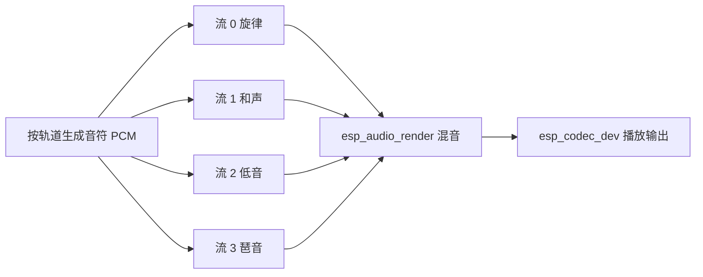

# 简单钢琴示例

- [English Version](./README.md)
- 例程难度：⭐⭐⭐

## 例程简介

- 本例程基于 `esp_audio_render` 实现复音钢琴播放。
- 例程演示 4 条音轨（旋律、和声、低音、琶音）实时生成与混音，并通过板载音频编解码器播放。

### 典型场景

- 学习多流 PCM 渲染与混音流程
- 验证实时合成音频的性能和稳定性
- 通过 UART 实现交互式按键按下/释放控制

## 环境配置

### 硬件要求

- 推荐开发板：[ESP32-S3-Korvo2](https://docs.espressif.com/projects/esp-adf/en/latest/design-guide/dev-boards/user-guide-esp32-s3-korvo-2.html) 或 [ESP32-P4-Function-EV-Board](https://docs.espressif.com/projects/esp-dev-kits/en/latest/esp32p4/esp32-p4-function-ev-board/user_guide.html)
- 可用的音频输出设备（扬声器或耳机）

### 默认 IDF 分支

本例程支持 IDF `release/v5.4` (>= v5.4.3) 和 `release/v5.5` (>= v5.5.2)。

## 编译和下载

### 编译准备

```bash
cd $YOUR_GMF_PATH/packages/esp_audio_render/examples/simple_piano
idf.py gen-bmgr-config -l
idf.py gen-bmgr-config -b esp32_s3_korvo2_v3
```

> [!NOTE]
> 如果切换为其他 `esp_board_manager` 支持的开发板，请按相同步骤执行并替换板型名称。
> 自定义开发板请参考 [自定义开发板指南](https://github.com/espressif/esp-gmf/blob/main/packages/esp_board_manager/docs/how_to_customize_board_cn.md)。

### 编译与烧录

```bash
idf.py build
idf.py -p PORT flash monitor
```

## 如何使用例程

### 流程介绍



### 功能和用法

例程会演奏《小星星》，共 4 条音轨：

- 轨道 0：旋律
- 轨道 1：和声
- 轨道 2：低音
- 轨道 3：琶音

默认输出配置：

- 采样率：16 kHz
- 位宽：16 bit
- 声道：单声道

主要执行流程：

1. 初始化音频 DAC 并创建 render 实例。
2. 打开 4 条 render 流并创建 `song_render`。
3. 按块生成音符 PCM 并写入对应流。
4. 混音后通过 `esp_codec_dev` 输出。

### **启用实时钢琴功能**（可选）
启用通过UART的交互式钢琴控制：

1. **在[piano_example.c](main/piano_example.c)中启用功能并重新构建**：
   ```c
   #define SUPPORT_REALTIME_TRACK
   ```

2. **使用Python控制器**（在另一个终端中）：
   ```bash
   # 安装依赖
   pip install pyserial

   # 运行钢琴控制器
   python3 piano_key.py --port /dev/ttyUSB0 --baud 115200
   ```

3. **实时钢琴演奏**：
   - **数字1-7**：C4-B4（中八度）
   - **字母Q-U**：C5-B5（高八度）
   - **ESC**：停止钢琴
   - **Ctrl+C**：退出控制器

## 故障排除

### 无声音输出

- 确认 DAC 设备初始化成功（`ESP_BOARD_DEVICE_NAME_AUDIO_DAC`）。
- 检查 `esp_codec_dev_set_out_vol` 音量设置。
- 确认扬声器/耳机硬件连接正常。

### 实时控制无响应

- 确认 UART0 与主机串口工具连接正常。
- 确认命令格式正确（如 `P:C4`、`R:C4`、`P:ESC`）。

## 技术支持

- 技术支持论坛：[esp32.com](https://esp32.com/viewforum.php?f=20)
- 问题反馈与功能建议：[GitHub issue](https://github.com/espressif/esp-gmf/issues)
