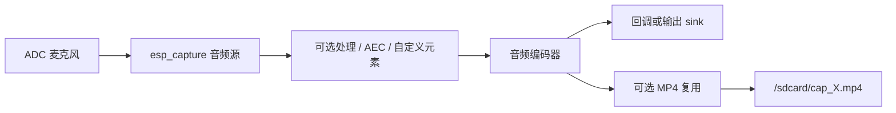

# ESP 音频采集示例

- [English Version](./README.md)
- 例程难度：⭐⭐

## 例程简介

- 本例程演示基于 `esp_capture` 的常见音频采集能力。
- 包含基础采集、AEC 采集、MP4 录制和自定义处理流水线等场景。

### 典型场景

- 固定时长麦克风采集。
- 双工场景下通过 AEC 提升音频质量。
- 将采集数据分片录制到 SD 卡 MP4 文件。
- 在采集图中扩展自定义处理元素（如 ALC）。

## 环境配置

### 硬件要求

- 推荐开发板：[ESP32-S3-Korvo2](https://docs.espressif.com/projects/esp-adf/en/latest/design-guide/dev-boards/user-guide-esp32-s3-korvo-2.html) 或 [ESP32-P4-Function-EV-Board](https://docs.espressif.com/projects/esp-dev-kits/en/latest/esp32p4/esp32-p4-function-ev-board/user_guide.html)
- 音频输入设备（ADC 麦克风）
- SD 卡（可选，保存录制文件需要）

### 默认 IDF 分支

本例程支持 IDF `release/v5.4` (>= v5.4.3) 和 `release/v5.5` (>= v5.5.2)。

## 编译和下载

### 选择并配置开发板

本示例使用 [ESP Board Manager](https://github.com/espressif/esp-board-manager) 管理板级资源。推荐安装辅助工具 [`esp-bmgr-assist`](https://pypi.org/project/esp-bmgr-assist/) 作为默认入口。

在已激活的 ESP-IDF Python 环境下安装（同一环境只需安装一次）：

```bash
pip install esp-bmgr-assist
pip install --upgrade esp-bmgr-assist
```

- 查看支持的板子：

```bash
idf.py bmgr -l
```

输出示例：

```text
ℹ️  Main Boards:
  [1] dual_eyes_board_v1_0
  [2] esp32_c3_lyra
  [3] esp32_c5_spot
  [4] esp32_p4_function_ev
  [5] esp32_s3_korvo2_v3
  [6] esp32_s3_korvo2l
  [7] esp_box_3
  [8] esp_box_lite
  [9] esp_hi
```

- 选择开发板：

```bash
idf.py bmgr -b <board_index|board_name>
```

例如选择 `esp32_s3_korvo2_v3`：

```bash
idf.py bmgr -b 5
# 或
idf.py bmgr -b esp32_s3_korvo2_v3
```

首次执行 `idf.py bmgr` 时，组件会根据本工程 `main/idf_component.yml` 中声明的 `espressif/esp_board_manager` 依赖自动下载。

> [!NOTE]
> 如果切换为其他 `esp_board_manager` 支持的开发板，请按相同步骤执行并替换板型名称/索引。
> 自定义开发板请参考 [自定义开发板指南](https://github.com/espressif/esp-board-manager/blob/main/esp_board_manager/docs/how_to_customize_board_cn.md)。
> `esp_board_manager` 更多信息请参考 [ESP_BOARD_MANAGER 入门指南](https://github.com/espressif/esp-board-manager/blob/main/esp_board_manager/README_CN.md)

### 编译与烧录

```bash
idf.py build
idf.py -p PORT flash monitor
```

## 如何使用例程

### 流程介绍



### 功能和用法

`app_main()` 会按顺序执行以下 case（每个 10 秒）：

1. `audio_capture_run`
2. `audio_capture_run_with_aec`
3. `audio_capture_run_with_muxer`（仅在 SD 卡挂载成功时执行）
4. `audio_capture_run_with_customized_process`

其他关键行为：

- 注册默认音频编码器（`esp_audio_enc_register_default`）
- 注册 MP4 复用器（`mp4_muxer_register`）
- 通过 `esp_capture_set_thread_scheduler` 设置线程调度参数

### 配置说明

`main/settings.h` 主要配置项：

- `AUDIO_CAPTURE_FORMAT`（默认：`ESP_CAPTURE_FMT_ID_AAC`）
- `AUDIO_CAPTURE_SAMPLE_RATE`（默认：`16000`）
- `AUDIO_CAPTURE_CHANNEL`（默认：`2`）

## 故障排除

### 采集启动失败

- 确认音频 ADC 设备初始化成功
- 确认板级音频输入硬件连接正常

### 未生成录制文件

- 确认 `app_main()` 中 SD 卡挂载成功
- 检查 SD 卡剩余空间和写权限

### AEC 分支不可用或效果不佳

- AEC 受芯片目标限制（主要支持 ESP32-S3 / ESP32-P4）
- 确认板级播放与采集路径配置正确

## 技术支持

- 技术支持论坛：[esp32.com](https://esp32.com/viewforum.php?f=20)
- 问题反馈与功能建议：[GitHub issue](https://github.com/espressif/esp-gmf/issues)
