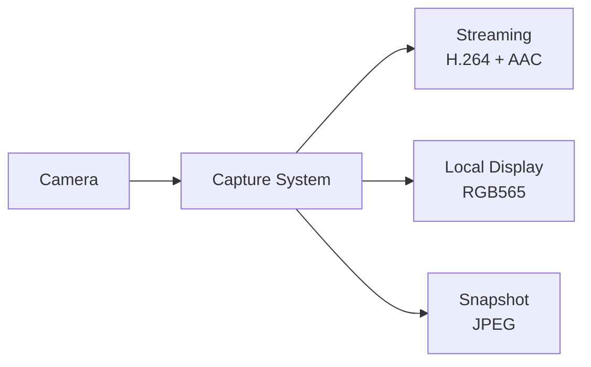
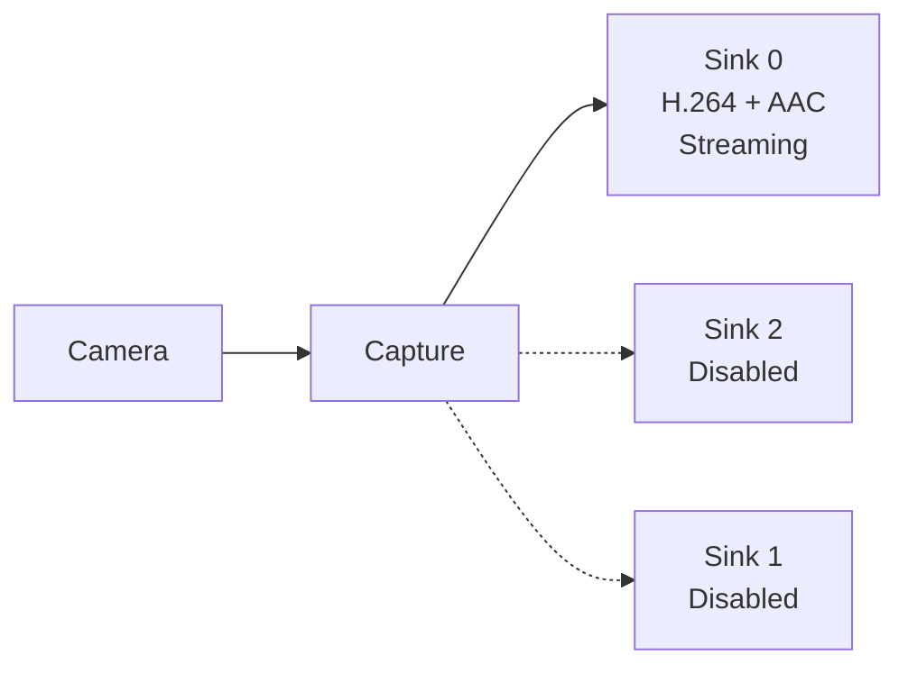
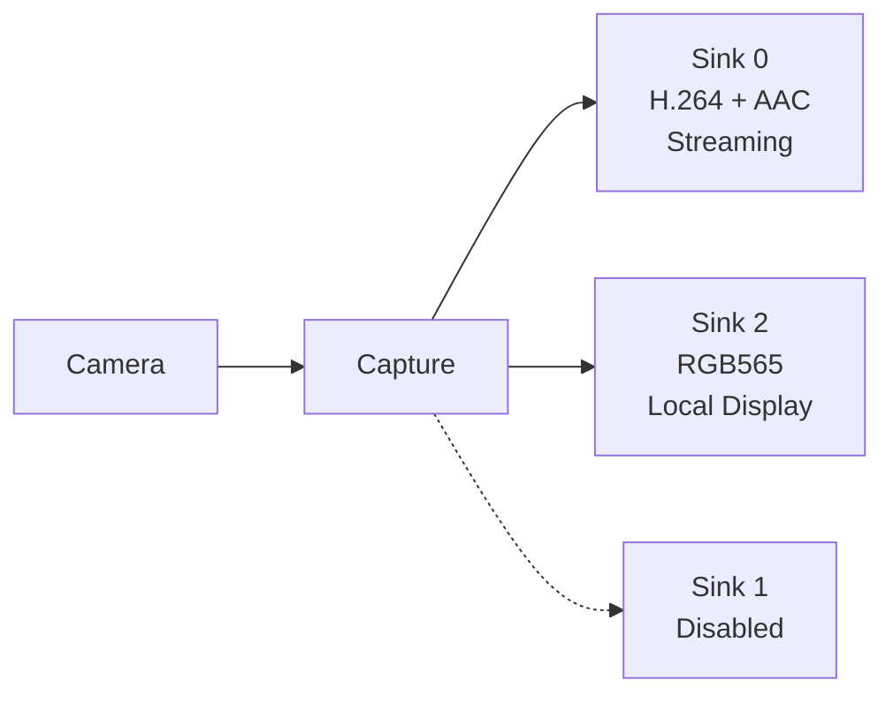
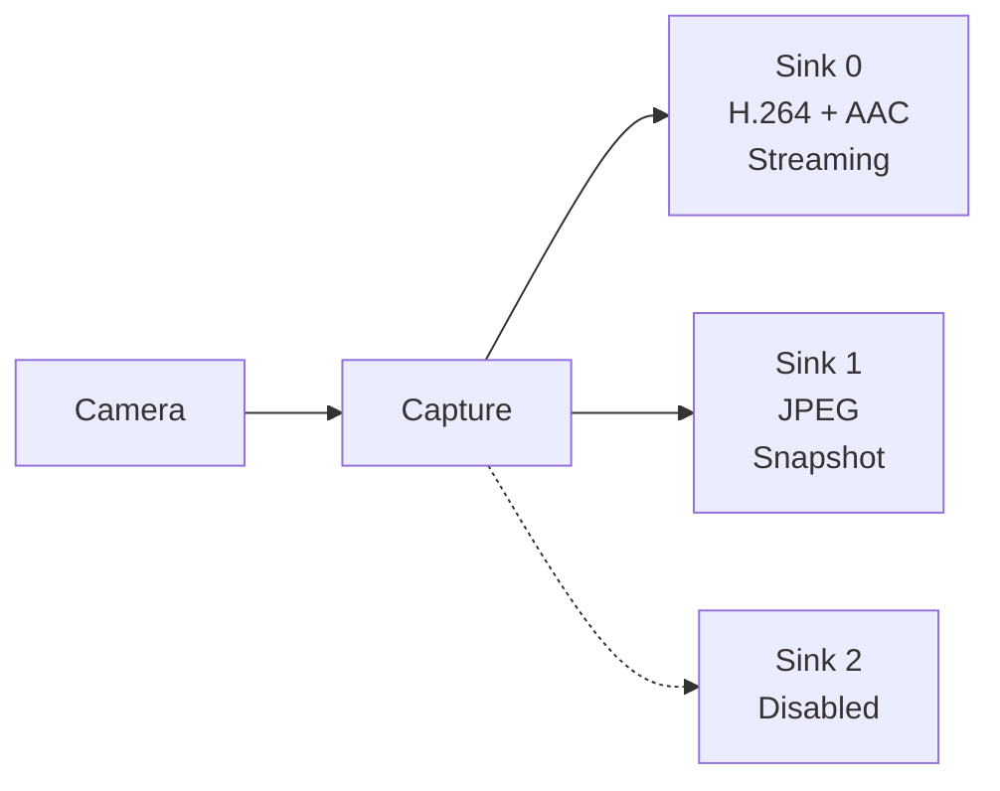
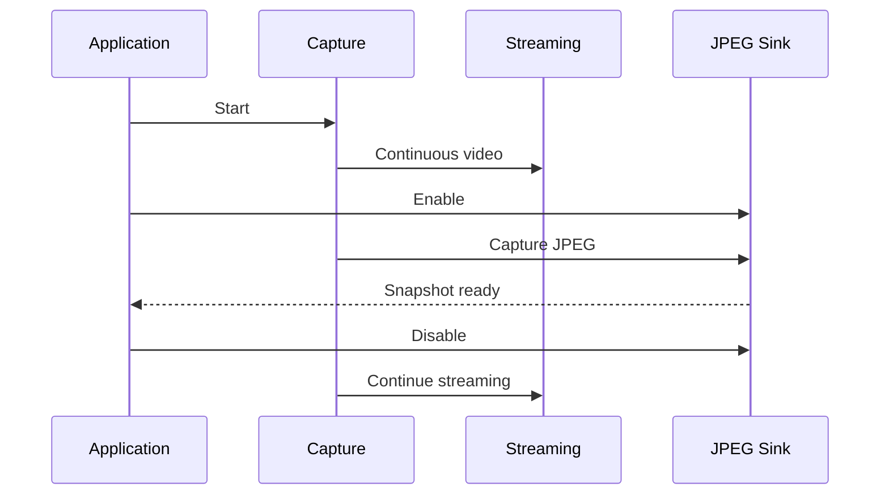
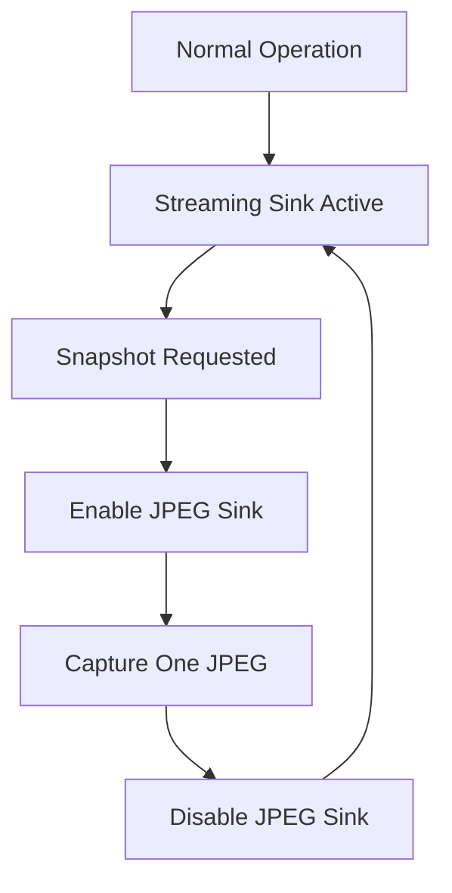

# ESP Capture Multiple Sink Example

- [中文版](./README_CN.md)
- Regular Example: ⭐⭐⭐

## Example Brief

- This example demonstrates how a **single camera capture system can provide multiple outputs to different consumers** using `esp_capture`.
- Each sink can be enabled or disabled independently, and a sink can run continuously or as a one-shot capture.
- Main example: `main/capture_multiple_sink.c`
- Sink configuration: `main/settings.h`

### Typical Scenarios

- Video streaming + local display
- Video streaming + snapshots
- Live preview + AI / image processing
- Event-triggered or low-memory one-shot snapshots
- Multiple consumers with different resolutions or formats

## Environment Setup

### Hardware Required

- Recommended board: [ESP32-P4-Function-EV-Board](https://docs.espressif.com/projects/esp-dev-kits/en/latest/esp32p4/esp32-p4-function-ev-board/user_guide.html) (multi-resolution / PPA scale paths target ESP32-P4)
- Camera module (CSI) and audio input device (ADC microphone)
- SD card is **not** required (frames are verified in memory)

### Default IDF Branch

This example supports IDF `release/v5.5` (>= v5.5.2).

## Build and Flash

### Select and configure a development board

This example uses [ESP Board Manager](https://github.com/espressif/esp-board-manager) to manage board-level resources. The [`esp-bmgr-assist`](https://pypi.org/project/esp-bmgr-assist/) helper tool is recommended as the default entry point.

Install once in your activated ESP-IDF Python environment:

```bash
pip install esp-bmgr-assist
pip install --upgrade esp-bmgr-assist  # run this command when an update is requested
```

- List supported boards:

```bash
idf.py bmgr -l
```

Example output:

```text
ℹ️  Board Components:
  espressif/esp_boards:
    [1] esp32_c3_lyra
    [2] esp32_lyrat_4_3
    [3] esp32_lyrat_mini_1_1
    [4] esp32_p4_eye
    [5] esp32_p4_function_ev_board
    [6] esp32_s31_function_coreboard_1
    [7] esp32_s31_korvo_1
    [8] esp32_s3_box_3
    [9] esp32_s3_box_lite
    [10] esp32_s3_korvo_2_3
```

Different `esp_board_manager` versions or custom board dependencies may change the list and indexes. Use the actual output of `idf.py bmgr -l` when selecting a board.

- Select a board:

```bash
idf.py bmgr -b <board_index|board_name>
```

For example, to select `esp32_p4_function_ev_board`:

```bash
idf.py bmgr -b 5
# or
idf.py bmgr -b esp32_p4_function_ev_board
```

On first invocation, the component is downloaded automatically based on the `espressif/esp_board_manager` dependency declared in `main/idf_component.yml`.

> [!NOTE]
> To switch to a different board supported by `esp_board_manager`, repeat the same steps with the new board name or index.
> For a custom board, see [Creating a Board Guide](https://docs.espressif.com/projects/esp-board-manager/en/latest/create-board/index.html).
> For more information about `esp_board_manager`, see the [ESP Board Manager Getting Started Guide](https://github.com/espressif/esp-board-manager/blob/main/esp_board_manager/README.md).


## How to Use the Example

### Flow Introduction



All outputs share the **same capture system**. A separate capture instance is not required for each consumer.

### Functionality and Usage

`app_main()` builds the capture system once, then runs four scenarios. Each scenario does **enable sinks → start → run → stop** (easy to copy for product code). Capture is destroyed at the end.

1. **Streaming only** — sink 0 enabled, sinks 1/2 disabled, run 30 seconds
2. **Streaming + display** — sinks 0 and 2 enabled for 30 seconds; mute stream 10 seconds; unmute 10 seconds
3. **JPEG one-shot (fast)** — sink 0 remains active while sink 1 performs two one-shot JPEG captures
4. **JPEG one-shot (low memory)** — sink 1 is enabled only while capturing, then disabled immediately after the snapshot

Additional behavior:

- Registers default video and audio encoders (`esp_video_enc_register_default`, `esp_audio_enc_register_default`)
- Applies custom thread scheduler through `esp_capture_set_thread_scheduler`

#### Scenario diagrams

**1. Streaming only**



Default streaming configuration: 1920×1080 @ 25 fps H.264 + AAC 16 kHz / mono.

**2. Streaming + local display**



Useful for cameras, doorbells, and monitors that need both remote streaming and local preview.

**3. Streaming + snapshot**





**4. Low-memory one-shot snapshot**



### Configuration

Sinks are configured through `CAPTURE_SINKS_SETTINGS` in `main/settings.h`.

Default sinks:

| Index | Role | Default |
| ----- | ---- | ------- |
| 0 | Streaming | 1920×1080 @ 25 H.264 + AAC 16 kHz / 1ch |
| 1 | Snapshot | 2560×1440 @ 1 JPEG |
| 2 | Display | 320×240 @ 20 RGB565 |

`SINK_NUM` is derived from the array. The build fails if the count exceeds `CONFIG_ESP_CAPTURE_MAX_SINK_NUM`.

To adapt the example:

1. Edit `CAPTURE_SINKS_SETTINGS` in `main/settings.h`
2. Set resolution, frame rate, and format for each sink
3. Keep continuously required outputs enabled; use one-shot for occasional snapshots
4. Connect each sink to the required application component (WebRTC / LCD / AI / recording, etc.)

## Troubleshooting

### Capture start fails

- Confirm camera and audio ADC device init succeed
- Confirm CSI camera hardware and board selection (`idf.py bmgr -b ...`)
- For 1080p input, enable the matching camera sensor mode in menuconfig (for example SC2336 1920×1080)

### Sink setup fails / static assert

- Reduce sinks in `CAPTURE_SINKS_SETTINGS`, or increase `CONFIG_ESP_CAPTURE_MAX_SINK_NUM`
- Confirm requested formats are supported by the board encoders / PPA path

### Bad frame checks (`bad` count increases)

- **H.264** — confirm Annex-B output (start code present)
- **JPEG** — confirm complete frames with `FF D8` … `FF D9`
- **RGB565** — confirm size matches `width × height × 2`

### JPEG one-shot timeout

- Confirm sink 1 is enabled with `ESP_CAPTURE_RUN_MODE_ONESHOT`
- Keep the streaming sink drained while waiting so the pipeline is not back-pressured
- Allow enough time for 2K upscale + JPEG encode on first open of the snapshot path

## Technical Support

- Technical support forum: [esp32.com](https://esp32.com/viewforum.php?f=20)
- Issues and feature requests: [GitHub issue](https://github.com/espressif/esp-gmf/issues)
