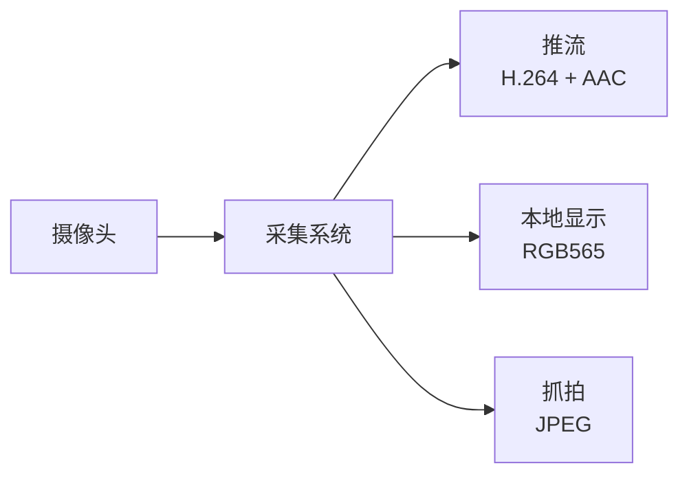
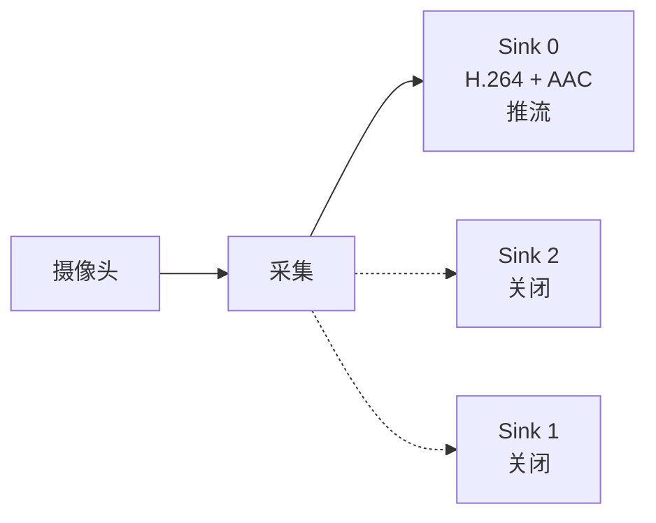
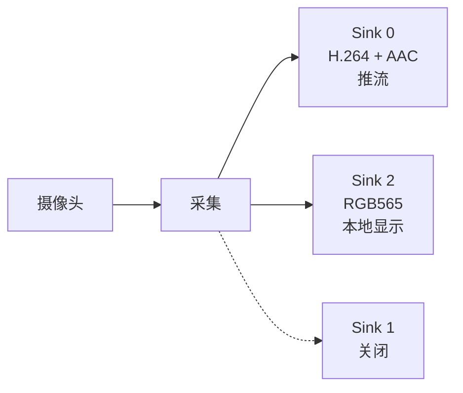
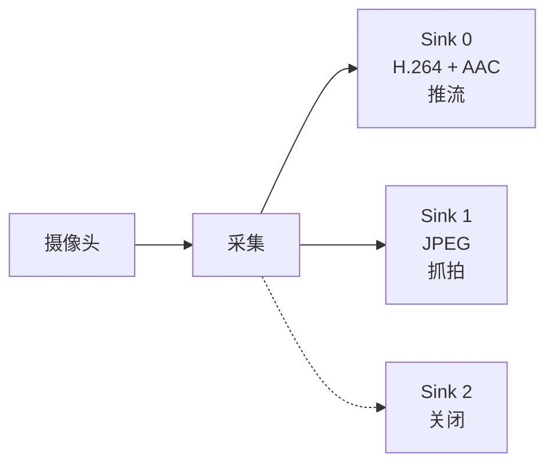
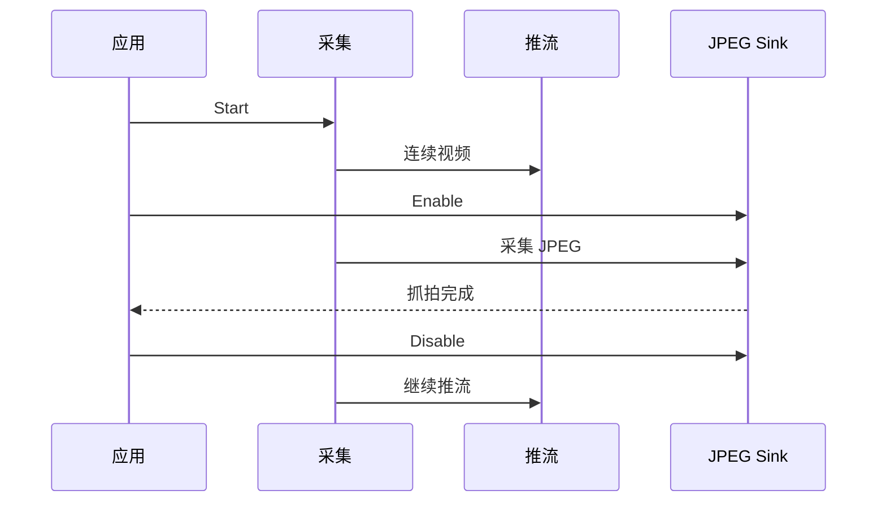
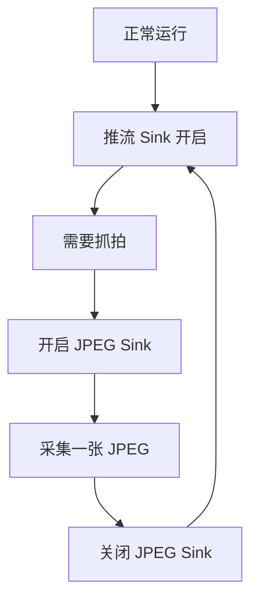

# ESP 多 Sink 采集示例

- [English Version](./README.md)
- 例程难度：⭐⭐⭐

## 例程简介

- 本例程演示如何用 **一套摄像头采集系统**，通过 `esp_capture` 为多个消费者提供不同输出。
- 每个 sink 可独立开启 / 关闭，既可连续运行，也可 one-shot 抓拍。
- 主程序：`main/capture_multiple_sink.c`
- Sink 配置：`main/settings.h`

### 典型场景

- 视频推流 + 本地显示
- 视频推流 + 抓拍
- 实时预览 + AI / 图像处理
- 事件触发或低内存 one-shot 抓拍
- 多路不同分辨率 / 格式的消费者

## 环境配置

### 硬件要求

- 推荐开发板：[ESP32-P4-Function-EV-Board](https://docs.espressif.com/projects/esp-dev-kits/en/latest/esp32p4/esp32-p4-function-ev-board/user_guide.html)（多分辨率 / PPA 缩放路径面向 ESP32-P4）
- 摄像头模组（CSI）与音频输入设备（ADC 麦克风）
- **不需要** SD 卡（帧在内存中直接校验）

### 默认 IDF 分支

本例程支持 IDF `release/v5.5` (>= v5.5.2)。

## 编译和下载

### 选择并配置开发板

本示例使用 [ESP Board Manager](https://github.com/espressif/esp-board-manager) 管理板级资源。推荐安装辅助工具 [`esp-bmgr-assist`](https://pypi.org/project/esp-bmgr-assist/) 作为默认入口。

在已激活的 ESP-IDF Python 环境下安装（同一环境只需安装一次）：

```bash
pip install esp-bmgr-assist
pip install --upgrade esp-bmgr-assist  # 当提示需要更新时执行此命令
```

- 查看支持的板子：

```bash
idf.py bmgr -l
```

输出示例：

```text
ℹ️  Board Components:
  espressif/esp_boards:
    [1] esp32_c3_lyra
    [2] esp32_lyrat_4_3
    [3] esp32_lyrat_mini_1_1
    [4] esp32_p4_eye
    [5] esp32_p4_function_ev_board
    [6] esp32_s31_function_coreboard_1
    [7] esp32_s31_korvo_1
    [8] esp32_s3_box_3
    [9] esp32_s3_box_lite
    [10] esp32_s3_korvo_2_3
```

不同 `esp_board_manager` 版本或自定义开发板依赖可能会使列表和序号变化，使用时以 `idf.py bmgr -l` 的实际输出为准。

- 选择开发板：

```bash
idf.py bmgr -b <board_index|board_name>
```

例如选择 `esp32_p4_function_ev_board`：

```bash
idf.py bmgr -b 5
# 或
idf.py bmgr -b esp32_p4_function_ev_board
```

首次执行 `idf.py bmgr` 时，组件会根据本工程 `main/idf_component.yml` 中声明的 `espressif/esp_board_manager` 依赖自动下载。

> [!NOTE]
> 如果切换为其他 `esp_board_manager` 支持的开发板，请按相同步骤执行并替换板型名称/索引。
> 自定义开发板请参考 [创建开发板指南](https://docs.espressif.com/projects/esp-board-manager/zh_CN/latest/create-board/index.html)。
> `esp_board_manager` 更多信息请参考 [ESP_BOARD_MANAGER 入门指南](https://github.com/espressif/esp-board-manager/blob/main/esp_board_manager/README_CN.md)

## 如何使用例程

### 流程介绍



所有输出共享 **同一套采集系统**，无需为每个消费者再开一套 capture。

### 功能和用法

`app_main()` 只构建一次采集系统，然后依次运行四个场景。每个场景均为 **enable sinks → start → run → stop**（便于产品代码直接拷贝）。最后统一销毁 capture。

1. **仅推流** — 开启 sink 0，关闭 sink 1/2，运行 30 秒
2. **推流 + 显示** — 开启 sink 0 与 2，运行 30 秒；静音推流 10 秒；再恢复推流 10 秒
3. **JPEG one-shot（快速）** — sink 0 持续运行，sink 1 连续两次 one-shot 抓拍
4. **JPEG one-shot（省内存）** — 仅在抓拍时开启 sink 1，抓完立刻关闭

其他相关行为：

- 注册默认视频 / 音频编码器（`esp_video_enc_register_default`、`esp_audio_enc_register_default`）
- 通过 `esp_capture_set_thread_scheduler` 设置线程调度参数
- 不写 SD 卡；在内存中校验帧：
  - **H.264** — Annex-B 起始码（`00 00 01` 或 `00 00 00 01`）
  - **JPEG** — SOI（`FF D8`）与 EOI（`FF D9`）
  - **RGB565** — 帧长度等于 `width × height × 2`

#### 场景示意

**1. 仅推流**



默认推流配置：1920×1080 @ 25 fps H.264 + AAC 16 kHz / 单声道。

**2. 推流 + 本地显示**



适用于同时需要远端推流与本地预览的摄像头、门铃、监视器等设备。

**3. 推流 + 抓拍**





**4. 低内存 one-shot 抓拍**



### 配置说明

Sink 通过 `main/settings.h` 中的 `CAPTURE_SINKS_SETTINGS` 配置。

默认 Sink：

| 下标 | 用途 | 默认 |
| ---- | ---- | ---- |
| 0 | 推流 | 1920×1080 @ 25 H.264 + AAC 16 kHz / 1ch |
| 1 | 抓拍 | 2560×1440 @ 1 JPEG |
| 2 | 显示 | 320×240 @ 20 RGB565 |

`SINK_NUM` 由数组长度自动推导。若数量超过 `CONFIG_ESP_CAPTURE_MAX_SINK_NUM`，编译会失败。

适配产品应用时可：

1. 修改 `main/settings.h` 中的 `CAPTURE_SINKS_SETTINGS`
2. 为每个 sink 设置分辨率、帧率与格式
3. 持续需要的输出保持开启；偶发抓拍使用 one-shot
4. 将各 sink 接到应用组件（WebRTC / LCD / AI / 录像等）

## 故障排除

### 采集启动失败

- 确认摄像头与音频 ADC 设备初始化成功
- 确认 CSI 摄像头硬件与板型选择（`idf.py bmgr -b ...`）
- 若输入为 1080p，请在 menuconfig 中启用对应传感器模式（例如 SC2336 1920×1080）

### Sink setup 失败 / static assert

- 减少 `CAPTURE_SINKS_SETTINGS` 中的 sink 数量，或增大 `CONFIG_ESP_CAPTURE_MAX_SINK_NUM`
- 确认请求的格式被板级编码器 / PPA 路径支持

### 帧校验失败（`bad` 计数增加）

- **H.264** — 确认输出为 Annex-B（含起始码）
- **JPEG** — 确认完整帧：`FF D8` … `FF D9`
- **RGB565** — 确认长度等于 `width × height × 2`

### JPEG one-shot 超时

- 确认 sink 1 使用 `ESP_CAPTURE_RUN_MODE_ONESHOT` 开启
- 等待抓拍时继续 drain 推流 sink，避免管线反压
- 首次打开抓拍路径时，为 2K 放大 + JPEG 编码预留足够时间

## 技术支持

- 技术支持论坛：[esp32.com](https://esp32.com/viewforum.php?f=20)
- 问题反馈与功能建议：[GitHub issue](https://github.com/espressif/esp-gmf/issues)
