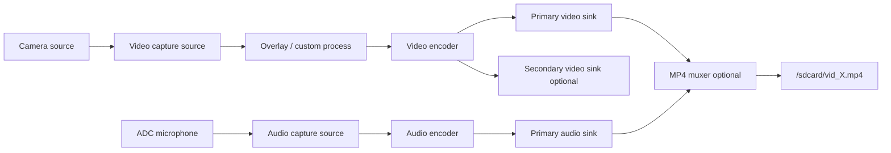

# ESP Video Capture Example

- [中文版](./README_CN.md)
- Complex Example: ⭐⭐⭐

## Example Brief

- This example demonstrates multi-scenario video capture with `esp_capture`.
- It covers basic capture, one-shot capture, overlay, MP4 recording, custom processing, and dual-path output.

### Typical Scenarios

- Validate camera + microphone synchronized capture
- Record AV streams to SD card in MP4 slices
- Add dynamic text overlay on video stream
- Output two video paths simultaneously in different formats

## Environment Setup

### Hardware Required

- Recommended board: [ESP32-S3-Korvo2](https://docs.espressif.com/projects/esp-adf/en/latest/design-guide/dev-boards/user-guide-esp32-s3-korvo-2.html) or [ESP32-P4-Function-EV-Board](https://docs.espressif.com/projects/esp-dev-kits/en/latest/esp32p4/esp32-p4-function-ev-board/user_guide.html)
- Camera module and audio input device
- SD card (optional, required for muxer case)

### Default IDF Branch

This example supports IDF `release/v5.4` (>= v5.4.3) and `release/v5.5` (>= v5.5.2).

## Build and Flash

### Select and configure a development board

This example uses [ESP Board Manager](https://github.com/espressif/esp-board-manager) to manage board-level resources. The [`esp-bmgr-assist`](https://pypi.org/project/esp-bmgr-assist/) helper tool is recommended as the default entry point.

Install once in your activated ESP-IDF Python environment:

```bash
pip install esp-bmgr-assist
pip install --upgrade esp-bmgr-assist
```

- List supported boards:

```bash
idf.py bmgr -l
```

Example output:

```text
ℹ️  Main Boards:
  [1] dual_eyes_board_v1_0
  [2] esp32_c3_lyra
  [3] esp32_c5_spot
  [4] esp32_p4_function_ev
  [5] esp32_s3_korvo2_v3
  [6] esp32_s3_korvo2l
  [7] esp_box_3
  [8] esp_box_lite
  [9] esp_hi
```

- Select a board:

```bash
idf.py bmgr -b <board_index|board_name>
```

For example, to select `esp32_s3_korvo2_v3`:

```bash
idf.py bmgr -b 5
# or
idf.py bmgr -b esp32_s3_korvo2_v3
```

On first invocation, the component is downloaded automatically based on the `espressif/esp_board_manager` dependency declared in `main/idf_component.yml`.

> [!NOTE]
> To switch to a different board supported by `esp_board_manager`, repeat the same steps with the new board name or index.
> For a custom board, see [How to customize board](https://github.com/espressif/esp-board-manager/blob/main/esp_board_manager/docs/how_to_customize_board.md).
> For more information about `esp_board_manager`, see the [ESP Board Manager Getting Started Guide](https://github.com/espressif/esp-board-manager/blob/main/esp_board_manager/README.md).

### Build and Flash Commands

```bash
idf.py build
idf.py -p PORT flash monitor
```

## How to Use the Example

### Flow Introduction



### Functionality and Usage

`app_main()` runs these cases in sequence (10 seconds each):

1. `video_capture_run`
2. `video_capture_run_one_shot`
3. `video_capture_run_with_overlay`
4. `video_capture_run_with_muxer` (only when SD card mount succeeds)
5. `video_capture_run_with_customized_process`
6. `video_capture_run_dual_path`

Additional behavior:

- Registers default audio/video encoders and MP4 muxer
- Applies custom thread scheduler via `esp_capture_set_thread_scheduler`

### Configuration

Main configurable items are in `main/settings.h`:

- Video sink0: `VIDEO_SINK0_FMT`, `VIDEO_SINK0_WIDTH`, `VIDEO_SINK0_HEIGHT`, `VIDEO_SINK0_FPS`
- Audio sink0: `AUDIO_SINK0_FMT`, `AUDIO_SINK0_SAMPLE_RATE`, `AUDIO_SINK0_CHANNEL`
- Dual-path sink1: `VIDEO_SINK1_FMT`, `VIDEO_SINK1_WIDTH`, `VIDEO_SINK1_HEIGHT`, `VIDEO_SINK1_FPS`
- Optional second audio path: `AUDIO_SINK1_FMT`, `AUDIO_SINK1_SAMPLE_RATE`, `AUDIO_SINK1_CHANNEL`

## Troubleshooting

### Video capture does not start

- Confirm camera device initialization succeeds
- Check camera wiring and sensor availability
- Verify selected format/resolution/fps combinations

### Audio capture fails in AV mode

- Confirm audio ADC initialization succeeds
- Check microphone path and audio sink settings

### MP4 files are not generated

- Confirm SD card mount success
- Check storage free space and write permission

### Performance is unstable

- Tune thread scheduling config in `capture_test_scheduler`
- Reduce resolution/fps or choose lighter encode format if needed

## Technical Support

- Technical support forum: [esp32.com](https://esp32.com/viewforum.php?f=20)
- Issues and feature requests: [GitHub issue](https://github.com/espressif/esp-gmf/issues)
