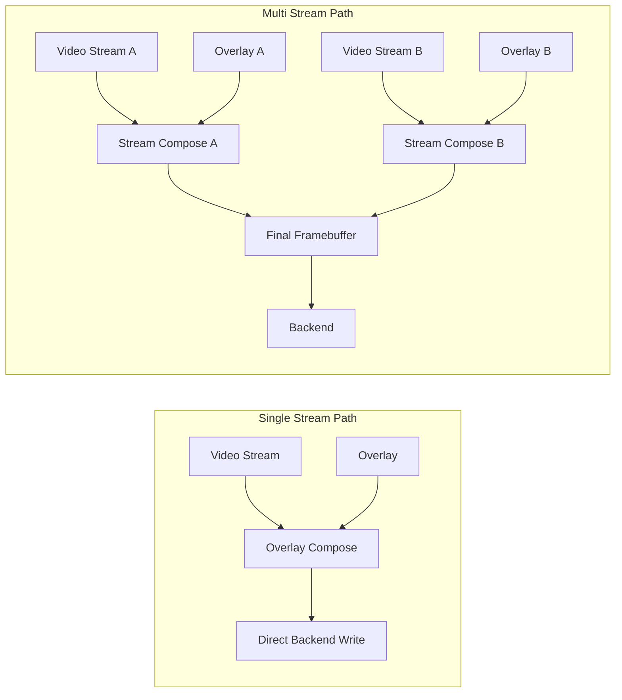

# ESP Video Render

[](https://components.espressif.com/components/espressif/esp_video_render)

- [中文说明](./README_CN.md)

## Overview

`esp_video_render` is a video composition and display component for ESP chips. It is designed for products that need to render video efficiently while also supporting UI composition, partial refresh, and flexible display backends.

The component is built around a practical embedded rendering model:

- A single render instance manages one display backend.
- Each render can host multiple streams.
- Each stream can display video, overlay content, or both.
- Each overlay can contain multiple containers and widgets.

This makes `esp_video_render` suitable for video players, smart displays, robot eyes, intercom panels, camera preview layouts, and other video-first embedded interfaces.

## Why Use `esp_video_render`

- **Video-first composition model**: blend video and UI in one rendering pipeline instead of stitching separate subsystems together.
- **Efficient partial updates**: dirty-region tracking reduces unnecessary redraws and background fills.
- **Scalable layout**: multiple streams can be placed, cropped, rotated, hidden, reordered, or updated independently.
- **Flexible output**: supports direct LCD pipelines, LVGL integration, and framebuffer-based backends.
- **Built for real products**: includes overlay primitives, widgets, dual-eyes support, and example applications.

## Key Features

### Video Rendering and Composition

- Multiple simultaneous streams in a single render
- Per-stream display rectangle and source crop rectangle
- Stream rotation: `0`, `90`, `180`, `270` degrees
- Stream visibility and Z-order control
- Per-stream alpha blending
- Background color or background image support
- Cached and non-cached stream modes
- Optional asynchronous rendering for stream workloads

### Efficient Rendering Pipeline

- Dirty-region based redraw
- Background refill optimization for opaque regions
- Stream and overlay composition into the final framebuffer
- Support for decode-to-buffer and decode-to-framebuffer workflows
- Optional direct framebuffer write path for efficient pipelines

### Backend Support

- LCD backend for direct display output
- LVGL backend for LVGL-based applications
- Single-buffer and double-buffer workflows
- GRAM-style partial update backend support
- Linux emulation backend for desktop-side validation and UI testing
- Extensible backend interface for custom display drivers

### Overlay System

- One overlay per stream
- Overlay-only streams are supported
- Multiple regions and multiple containers per overlay
- Thread-safe compose lock for overlay updates
- Region movement tracking with previous-rectangle invalidation
- Transparent-color and alpha-based composition support

### Widget System

- Built-in **text widget**
- Built-in **image widget**
- Container-based organization for widget composition
- Optional container cache to reduce redraw cost
- Transparent-color composition for images and containers

### Dual-Stream Rendering

- Generic dual-stream API for synchronized two-view output
- Typically used for left/right eye rendering and stereo emulation
- Supports single-display or dual-display layouts
- Independent display rectangles for each stream
- Buffer-based workflow for aligned frame delivery
- Optional async render/decode parallelism

### Video Proc Helper

`esp_video_render` also includes a lightweight video proc helper for decode and format-conversion paths. It can run synchronously for simple flows, or switch to async and cached output modes when you want smoother decode pipelines, output buffering, or manual frame acquisition.

## Supported Formats and Outputs

### Video/Input Formats

- Encoded formats: `H.264`, `MJPEG`
- Raw formats: `RGB565`, `RGB565_BE`, `RGB888`, `BGR888`, `YUV420`, `YUV422`, `YUV422P`, `O_UYY_E_VYY`

### Display/Backend Targets

- LCD panel backends such as `DVP`, `RGB`, `I80`, `DPI`
- LVGL display integration
- Linux emulation environment for desktop-side validation and UI testing

## Architecture

At a high level, `esp_video_render` composes video and overlay content, then sends the result to the configured backend. In the single-stream case, overlay content can be composed directly into the stream output before it is written to the backend. In the multi-stream case, each stream is composed first, then blended into the final framebuffer.



### Main Building Blocks

- **Render**
  The top-level object. It owns the backend and manages all streams.

- **Stream**
  The basic composition unit. A stream may contain video input, overlay content, or both.

- **Overlay**
  A UI composition layer associated with a stream. It can be updated independently and blended on top of video or directly into the final framebuffer.

- **Container**
  A region inside an overlay. Containers can be cached or uncached, and each one owns a widget list.

- **Widget**
  The smallest UI element. Widgets redraw within container dirty regions to minimize work.

- **Backend**
  The output abstraction that owns or exposes the target framebuffer and handles display update.

## Overlay and Widget Model

The overlay system is one of the main advantages of this component. It lets you build video-driven UIs without adding a separate full-screen GUI stack for simple cases.

### Overlay

Use `esp_video_render_stream_get_overlay()` to attach UI composition to a stream. An overlay can:

- hold one or more regions or containers
- be marked dirty explicitly
- be locked during composition updates
- redraw only changed regions
- work as an overlay-only stream, allowing the UI to render directly into the framebuffer even when no video content is attached

### Containers

Containers are positioned in screen coordinates and act as the main widget host. They support:

- cached or uncached rendering
- background color
- alpha control
- transparent-color composition
- visibility control
- add/remove widget operations
- composition change notification with dirty-region tracking

### Text Widget

The text widget supports:

- UTF-8 text rendering
- font loading from file, memory, or resource
- separate emoji font support
- text color and background color
- horizontal and vertical alignment
- scrolling and pause/resume control
- shadow effect
- overflow control

### Image Widget

The image widget supports:

- drawing pre-decoded image buffers
- image reuse across multiple widgets
- transparent-color blending

For image assets stored as encoded images, use `esp_video_render_decode_image()` to decode them into a renderable frame buffer.

For more widget notes and integration details, see [`widget_support.md`](./widget_support.md).

## Public API Highlights

### Core Render Lifecycle

- `esp_video_render_create()`
- `esp_video_render_set_display()`
- `esp_video_render_set_event_cb()`
- `esp_video_render_set_bg_color()`
- `esp_video_render_set_bg_image()`

### Stream Control

- `esp_video_render_stream_open()`
- `esp_video_render_stream_write()`
- `esp_video_render_stream_close()`
- `esp_video_render_stream_render_async()`
- `esp_video_render_stream_set_src_rect()`
- `esp_video_render_stream_set_disp_rect()`
- `esp_video_render_stream_set_zorder()`
- `esp_video_render_stream_set_rotate()`
- `esp_video_render_stream_set_visible()`
- `esp_video_render_stream_set_alpha()`

### Framebuffer-Oriented Path

- `esp_video_render_stream_acquire_fb()`
- `esp_video_render_stream_write_fb()`
- `esp_video_render_stream_release_fb()`

### Overlay and UI

- `esp_video_render_stream_get_overlay()`
- `esp_vui_overlay_add_container()`
- `esp_vui_container_create()`
- `esp_vui_text_widget_init()`
- `esp_vui_image_widget_init()`

### Dual-Eyes

- `esp_video_render_dual_stream_open()`
- `esp_video_render_dual_stream_set_display_rect()`
- `esp_video_render_dual_stream_get_buffer()`
- `esp_video_render_dual_stream_send_buffer()`
- `esp_video_render_dual_stream_close()`

## Quick Start

### 1. Create the render and backend

```c
esp_video_render_cfg_t render_cfg = {
    .pool = pool,
    .fps = 30,
};

esp_video_render_handle_t render = NULL;
esp_video_render_create(&render_cfg, &render);

esp_video_render_backend_cfg_t backend_cfg = {
    .ops = backend_ops,
    .cfg = &backend_cfg_data,
    .cfg_size = sizeof(backend_cfg_data),
};

esp_video_render_set_display(render, &backend_cfg);
```

### 2. Open a stream

```c
esp_video_render_stream_info_t stream_info = {
    .info = {
        .format = ESP_VIDEO_RENDER_FORMAT_MJPEG,
        .width = 640,
        .height = 480,
        .fps = 30,
    },
    .cached = false,
};

esp_video_render_stream_handle_t stream = NULL;
esp_video_render_stream_open(render, &stream_info, &stream);
```

### 3. Configure composition

```c
esp_video_render_rect_t disp = {
    .x = 0,
    .y = 0,
    .width = 320,
    .height = 240,
};

esp_video_render_stream_set_disp_rect(stream, &disp);
esp_video_render_stream_set_zorder(stream, 1);
```

### 4. Write frames

```c
esp_video_render_frame_t frame = {
    .data = data,
    .size = data_size,
    .format = ESP_VIDEO_RENDER_FORMAT_MJPEG,
    .width = 640,
    .height = 480,
};

esp_video_render_stream_write(stream, &frame);
```

### 5. Optional: attach overlay UI

```c
esp_vui_overlay_handle_t overlay = NULL;
esp_video_render_stream_get_overlay(stream, &overlay);
```

### 6. Close the stream

```c
esp_video_render_stream_close(stream);
```

## Examples

This component currently includes three main examples:

- [`examples/video_render`](./examples/video_render/README.md)
  Basic single-stream and multi-stream rendering, scaling, progress overlay, and backend usage.

- [`examples/dual_eyes`](./examples/dual_eyes/README.md)
  Dual-eyes rendering on one display or two displays.

- [`examples/video_player`](./examples/video_player/README.md)
  Video playback with lightweight UI composition.

## Linux Emulation

`esp_video_render` includes a Linux emulation environment that uses SDL for output and can optionally use GStreamer CLI tools for video-processing paths. This is useful for desktop UI validation, render-pipeline debugging, and regression testing before running on ESP hardware.

See [`emulation/README.md`](./emulation/README.md) for build, run, and test instructions.

## Configuration Notes

### LVGL Backend

The LVGL backend is disabled by default. Enable it in `menuconfig`:

```text
Video Render Configuration -> ESP_VIDEO_RENDER_LVGL_BACKEND_SUPPORT
```

### Text Widget Emoji Support

If emoji rendering is required in the text widget, FreeType needs PNG support enabled. The current project notes for that setup are kept in [`widget_support.md`](./widget_support.md).

## FAQ

- Why does the video render `Blender` task need so much stack?
  When FreeType text rendering is enabled, the raster path uses a large stack buffer, `TCell buffer[FT_MAX_GRAY_POOL]`, which takes about 16 KB. If text rendering is not needed, the `Blender` task stack can usually be reduced to around 4 KB.

- Why does flicker appear when video and UI are blended by the `Blender` task with only one framebuffer on a DPI/RGB LCD?
  With a single framebuffer, video is blended into the buffer first, then the UI is blended into that same buffer, and finally the frame is sent to the panel. Because rendering and scanout share the same framebuffer, visible flicker or tearing can appear.
  To reduce this effect, disable the `Blender` task for this mode or use two framebuffers instead.


## Technical Support

- Technical support: [esp32.com](https://esp32.com/viewforum.php?f=20) forum
- Issue reports and feature requests: [GitHub issue](https://github.com/espressif/esp-gmf/issues)
