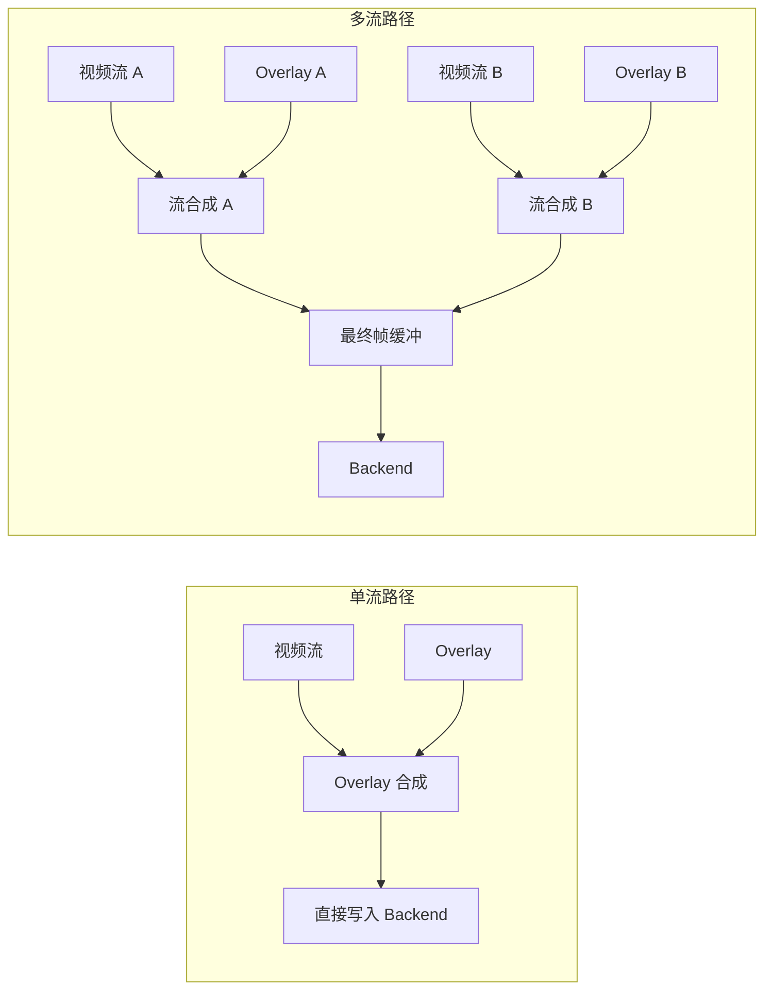

# ESP 视频渲染器

[](https://components.espressif.com/components/espressif/esp_video_render)

- [English](./README.md)
- [Linux 仿真指南](./emulation/README_CN.md)

## 概述

`esp_video_render` 是一个面向 ESP 芯片的视频合成与显示组件，适用于既需要高效视频渲染、又需要叠加 UI、局部刷新和灵活显示后端的产品。

该组件围绕一种适合嵌入式场景的渲染模型构建：

- 一个 render 实例管理一个显示后端
- 一个 render 可包含多个 stream
- 每个 stream 可以承载视频、overlay，或两者同时存在
- 每个 overlay 可以包含多个 container 和 widget

因此，`esp_video_render` 适用于视频播放器、智能显示终端、机器人眼睛、可视对讲界面、摄像头预览布局等视频优先型嵌入式应用。

## 为什么选择 `esp_video_render`

- **视频优先的合成模型**：在同一条渲染链路中完成视频与 UI 的组合，而不是把多个子系统拼接在一起。
- **高效局部刷新**：通过脏区域跟踪减少不必要的重绘与背景填充。
- **布局扩展灵活**：多个流可以独立设置位置、裁剪、旋转、显示隐藏、层级和更新策略。
- **输出方式灵活**：支持直接 LCD 输出、LVGL 集成以及基于帧缓冲的后端。
- **面向真实产品设计**：内置 overlay、widget、双眼渲染和完整示例。

## 核心特性

### 视频渲染与合成

- 单个 render 中支持多个 stream 同时渲染
- 每个 stream 支持显示区域和源裁剪区域配置
- 支持 `0`、`90`、`180`、`270` 度旋转
- 支持 stream 可见性和 Z-order 控制
- 支持每流 alpha 混合
- 支持背景色和背景图
- 支持 cached 与 non-cached 两种 stream 模式
- 支持按需启用异步渲染

### 高效渲染流水线

- 基于 dirty region 的局部重绘
- 针对不透明区域的背景重填优化
- 支持 stream 与 overlay 合成到最终帧缓冲
- 支持解码到普通缓冲和解码到帧缓冲两种流程
- 支持直接写入帧缓冲的高效路径

### 后端支持

- LCD 直连显示后端
- LVGL 显示后端
- 单缓冲和双缓冲工作流
- 类 GRAM 的局部更新后端支持
- Linux 仿真后端，便于桌面侧验证和 UI 测试
- 可扩展的自定义后端接口

### Overlay 系统

- 每个 stream 可绑定一个 overlay
- 支持仅包含 overlay 的 stream
- 每个 overlay 支持多个 region 和多个 container
- 提供线程安全的 compose lock
- 支持 region 位移跟踪和前一矩形失效处理
- 支持透明色和 alpha 混合

### Widget 系统

- 内置**文本组件**
- 内置**图像组件**
- 采用 container 组织 widget
- 支持可选的 container cache 以减少重绘成本
- 支持图像与容器透明色合成

### 双流渲染

- 提供通用的双流同步输出 API
- 典型场景是左右眼渲染和立体显示仿真
- 支持单屏或双屏布局
- 每个 stream 都可独立配置显示矩形
- 提供基于缓冲的对齐输出流程
- 支持可选的异步渲染/解码并行

### Video Proc 助手

`esp_video_render` 还提供了一个轻量级 video proc 助手，用于解码和格式转换等处理流程。它既可以用同步方式简化基础链路，也可以切换到异步和缓存输出模式，让解码流水线、输出缓冲和手动取帧更加灵活。

## 支持的格式与输出

### 视频/输入格式

- 编码格式：`H.264`、`MJPEG`
- 原始格式：`RGB565`、`RGB565_BE`、`RGB888`、`BGR888`、`YUV420`、`YUV422`、`YUV422P`、`O_UYY_E_VYY`

### 显示/后端目标

- `DVP`、`RGB`、`I80`、`DPI` 等 LCD 后端
- LVGL 显示集成
- Linux 仿真环境，用于桌面侧验证和 UI 测试

## 架构

从整体上看，`esp_video_render` 会先组合视频与 overlay 内容，再将结果输出到配置好的后端。在单流场景下，overlay 可以先与 stream 输出直接合成，再写入后端；在多流场景下，则先完成每个 stream 的合成，再统一混合到最终帧缓冲。



### 主要构成模块

- **Render**
  顶层对象，负责管理 backend 和所有 stream。

- **Stream**
  基本合成单元。一个 stream 可以包含视频输入、overlay，或两者同时存在。

- **Overlay**
  关联在 stream 上的 UI 合成层，可独立更新，并可叠加到视频上或直接合成到最终帧缓冲。

- **Container**
  overlay 内的一个区域，可配置为缓存模式或非缓存模式，并负责维护 widget 列表。

- **Widget**
  最小的 UI 元素。widget 会在 container 的 dirty region 内按需重绘，以减少无效开销。

- **Backend**
  输出抽象层，负责持有或提供目标帧缓冲，并执行显示更新。

## Overlay 与 Widget 模型

overlay 系统是该组件的核心优势之一。对于简单场景，它允许你在不引入完整 GUI 框架的情况下构建视频优先的 UI。

### Overlay

通过 `esp_video_render_stream_get_overlay()` 可以把 UI 合成能力附加到某个 stream。overlay 支持：

- 持有一个或多个 region / container
- 显式标记 dirty
- 在更新期间加锁保护
- 仅重绘变化区域
- 以仅 overlay 的方式工作，即使没有视频内容，也能直接把 UI 渲染到帧缓冲

### Container

container 使用屏幕坐标定位，是 widget 的主要宿主。它支持：

- cached 或 uncached 渲染
- 背景颜色
- alpha 控制
- 透明色合成
- 可见性控制
- 添加和删除 widget
- 通过 dirty region 跟踪组合变化

### 文本组件

文本组件支持：

- UTF-8 文本渲染
- 从文件、内存或资源加载字体
- 独立的 emoji 字体支持
- 文本颜色与背景颜色
- 水平和垂直对齐
- 滚动、暂停与恢复
- 阴影效果
- 溢出模式控制

### 图像组件

图像组件支持：

- 绘制预先解码的图像缓冲
- 多个 widget 复用同一份图像数据
- 透明色混合

若图像资源为编码格式，可使用 `esp_video_render_decode_image()` 将其解码为可渲染的帧缓冲。

关于 widget 的更多说明，请参考 [`widget_support.md`](./widget_support.md)。

## 公开 API 速览

### Render 生命周期

- `esp_video_render_create()`
- `esp_video_render_set_display()`
- `esp_video_render_set_event_cb()`
- `esp_video_render_set_bg_color()`
- `esp_video_render_set_bg_image()`

### Stream 控制

- `esp_video_render_stream_open()`
- `esp_video_render_stream_write()`
- `esp_video_render_stream_close()`
- `esp_video_render_stream_render_async()`
- `esp_video_render_stream_set_src_rect()`
- `esp_video_render_stream_set_disp_rect()`
- `esp_video_render_stream_set_zorder()`
- `esp_video_render_stream_set_rotate()`
- `esp_video_render_stream_set_visible()`
- `esp_video_render_stream_set_alpha()`

### 面向帧缓冲的路径

- `esp_video_render_stream_acquire_fb()`
- `esp_video_render_stream_write_fb()`
- `esp_video_render_stream_release_fb()`

### Overlay 与 UI

- `esp_video_render_stream_get_overlay()`
- `esp_vui_overlay_add_container()`
- `esp_vui_container_create()`
- `esp_vui_text_widget_init()`
- `esp_vui_image_widget_init()`

### 双眼渲染

- `esp_video_render_dual_stream_open()`
- `esp_video_render_dual_stream_set_display_rect()`
- `esp_video_render_dual_stream_get_buffer()`
- `esp_video_render_dual_stream_send_buffer()`
- `esp_video_render_dual_stream_close()`

## 快速开始

### 1. 创建 render 和 backend

```c
esp_video_render_cfg_t render_cfg = {
    .pool = pool,
    .fps = 30,
};

esp_video_render_handle_t render = NULL;
esp_video_render_create(&render_cfg, &render);

esp_video_render_backend_cfg_t backend_cfg = {
    .ops = backend_ops,
    .cfg = &backend_cfg_data,
    .cfg_size = sizeof(backend_cfg_data),
};

esp_video_render_set_display(render, &backend_cfg);
```

### 2. 打开一个 stream

```c
esp_video_render_stream_info_t stream_info = {
    .info = {
        .format = ESP_VIDEO_RENDER_FORMAT_MJPEG,
        .width = 640,
        .height = 480,
        .fps = 30,
    },
    .cached = false,
};

esp_video_render_stream_handle_t stream = NULL;
esp_video_render_stream_open(render, &stream_info, &stream);
```

### 3. 配置合成属性

```c
esp_video_render_rect_t disp = {
    .x = 0,
    .y = 0,
    .width = 320,
    .height = 240,
};

esp_video_render_stream_set_disp_rect(stream, &disp);
esp_video_render_stream_set_zorder(stream, 1);
```

### 4. 写入帧

```c
esp_video_render_frame_t frame = {
    .data = data,
    .size = data_size,
    .format = ESP_VIDEO_RENDER_FORMAT_MJPEG,
    .width = 640,
    .height = 480,
};

esp_video_render_stream_write(stream, &frame);
```

### 5. 可选：绑定 overlay UI

```c
esp_vui_overlay_handle_t overlay = NULL;
esp_video_render_stream_get_overlay(stream, &overlay);
```

### 6. 关闭 stream

```c
esp_video_render_stream_close(stream);
```

## 示例

当前组件包含以下几个主要示例：

- [`examples/video_render`](./examples/video_render/README_CN.md)
  展示基础单流/多流渲染、缩放、进度条 overlay 和不同 backend 的使用方式。

- [`examples/dual_eyes`](./examples/dual_eyes/README_CN.md)
  展示单屏或双屏下的双眼渲染流程。

- [`examples/video_player`](./examples/video_player/README_CN.md)
  展示带轻量 UI 合成的视频播放示例。

## Linux 仿真

`esp_video_render` 提供 Linux 仿真环境，使用 SDL 进行显示输出，并可选使用 GStreamer CLI 工具模拟视频处理路径。该环境适用于桌面侧 UI 验证、渲染链路调试和回归测试。

详细说明请参考 [`emulation/README_CN.md`](./emulation/README_CN.md)。

## 配置说明

### LVGL 后端

LVGL 后端默认关闭，可在 `menuconfig` 中启用：

```text
Video Render Configuration -> ESP_VIDEO_RENDER_LVGL_BACKEND_SUPPORT
```

### 文本组件 Emoji 支持

如果文本组件需要显示 emoji，需要为 FreeType 启用 PNG 支持。相关配置说明保留在 [`widget_support.md`](./widget_support.md) 中。

## 常见问题

- 为什么视频渲染的 `Blender` 任务需要这么大的栈？
  当启用 FreeType 文本渲染时，光栅化路径会使用一个较大的栈上缓冲区 `TCell buffer[FT_MAX_GRAY_POOL]`，大约会占用 16 KB。如果不需要文本渲染，`Blender` 任务的栈通常可以降到约 4 KB。

- 为什么在 DPI/RGB LCD 上只使用一个 framebuffer，并由 `Blender` 任务同时混合视频和 UI 时会出现闪烁？
  当只有一个 framebuffer 时，会先把视频混合到该缓冲区，再把 UI 混合到同一个缓冲区，最后再送到屏幕输出。由于渲染和屏幕扫描共用同一个 framebuffer，就可能出现可见的闪烁或撕裂。
  如果要减轻这个问题，建议在这种模式下关闭 `Blender` 任务，或者改用双 framebuffer。

## 技术支持

- 技术支持论坛：[esp32.com](https://esp32.com/viewforum.php?f=20)
- 问题反馈和功能建议：[GitHub issue](https://github.com/espressif/esp-gmf/issues)
