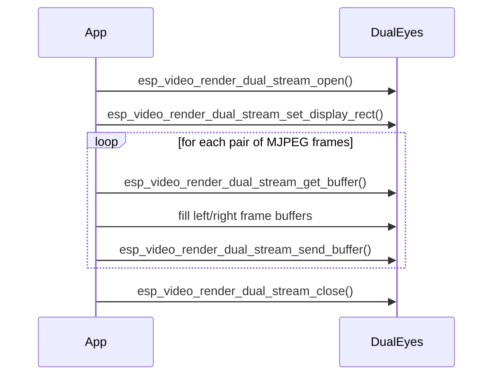

# Dual Eyes Display Example

- [中文版](./README_CN.md)
- Regular Example: ⭐⭐

## Example Brief

- This example demonstrates how to use the `esp_video_render_dual_stream_*` API to drive left and right eye streams as one synchronized rendering task.
- It shows both side-by-side output on a single display and split output on two displays, depending on the build configuration.
- It also demonstrates optional LVGL integration and frame-rate controlled playback using MJPEG sources from an SD card.

### Typical Scenarios

- Robot eyes and animated face displays
- AI companion products
- Simple stereo or dual-panel video effects
- Two-stream synchronized playback with one control flow

### Run Flow

After startup, the example initializes the required board devices, opens the dual-eyes renderer, and repeatedly plays the left and right eye MJPEG files.

- In single-display mode, both eyes are placed on one screen.
- In dual-display mode, each eye is rendered to its own display path.
- The example also runs both non-LVGL and LVGL-backed display flows when available.



### File Structure

```text
examples/dual_eyes
├── main
│   ├── dual_display.h
│   ├── dual_eyes.c
│   ├── dual_eyes.h
│   ├── main.c
│   ├── settings.h
│   └── video_render_sys.c
├── CMakeLists.txt
├── idf_ext.py
├── partitions.csv
├── README.md
└── README_CN.md
```

## Environment Setup

### Hardware Required

For single-display mode:

- An ESP board with LCD support, such as:
  - [ESP32-S3-Korvo2](https://docs.espressif.com/projects/esp-adf/en/latest/design-guide/dev-boards/user-guide-esp32-s3-korvo-2.html)
  - [ESP32-P4-Function-EV-Board](https://docs.espressif.com/projects/esp-dev-kits/en/latest/esp32p4/esp32-p4-function-ev-board/user_guide.html)
- One supported display panel
- An SD card with MJPEG test files

For dual-display mode:

- Board and display wiring that matches `main/dual_display.h`
- Two supported panels

### Default IDF Branch

This example supports IDF release/v5.5 (>= v5.5.2).

### Software Requirements

- MJPEG test files on the SD card
- Default input files in `main/settings.h`:
  - `LEFT_FILE`
  - `RIGHT_FILE`

## Build and Flash

### Build Preparation

Before building, make sure the ESP-IDF environment is installed and exported.

```bash
cd /path/to/esp-gmf/packages/esp_video_render/examples/dual_eyes
```

Generate board-manager code for your target board before building. For example:

```bash
idf.py gen-bmgr-config -b esp32_p4_function_ev
```

If you use a different supported board, replace `esp32_p4_function_ev` with the corresponding board name. To list supported boards, run:

```bash
idf.py gen-bmgr-config -l
```

### Project Configuration

Key configuration items:

- `main/settings.h`
  - `VIDEO_WIDTH`
  - `VIDEO_HEIGHT`
  - `MAX_FRAME_SIZE`
  - `LEFT_FILE`
  - `RIGHT_FILE`
- `DUAL_EYES_ON_DUAL_DISPLAY`
  - comment out for one-display mode
  - enable for dual-display mode
- `main/dual_display.h`
  - update display wiring and panel parameters for dual-display targets

Generate MJPEG files with:

```bash
ffmpeg -i input.mp4 -q:v 1 -c:v mjpeg -pix_fmt yuvj420p -vtag MJPG left.mjpeg
```

Check the largest encoded frame size with:

```bash
ffprobe -v error -select_streams v:0 -show_entries packet=size -of csv=p=0 left.mjpeg | sort -n | tail -1
```

Use that result to size `MAX_FRAME_SIZE`.

### Build and Flash Commands

```bash
idf.py build
idf.py -p PORT flash monitor
```

## How to Use the Example

### Functionality and Usage

- Copy the left and right MJPEG files [left.mjpeg](../../assets/left.mjpeg), [rignt.mjpeg](../../assets/right.mjpeg) to the SD card.
- Flash the example and reset the board.
- The example automatically runs the configured display mode:
  - one display with left and right eyes side-by-side
  - or dual display with one eye per panel
- When LVGL support is enabled, the example also exercises the LVGL-backed path.

### Results

When everything is configured correctly, you should see:

- synchronized left and right eye playback
- automatic display rectangle setup for both eyes
- repeated playback for stress or leak checking
- FPS logging after playback loops complete

## Troubleshooting

### Display too small

If the panel is smaller than the configured eye resolution, single-display mode may scale down, but some hardware combinations may still be too small for the requested layout.

### File open failure

If the example skips playback, verify the SD card is mounted and the files match the paths defined in `main/settings.h`.

### Incorrect dual-display wiring

If dual-display mode does not work, check the pin and panel configuration in `main/dual_display.h`.

## Technical Support

- Technical support: [esp32.com](https://esp32.com/viewforum.php?f=20) forum
- Issue reports and feature requests: [GitHub issue](https://github.com/espressif/esp-gmf/issues)
