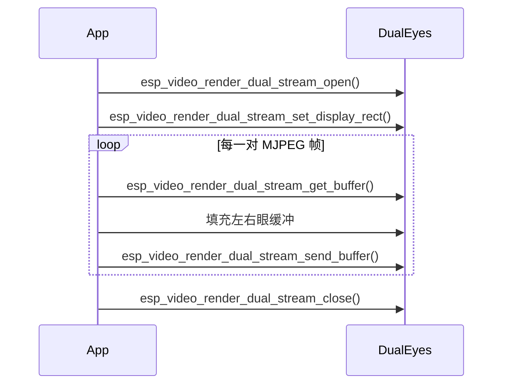

# 双眼显示示例

- [English](./README.md)
- 例程难度：⭐⭐

## 示例简介

- 本示例展示如何使用 `esp_video_render_dual_stream_*` API 完成左右眼同步渲染。
- 它同时支持单屏并排输出和双屏分别输出两种模式，具体由编译配置决定。
- 示例还演示了可选的 LVGL 集成，以及基于 SD 卡 MJPEG 文件的定帧率播放。

### 典型场景

- 机器人眼睛与表情动画
- AI 伴侣类产品
- 简单双屏或双眼视频效果
- 双路视频的同步播放

### 运行流程

启动后，示例会初始化所需板级设备，打开双眼渲染器，并循环播放左右眼的 MJPEG 文件。

- 在单屏模式下，左右眼会并排显示在同一块屏幕上。
- 在双屏模式下，每只眼睛会输出到独立显示通路。
- 如果工程中启用了 LVGL，示例还会测试 LVGL backend 路径。



### 文件结构

```text
examples/dual_eyes
├── main
│   ├── dual_display.h
│   ├── dual_eyes.c
│   ├── dual_eyes.h
│   ├── main.c
│   ├── settings.h
│   └── video_render_sys.c
├── CMakeLists.txt
├── idf_ext.py
├── partitions.csv
├── README.md
└── README_CN.md
```

## 环境准备

### 硬件要求

单屏模式：

- 一块支持 LCD 的 ESP 开发板，例如：
  - [ESP32-S3-Korvo2](https://docs.espressif.com/projects/esp-adf/en/latest/design-guide/dev-boards/user-guide-esp32-s3-korvo-2.html)
  - [ESP32-P4-Function-EV-Board](https://docs.espressif.com/projects/esp-dev-kits/en/latest/esp32p4/esp32-p4-function-ev-board/user_guide.html)
- 一块受支持的显示屏
- 一张存放 MJPEG 测试文件的 SD 卡

双屏模式：

- 与 `main/dual_display.h` 配置匹配的板级与显示连接
- 两块受支持的显示屏

### 默认 IDF 分支

本示例支持 IDF release/v5.5（>= v5.5.2）。

### 软件要求

- SD 卡中准备好 MJPEG 测试文件
- 默认输入文件在 `main/settings.h` 中定义：
  - `LEFT_FILE`
  - `RIGHT_FILE`

## 构建与烧录

### 构建准备

开始构建前，请确保已经完成 ESP-IDF 环境安装并执行过导出。

```bash
cd /path/to/esp-gmf/packages/esp_video_render/examples/dual_eyes
```

在构建前先为目标开发板生成 board-manager 代码，例如：

```bash
idf.py gen-bmgr-config -b esp32_p4_function_ev
```

如果你使用的是其他受支持的开发板，请将 `esp32_p4_function_ev` 替换为对应的板型名称。可通过以下命令列出支持的开发板：

```bash
idf.py gen-bmgr-config -l
```

### 工程配置

关键配置项如下：

- `main/settings.h`
  - `VIDEO_WIDTH`
  - `VIDEO_HEIGHT`
  - `MAX_FRAME_SIZE`
  - `LEFT_FILE`
  - `RIGHT_FILE`
- `DUAL_EYES_ON_DUAL_DISPLAY`
  - 注释掉表示单屏模式
  - 启用后表示双屏模式
- `main/dual_display.h`
  - 在双屏模式下，需根据实际硬件更新显示参数和引脚配置

生成 MJPEG 文件：

```bash
ffmpeg -i input.mp4 -q:v 1 -c:v mjpeg -pix_fmt yuvj420p -vtag MJPG left.mjpeg
```

查询最大 MJPEG 帧大小：

```bash
ffprobe -v error -select_streams v:0 -show_entries packet=size -of csv=p=0 left.mjpeg | sort -n | tail -1
```

请根据结果调整 `MAX_FRAME_SIZE`。

### 构建与烧录命令

```bash
idf.py build
idf.py -p PORT flash monitor
```

## 如何使用本示例

### 功能与用法

- 将左右眼 MJPEG 文件 [left.mjpeg](../../assets/left.mjpeg)、 [rignt.mjpeg](../../assets/right.mjpeg) 复制到 SD 卡中。
- 烧录程序并复位开发板。
- 示例会自动根据当前配置运行：
  - 单屏模式：左右眼并排显示在一块屏幕上
  - 双屏模式：左右眼分别输出到两块屏幕
- 如果启用了 LVGL，示例还会测试 LVGL backend。

### 结果

配置正确时，你应能看到：

- 左右眼同步播放
- 根据屏幕尺寸自动设置显示矩形
- 多轮重复播放，用于压力测试或内存泄漏检查
- 每轮播放结束后输出 FPS 日志

## 故障排查

### 显示区域不足

如果显示屏尺寸小于配置的视频尺寸，单屏模式下可能会缩小显示，但某些硬件组合仍可能不足以承载目标布局。

### 文件打开失败

如果示例跳过播放，请检查 SD 卡是否已挂载，并确认 `main/settings.h` 中的文件路径是否正确。

### 双屏接线不匹配

如果双屏模式无法正常工作，请检查 `main/dual_display.h` 中的引脚和显示参数配置是否与实际硬件一致。

## 技术支持

- 技术支持论坛：[esp32.com](https://esp32.com/viewforum.php?f=20)
- 问题反馈和功能建议：[GitHub issue](https://github.com/espressif/esp-gmf/issues)
