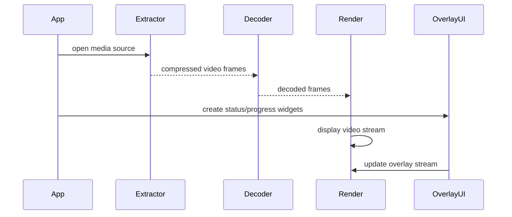

# Video Player Example

- Complex Example: ⭐⭐⭐

## Example Brief

- This example demonstrates how to build a lightweight video player on top of `esp_video_render`.
- It combines file-based media extraction, decode, render, and overlay UI into a single application flow.
- It shows how to play local media files with a compact on-screen UI that includes play state, progress, file name, volume, mute state, and FPS.

### Typical Scenarios

- Local video playback from SD card
- Media-first applications with lightweight UI
- Embedded demo player for MP4, AVI, or TS input
- Evaluating render, decode, and overlay interaction on ESP boards

### Resources

- Uses multiple worker tasks for extract, decode, and render/write stages
- Benefits from PSRAM for better buffering and decode throughput
- Embeds a font asset for the UI text layer

### Run Flow

The example scans `PLAYER_SOURCE_URL` for supported media files, builds a playlist, opens the first playable file, then runs the media pipeline and overlay UI in parallel.



### File Structure

```text
examples/video_player
├── main
│   ├── main.c
│   ├── settings.h
│   ├── video_player_app.c
│   ├── video_player_view.c
│   ├── video_player_view.h
│   ├── video_render_sys.c
│   └── video_render_sys.h
├── CMakeLists.txt
├── idf_ext.py
├── partitions.csv
└── README.md
```

## Environment Setup

### Hardware Required

- An ESP board with LCD support, such as:
  - [ESP32-S3-Korvo2](https://docs.espressif.com/projects/esp-adf/en/latest/design-guide/dev-boards/user-guide-esp32-s3-korvo-2.html)
  - [ESP32-P4-Function-EV-Board](https://docs.espressif.com/projects/esp-dev-kits/en/latest/esp32p4/esp32-p4-function-ev-board/user_guide.html)
- A supported display panel
- An SD card

### Default IDF Branch

This example supports IDF release/v5.5 (>= v5.5.2).

### Software Requirements

- Put supported media files under `PLAYER_SOURCE_URL` from `main/settings.h`
- Default media directory:
  - `/sdcard/render`
- Supported file extensions discovered by the example:
  - `.mp4`
  - `.avi`
  - `.ts`

## Build and Flash

### Build Preparation

Before building, make sure the ESP-IDF environment is installed and exported.

```bash
cd /path/to/esp-gmf/packages/esp_video_render/examples/video_player
```

Generate board-manager code for your target board before building. For example:

```bash
idf.py gen-bmgr-config -b esp32_p4_function_ev
```

If you use a different supported board, replace `esp32_p4_function_ev` with the corresponding board name. To list supported boards, run:

```bash
idf.py gen-bmgr-config -l
```

### Project Configuration

Key settings are defined in `main/settings.h`:

- `PLAYER_SOURCE_URL`
- `PLAYER_DEFAULT_FPS`
- `PLAYER_EXTRACT_POOL_SIZE`
- `PLAYER_DEC_OUT_CACHE_SIZE`

The example also embeds `DejaVuSans.ttf` for the UI text layer.

### Build and Flash Commands

```bash
idf.py build
idf.py -p PORT flash monitor
```

## How to Use the Example

### Functionality and Usage

- Copy one or more media files to `/sdcard/render`, or update `PLAYER_SOURCE_URL` to match your media directory.
- Flash the example and reset the board.
- The player starts automatically and opens the discovered playlist.
- The default runtime mode enables:
  - UI overlay
  - full-screen video
  - high-speed decode/render behavior

The example also registers console commands. Typical commands include:

- `play`
- `next`
- `prev`
- `pause`
- `resume`
- `stop`
- `seek <ms>`
- `vol <0-100>`
- `mute <0|1>`
- `ctrl <with_ui> <full_screen> <fullspeed>`

These commands allow you to experiment with UI visibility, playback state, fullscreen mode, and decode/render behavior without rebuilding the example.

### UI Features Demonstrated

The example view layer renders:

- play / pause state
- progress bar
- elapsed time
- current file name
- mute icon
- volume indicator
- FPS display

### Results

When the example runs correctly, you should see:

- playlist-based local video playback
- a status bar and center overlay UI
- overlay updates while playback continues
- console-controlled playback behavior

## Troubleshooting

### No media found

If playback does not start, verify that supported files exist in `/sdcard/render` or update `PLAYER_SOURCE_URL`.

### Unsupported file content

The example scans by extension, but the media still needs a decodable video stream. If a file opens but playback does not proceed, try another source file.

### UI missing or layout incorrect

Check display initialization and make sure the embedded font is included during build.

## Technical Support

- Technical support: [esp32.com](https://esp32.com/viewforum.php?f=20) forum
- Issue reports and feature requests: [GitHub issue](https://github.com/espressif/esp-gmf/issues)

