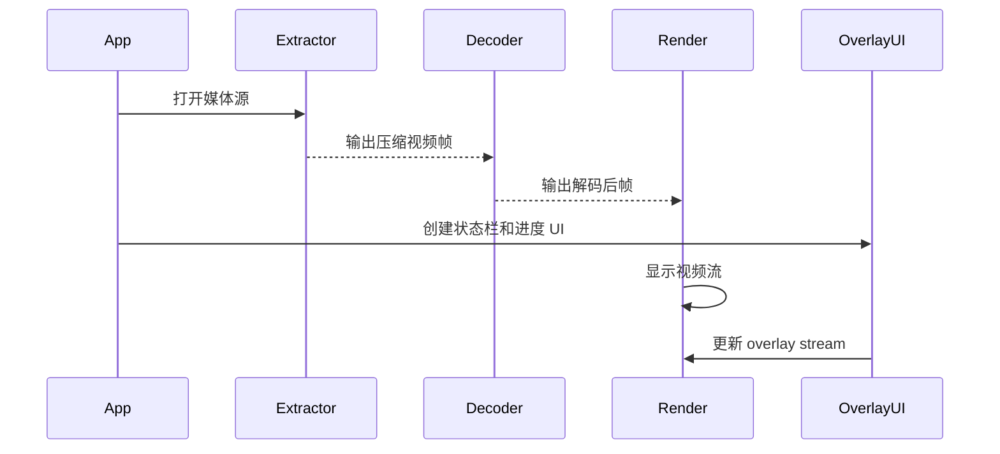

# 视频播放器示例

- [English](./README.md)
- 例程难度：⭐⭐⭐

## 示例简介

- 本示例展示如何基于 `esp_video_render` 构建一个轻量级视频播放器。
- 它将文件提取、解码、渲染和 overlay UI 组合在同一套应用流程中。
- 示例支持本地媒体文件播放，并带有简洁的屏幕 UI，包括播放状态、进度、文件名、音量、静音状态和 FPS 显示。

### 典型场景

- 基于 SD 卡的本地视频播放
- 以视频为主、UI 为辅的应用场景
- MP4 / AVI / TS 的嵌入式播放器验证
- 验证渲染、解码和 overlay 的协同工作

### 资源说明

- 使用多任务分别处理提取、解码和渲染/写入阶段
- 使用 PSRAM 可获得更好的缓冲与解码性能
- UI 文本层会嵌入字体资源

### 运行流程

示例会扫描 `PLAYER_SOURCE_URL` 目录下的媒体文件，生成播放列表，打开第一个可播放文件，然后并行运行媒体管线和 overlay UI。



### 文件结构

```text
examples/video_player
├── main
│   ├── main.c
│   ├── settings.h
│   ├── video_player_app.c
│   ├── video_player_view.c
│   ├── video_player_view.h
│   ├── video_render_sys.c
│   └── video_render_sys.h
├── CMakeLists.txt
├── idf_ext.py
├── partitions.csv
├── README.md
└── README_CN.md
```

## 环境准备

### 硬件要求

- 一块支持 LCD 的 ESP 开发板，例如：
  - [ESP32-S3-Korvo2](https://docs.espressif.com/projects/esp-adf/en/latest/design-guide/dev-boards/user-guide-esp32-s3-korvo-2.html)
  - [ESP32-P4-Function-EV-Board](https://docs.espressif.com/projects/esp-dev-kits/en/latest/esp32p4/esp32-p4-function-ev-board/user_guide.html)
- 一块受支持的显示屏
- 一张 SD 卡

### 默认 IDF 分支

本示例支持 IDF release/v5.5（>= v5.5.2）。

### 软件要求

- 将受支持的媒体文件放入 `main/settings.h` 中定义的 `PLAYER_SOURCE_URL` 目录
- 默认媒体目录：
  - `/sdcard/render`
- 示例会扫描以下扩展名：
  - `.mp4`
  - `.avi`
  - `.ts`

## 构建与烧录

### 构建准备

开始构建前，请确保已经完成 ESP-IDF 环境安装并执行过导出。

```bash
cd /path/to/esp-gmf/packages/esp_video_render/examples/video_player
```

在构建前先为目标开发板生成 board-manager 代码，例如：

```bash
idf.py gen-bmgr-config -b esp32_p4_function_ev
```

如果你使用的是其他受支持的开发板，请将 `esp32_p4_function_ev` 替换为对应的板型名称。可通过以下命令列出支持的开发板：

```bash
idf.py gen-bmgr-config -l
```

### 工程配置

关键设置位于 `main/settings.h`：

- `PLAYER_SOURCE_URL`
- `PLAYER_DEFAULT_FPS`
- `PLAYER_EXTRACT_POOL_SIZE`
- `PLAYER_DEC_OUT_CACHE_SIZE`

示例还会嵌入 `DejaVuSans.ttf` 作为 UI 文本字体。

### 构建与烧录命令

```bash
idf.py build
idf.py -p PORT flash monitor
```

## 如何使用本示例

### 功能与用法

- 将一个或多个媒体文件复制到 `/sdcard/render`，或修改 `PLAYER_SOURCE_URL` 指向你的媒体目录。
- 烧录程序并复位开发板。
- 播放器会自动启动并打开扫描到的播放列表。
- 默认运行模式会启用：
  - UI overlay
  - 全屏视频
  - 高速解码/渲染模式

该示例还注册了一组控制台命令，常用命令包括：

- `play`
- `next`
- `prev`
- `pause`
- `resume`
- `stop`
- `seek <ms>`
- `vol <0-100>`
- `mute <0|1>`
- `ctrl <with_ui> <full_screen> <fullspeed>`

通过这些命令可以在运行时调整 UI、播放状态、全屏模式和解码/渲染行为，而无需重新编译。

### UI 演示内容

示例 UI 会显示：

- 播放 / 暂停状态
- 进度条
- 已播放时间
- 当前文件名
- 静音图标
- 音量指示
- FPS 信息

### 结果

当示例运行正常时，你应能看到：

- 本地视频按播放列表顺序播放
- 顶部状态栏和中心控制 UI
- 播放过程中 overlay 持续更新
- 通过控制台命令动态控制播放行为

## 故障排查

### 未找到媒体文件

如果播放没有开始，请检查 `/sdcard/render` 下是否存在受支持的媒体文件，或确认 `PLAYER_SOURCE_URL` 配置正确。

### 文件扩展名匹配但无法播放

示例会根据扩展名扫描文件，但文件本身仍需包含可解码的视频流。如果文件被发现但无法正常播放，请更换测试文件。

### UI 未显示或布局异常

请检查显示初始化是否正常，并确认构建时已正确嵌入字体资源。

## 技术支持

- 技术支持论坛：[esp32.com](https://esp32.com/viewforum.php?f=20)
- 问题反馈和功能建议：[GitHub issue](https://github.com/espressif/esp-gmf/issues)
