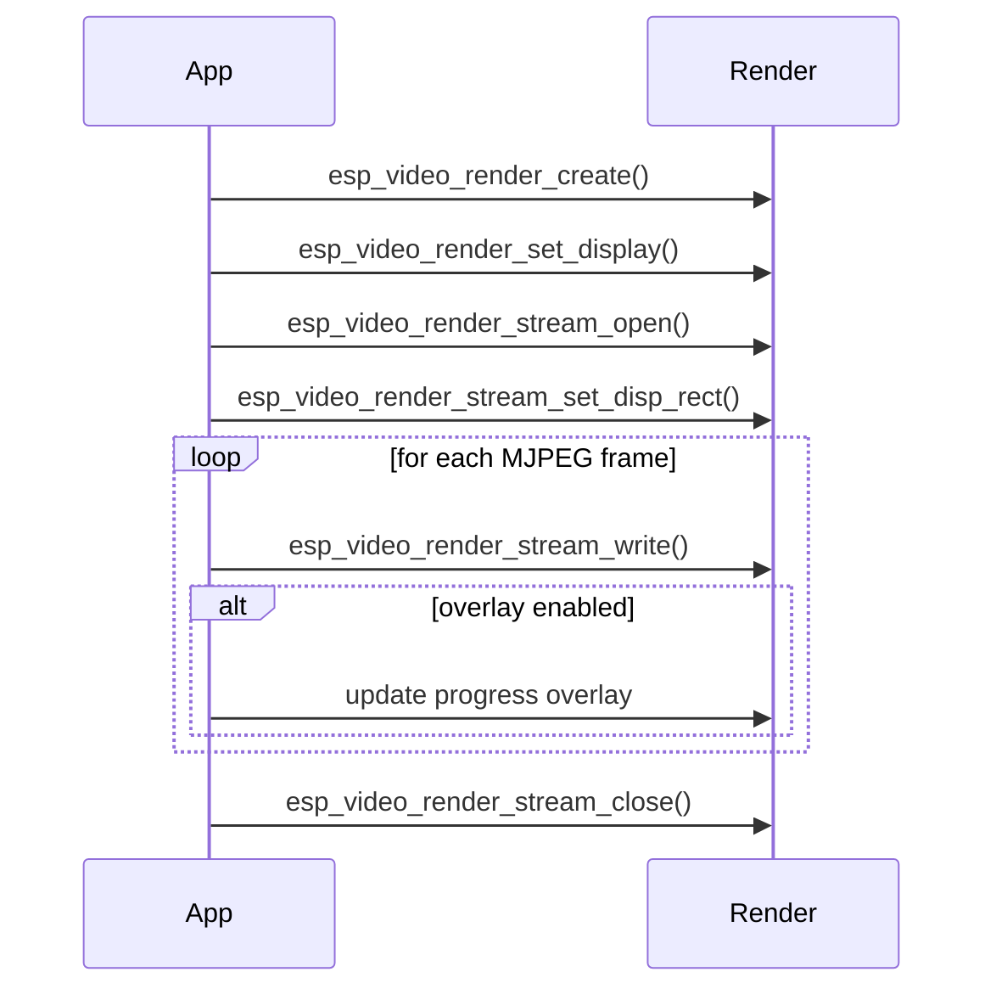

# Video Render Example

- [中文版](./README_CN.md)
- Regular Example: ⭐⭐

## Example Brief

- This example demonstrates the core `esp_video_render` workflows using MJPEG files stored on an SD card.
- It shows single-stream playback, dual-stream side-by-side playback, cached versus synchronous rendering, and a lightweight overlay progress bar.
- It also shows how the same render flow can target either the LCD backend or the LVGL backend.

### Typical Scenarios

- Basic video playback on an LCD
- Split-screen preview for two MJPEG sources
- Lightweight UI overlay on top of video
- Comparing synchronous and asynchronous render behavior

### Run Flow

On boot, the example initializes the LCD and SD card, then runs a sequence of demo cases:

1. Single video playback with normal render pacing
2. Single video playback with synchronous render
3. Single video playback with progress bar overlay
4. Dual-video side-by-side playback
5. Dual-video side-by-side playback with per-stream progress bars

When LVGL support is enabled, the same sequence is repeated once with the LVGL backend.



### File Structure

```text
examples/video_render
├── main
│   ├── main.c
│   ├── progress.c
│   ├── settings.h
│   ├── video_render.c
│   └── video_render_sys.c
├── CMakeLists.txt
├── idf_ext.py
├── partitions.csv
├── README.md
└── README_CN.md
```

## Environment Setup

### Hardware Required

- An ESP board with LCD support, such as:
  - [ESP32-S3-Korvo2](https://docs.espressif.com/projects/esp-adf/en/latest/design-guide/dev-boards/user-guide-esp32-s3-korvo-2.html)
  - [ESP32-P4-Function-EV-Board](https://docs.espressif.com/projects/esp-dev-kits/en/latest/esp32p4/esp32-p4-function-ev-board/user_guide.html)
- A supported display panel
- An SD card with MJPEG test files

### Default IDF Branch

This example supports IDF release/v5.5 (>= v5.5.2).

### Software Requirements

- MJPEG files placed on the SD card
- Default paths are defined in `main/settings.h`:
  - `LEFT_FILE`
  - `RIGHT_FILE`

## Build and Flash

### Build Preparation

Before building, make sure the ESP-IDF environment is installed and exported.

```bash
cd /path/to/esp-gmf/packages/esp_video_render/examples/video_render
```

Generate board-manager code for your target board before building. For example:

```bash
idf.py gen-bmgr-config -b esp32_p4_function_ev
```

If you use a different supported board, replace `esp32_p4_function_ev` with the corresponding board name. To list supported boards, run:

```bash
idf.py gen-bmgr-config -l
```

After board code is generated, build and flash the example:

```bash
idf.py build
idf.py -p /dev/XXXX flash monitor
```

### Project Configuration

Update `main/settings.h` to match your test files:

- `VIDEO_WIDTH`
- `VIDEO_HEIGHT`
- `MAX_FRAME_SIZE`
- `LEFT_FILE`
- `RIGHT_FILE`

MJPEG files can be generated with:

```bash
ffmpeg -i input.mp4 -q:v 1 -c:v mjpeg -pix_fmt yuvj420p -vtag MJPG left.mjpeg
```

To estimate the maximum MJPEG frame size:

```bash
ffprobe -v error -select_streams v:0 -show_entries packet=size -of csv=p=0 left.mjpeg | sort -n | tail -1
```

If you want to exercise the LVGL backend, enable the corresponding component options in `menuconfig`.

### Build and Flash Commands

```bash
idf.py build
idf.py -p PORT flash monitor
```

## How to Use the Example

### Functionality and Usage

- Copy `left.mjpeg` and `right.mjpeg` to the SD card, or update `main/settings.h` to match your file names.
- Flash the example and reset the board.
- The example automatically runs all playback cases; no user interaction is required.
- Watch the display to compare:
  - single versus dual stream layouts
  - plain playback versus playback with progress overlay
  - LCD backend versus LVGL backend when enabled

### Results

When the files are present and the display is configured correctly, you should see:

- centered single-video playback
- side-by-side dual-video playback
- progress bars rendered on top of the video
- the same test sequence repeated with LVGL when enabled

## Troubleshooting

### MJPEG file not found

If playback does not start, verify the SD card path matches the values in `main/settings.h`.

### Frame size too small

If MJPEG parsing fails or playback stops early, increase `MAX_FRAME_SIZE` to cover the largest encoded frame in your file.

### Display too small for dual view

The example automatically scales down when possible, but very small displays may still be insufficient for the configured input resolution.

## Technical Support

- Technical support: [esp32.com](https://esp32.com/viewforum.php?f=20) forum
- Issue reports and feature requests: [GitHub issue](https://github.com/espressif/esp-gmf/issues)
