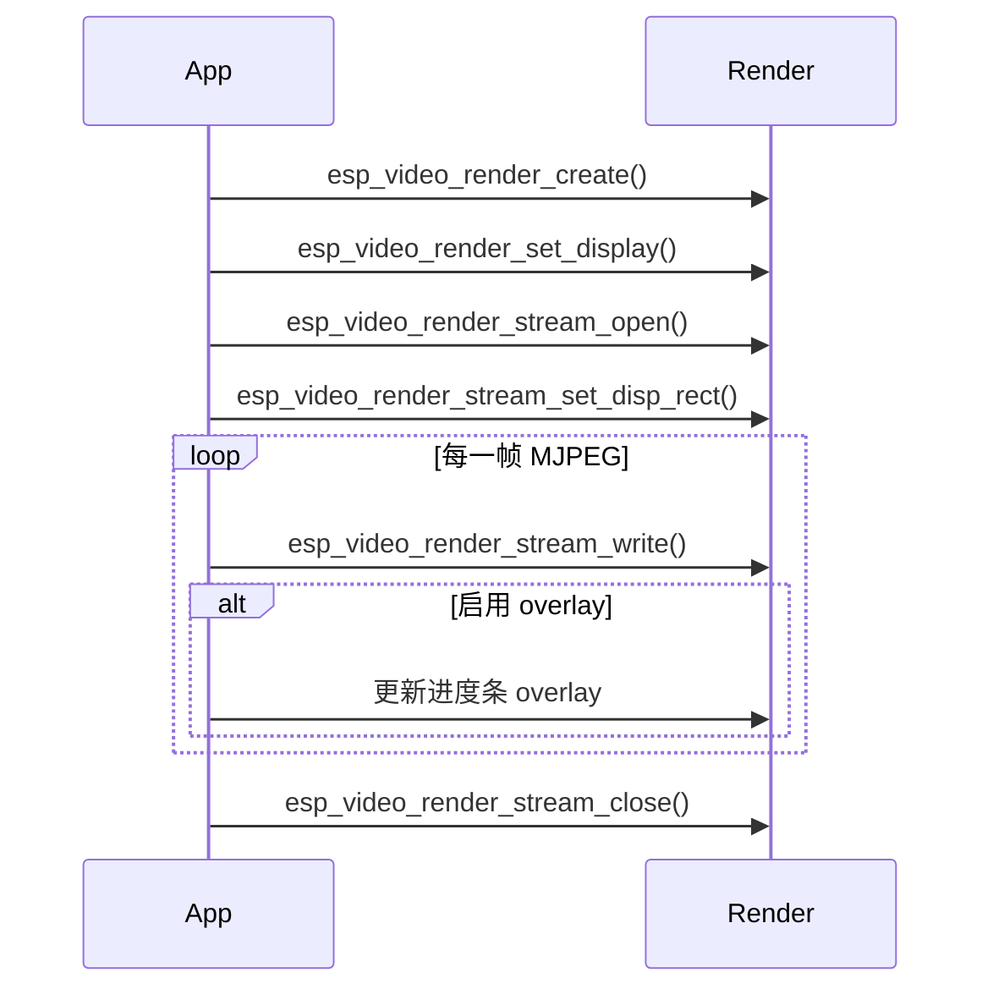

# 视频渲染示例

- [English](./README.md)
- 例程难度：⭐⭐

## 示例简介

- 本示例展示 `esp_video_render` 的核心使用方式，输入源为存放在 SD 卡上的 MJPEG 文件。
- 示例覆盖单流播放、双流并排播放、cached 与同步渲染方式，以及轻量进度条 overlay。
- 同时也展示了相同渲染流程在 LCD backend 和 LVGL backend 下的使用方式。

### 典型场景

- LCD 上的视频播放
- 双路 MJPEG 分屏预览
- 在视频上叠加轻量 UI
- 对比同步渲染与异步渲染行为

### 运行流程

启动后，示例会初始化 LCD 和 SD 卡，然后按顺序执行以下演示：

1. 单视频正常播放
2. 单视频同步渲染播放
3. 带进度条 overlay 的单视频播放
4. 双视频并排播放
5. 带进度条 overlay 的双视频并排播放

如果启用了 LVGL 支持，以上流程会再用 LVGL backend 重复执行一轮。



### 文件结构

```text
examples/video_render
├── main
│   ├── main.c
│   ├── progress.c
│   ├── settings.h
│   ├── video_render.c
│   └── video_render_sys.c
├── CMakeLists.txt
├── idf_ext.py
├── partitions.csv
├── README.md
└── README_CN.md
```

## 环境准备

### 硬件要求

- 一块支持 LCD 的 ESP 开发板，例如：
  - [ESP32-S3-Korvo2](https://docs.espressif.com/projects/esp-adf/en/latest/design-guide/dev-boards/user-guide-esp32-s3-korvo-2.html)
  - [ESP32-P4-Function-EV-Board](https://docs.espressif.com/projects/esp-dev-kits/en/latest/esp32p4/esp32-p4-function-ev-board/user_guide.html)
- 一块受支持的显示屏
- 一张存放 MJPEG 测试文件的 SD 卡

### 默认 IDF 分支

本示例支持 IDF release/v5.5（>= v5.5.2）。

### 软件要求

- SD 卡中准备好 MJPEG 文件
- 默认文件路径在 `main/settings.h` 中定义：
  - `LEFT_FILE`
  - `RIGHT_FILE`

## 构建与烧录

### 构建准备

开始构建前，请确保已经完成 ESP-IDF 环境安装并执行过导出。

```bash
cd /path/to/esp-gmf/packages/esp_video_render/examples/video_render
```

在构建前先为目标开发板生成 board-manager 代码，例如：

```bash
idf.py gen-bmgr-config -b esp32_p4_function_ev
```

如果你使用的是其他受支持的开发板，请将 `esp32_p4_function_ev` 替换为对应的板型名称。可通过以下命令列出支持的开发板：

```bash
idf.py gen-bmgr-config -l
```

生成 board 代码后，再构建并烧录示例：

```bash
idf.py build
idf.py -p /dev/XXXX flash monitor
```

### 工程配置

请根据测试资源更新 `main/settings.h`：

- `VIDEO_WIDTH`
- `VIDEO_HEIGHT`
- `MAX_FRAME_SIZE`
- `LEFT_FILE`
- `RIGHT_FILE`

可使用以下命令生成 MJPEG 文件：

```bash
ffmpeg -i input.mp4 -q:v 1 -c:v mjpeg -pix_fmt yuvj420p -vtag MJPG left.mjpeg
```

可使用以下命令估算最大 MJPEG 帧大小：

```bash
ffprobe -v error -select_streams v:0 -show_entries packet=size -of csv=p=0 left.mjpeg | sort -n | tail -1
```

如果需要测试 LVGL backend，请在 `menuconfig` 中启用相应配置。

## 如何使用本示例

### 功能与用法

- 将 `left.mjpeg` 和 `right.mjpeg` 复制到 SD 卡，或在 `main/settings.h` 中修改为你自己的文件路径。
- 烧录程序并复位开发板。
- 示例会自动依次执行所有播放场景，无需手动输入命令。
- 可在屏幕上观察以下差异：
  - 单流与双流布局
  - 普通播放与带进度条 overlay 的播放
  - 启用 LVGL 时 LCD backend 与 LVGL backend 的表现差异

### 结果

当文件存在且显示配置正确时，你应当能看到：

- 居中的单视频播放
- 并排的双视频播放
- 视频上的进度条 overlay
- 如启用 LVGL，则同一轮测试会以 LVGL backend 再执行一次

## 故障排查

### 找不到 MJPEG 文件

如果播放未开始，请检查 SD 卡路径是否与 `main/settings.h` 中的定义一致。

### 帧缓冲大小不足

如果 MJPEG 解析失败或播放中途停止，请增大 `MAX_FRAME_SIZE`，确保其覆盖文件中最大的编码帧。

### 显示区域过小

示例会在条件允许时自动缩小双流显示，但某些过小的显示器仍可能不足以容纳配置的视频尺寸。

## 技术支持

- 技术支持论坛：[esp32.com](https://esp32.com/viewforum.php?f=20)
- 问题反馈和功能建议：[GitHub issue](https://github.com/espressif/esp-gmf/issues)

